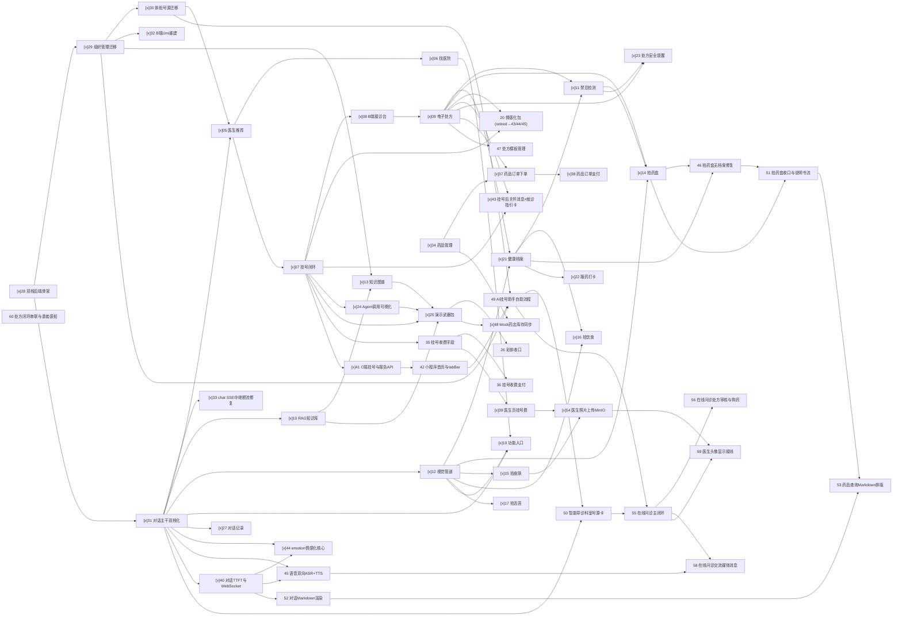

# 智愈（zhiyu-health）

AI 驱动的医疗 B+C 平台：C 端支付宝原生小程序（医疗 AI Agent）+ B 端 React 管理后台 + Java 业务后端（server-java）与 Python Agent 层（server-py）。

## 运行拓扑

- 云服务器 `43.139.160.223`：仅运行 PostgreSQL 16 + pgvector、Redis 7、Neo4j 5。
- 本地开发机：运行 server-java、server-py、React B 端和支付宝小程序开发者工具；所有测试也在本地执行。
- 团队成员通过数据库账号密码直接连接云端依赖，不建立 SSH 隧道；SSH 仅限维护者在用户明确要求后进行服务器维护。
- 未经用户明确授权，AI Agent 禁止 SSH 登录、上传代码、远程部署、重启服务或执行远程 Compose；数据库连接失败时只检查本地配置与安全组白名单并报告。
- 云安全组只允许团队固定公网 IP 访问数据库端口，人员网络出口变化后需先更新白名单。

```text
本地支付宝小程序工具 ─┐
本地 React 管理端 ──┼─> 本地 server-java :8080 ─> 云端 PG / Redis
本地 API 测试 ──────┘              │
                         本地 server-py :8000 ─> 云端 Neo4j / pgvector（只读）
```



server-java、server-py 和前端不部署到这台云服务器，日常开发、测试、SSE 联调和断点调试均在各成员本机完成。

正式产品名为”智愈”，助手名为”小愈”；`zhiyu-health` 是仓库标识。

## 仓库结构

```text
server-java/   Java 业务后端（Spring Boot + MyBatis-Plus）
server-py/     Python Agent 层（FastAPI + LangChain/LangGraph）
admin/         B 端 React + Umi + Ant Design
miniprogram/   C 端支付宝原生小程序 + antd-mini
deploy/        云端存储初始化脚本
docs/          ADR 与补充说明
.scratch/      canonical Spec 与本地施工票单
```

## 1. 云数据库人工维护（非日常开发步骤）

以下命令只允许维护者在首次部署或获得用户明确授权时执行，AI Agent 不得将其作为开发或测试前置步骤。服务器需安装 Docker Engine 与 Docker Compose v2，在服务器仓库目录执行：

```bash
sh deploy/bootstrap-env.sh
docker compose up -d
docker compose ps
```

默认启动 PostgreSQL、Redis、Neo4j。测试用 Neo4j 按需启动：

```bash
docker compose --profile test up -d neo4j-test
```

云安全组按需放行以下端口，来源必须限定为团队固定公网 IP，禁止配置为 `0.0.0.0/0`：

| 端口 | 服务            | 用途                         |
| ---- | --------------- | ---------------------------- |
| 5432 | PostgreSQL      | 业务数据与 pgvector          |
| 6379 | Redis           | 缓存与号源计数               |
| 7474 | Neo4j HTTP      | Neo4j Browser 管理界面，可选 |
| 7687 | Neo4j Bolt      | 应用连接                     |
| 7688 | Neo4j Test Bolt | 独立测试实例，仅测试时开放   |

## 2. 本地配置与双栈服务

在每位成员的本地仓库中，从 `.env.example` 创建 `.env`。通过团队约定的安全渠道取得服务器生成的 PostgreSQL、Redis、Neo4j 密码，填写对应连接串；主机地址保持为 `43.139.160.223`，无需填写 SSH 用户名或配置端口转发。`.env` 永不入库、不得发到群聊或打印到日志。

启动前可先在 PowerShell 验证当前公网 IP 已加入云安全组：

```powershell
Test-NetConnection 43.139.160.223 -Port 5432
Test-NetConnection 43.139.160.223 -Port 6379
Test-NetConnection 43.139.160.223 -Port 7687
```

三项的 `TcpTestSucceeded` 均应为 `True`。失败时检查本地 `.env` 与安全组白名单，不要 SSH 修改云端。随后分别在本地启动 server-java 与 server-py：

```bash
mvn -f server-java/pom.xml spring-boot:run
uv sync --frozen --dev
uv run python scripts/run-server-py.py   # Windows 上强制 SelectorEventLoop（psycopg 异步需要），端口默认 8000
```

验证统一入口与 Agent 层 health：

```bash
curl http://127.0.0.1:8080/api/health
curl http://127.0.0.1:8000/api/health
```

期望 PostgreSQL、Redis、Neo4j 均返回 `ok`；PostgreSQL 检查同时确认 `vector` 扩展已启用。

## 3. 本地 B 端

```bash
npm --prefix admin ci
npm --prefix admin run dev
```

访问 `http://localhost:5173`。Umi 将 `/api` 代理到本地 server-java `127.0.0.1:8080`。

## 4. 支付宝小程序

1. 在 `miniprogram/` 执行 `npm ci`（antd-mini 直接引用 `node_modules`，无需“构建 npm”）。
2. 用支付宝小程序开发者工具导入 `miniprogram/`（已提交 `mini.project.json`，含 component2 配置）。
3. 模拟器关闭“校验合法域名、web-view（业务域名）、TLS 版本以及 HTTPS 证书”。
4. 端侧业务请求统一进入本机 `http://127.0.0.1:8080/api`。
5. 预览二维码与真机调试通过支付宝开发者工具的调试代理访问本地 server-java；不依赖已备案 HTTPS 域名。

预览或真机调试时在开发者工具中选择团队真实 AppID，该本地配置不提交。

## 测试与检查

```bash
mvn -f server-java/pom.xml test
uv run pytest
uv run ruff check server-py
uv run mypy server-py/app

npm --prefix admin run typecheck
npm --prefix admin run build
```

Python 依赖由 `pyproject.toml` 声明、`uv.lock` 精确锁定；B 端和小程序依赖分别由各自的 `package-lock.json` 锁定。

## 文档

- 领域术语：`CONTEXT.md`
- 架构决策：`docs/adr/0001`–`0022`
- 产品规格：`.scratch/zhiyu-mvp/spec.md`
- UI 约定：`docs/specs/0002-ui-conventions.md`
- 施工票单：`.scratch/zhiyu-mvp/issues/`
