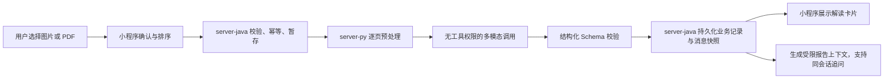

# 从报告上传到可追问卡片：多模态报告管道工程笔记

本文记录票 12「报告解读与视觉管道」落地过程中最值得复用的思路和踩过的坑。它不是需求复述，也不是按时间排列的复盘，而是写给以后继续开发药盒、皮肤、饮食、舌苔等视觉能力的人。

相关实现主要位于：

- `server-py/app/agent/vision/`：文档预处理、场景约束和多模态模型调用
- `server-java/.../ReportInterpretationService.java`：业务编排、幂等和持久化
- `miniprogram/pages/chat/report-composer.js`：选择、确认、上传和卡片展示
- `server-py/tests/test_vision_api.py`：视觉管道的主要行为测试

## 1. 真正的问题不是“让模型看图片”

把图片转成模型支持的输入并不难。难的是建立一条可以解释、可以失败、可以重试、不会越权的业务链路：



每一段都有不同的失败语义。文件不合法、PDF 加密、模型超时、模型输出不符合 Schema、业务写入失败，不能都折叠成一句“AI 出错了”。稳定错误码和明确的状态转换，才让前端提示、重试和排查成为可能。

## 2. 安全边界：不是不让模型看数据，而是只让它看完成任务所需的数据

报告解读本身要求模型读取健康指标、数值和参考范围。因此“避免大模型接触敏感数据”如果被理解成“任何健康内容都不能发给模型”，这个功能从定义上就无法成立。

更准确的安全目标是数据最小化和用途隔离：

- 允许发送完成报告解读所必需的医学内容。
- 尽可能在本地移除姓名、身份证号、手机号、就诊卡号等直接身份标识。
- 原始文件只在处理期间存在，成功或失败后都清理，不落业务库。
- 审计日志和 Agent trace 不记录报告原文、模型原始输出或凭据。
- 报告模型没有业务工具权限，不能因为图片里写了某条“指令”就查询、修改业务数据。
- 模型只允许返回约定的结构化结果，不能把文档里的链接、二维码或指令带到后续执行链路。

### 自研模型不自动等于更安全

安全性取决于部署边界、数据保留策略、训练使用条款、访问控制、日志和运维流程，不取决于产品是否宣传“自研模型”。自研但使用公共云托管，仍可能存在外部处理和保留；第三方模型如果部署在受控环境并签订明确的数据条款，也可能有更清楚的边界。

选型时应该问可核实的问题：数据发到哪里、保存多久、是否用于训练、谁能访问、是否支持删除、是否有审计和合规承诺。不能用“自研”两个字替代这些答案。

### 图片自动脱敏不能靠愿望实现

文字型 PDF 可以通过确定性规则遮盖明显的手机号、身份证号等文本，但图片和扫描 PDF 没有可靠文本层。若要宣称自动脱敏，至少还需要本地 OCR、字段定位、打码预览和用户确认。

本次实现选择诚实的边界：

- 不宣称图片自动脱敏。
- 首次使用时明确告知会发送到多模态模型，并建议用户预先遮盖身份信息。
- 演示只使用虚构报告。
- 真实报告上线前，必须补齐授权流程并核实供应商的数据条款。

这比展示一个看似安全、实际无法保证完整性的“自动脱敏”开关更可靠。

## 3. 页面文字是否可靠，不能只看“有没有抽取到文本”

PDF 中存在文本层，不代表文本层适合直接交给模型。常见问题包括：

- 扫描件带有质量很差的隐藏 OCR 文本。
- 表格按视觉位置排版，但抽取后项目名、数值、单位和参考范围错位。
- 多栏页面被抽成错误的阅读顺序。
- 图表或标记本身没有对应文本。
- 字体映射损坏，抽到的是乱码或不可见字符。

因此路由单位应该是“页”，而不是整份 PDF。每页按确定性规则进入三种路径：

| 路径 | 适用页面 | 提交给模型的内容 |
|---|---|---|
| 文本 | 连续正文、字符质量和阅读顺序可信 | 脱敏后的抽取文本 |
| 混合 | 表格、图表、多栏或文字与版式都重要 | 抽取文本 + 受控分辨率页面图像 |
| 图像 | 扫描页、空文本层、乱码或损坏文本层 | 页面图像 |

几个重要原则：

1. 路由必须可测试，不能再问一次 LLM“这页文字可靠吗”。否则路由本身变成不可重复、要计费、也可能失败的模型判断。
2. 多页顺序必须保留。报告里的结论、参考范围和脚注经常跨页关联。
3. 不能静默截断超限文件。用户看到的是一份完整报告，系统却只读前几页，会制造非常危险的完整性错觉。
4. 图像栅格化需要限制分辨率和解码像素，避免压缩炸弹或异常大页面耗尽内存。

## 4. 把报告内容当作“不可信数据”，而不是提示词的一部分

报告图片里可能出现任意文字，包括“忽略之前要求”“访问这个链接”等提示注入内容。防护重点不应只是追加一句“不要听它的”，而是降低被注入后的能力上限。

本次采用的组合边界是：

- 报告解读使用独立调用，不进入主对话 LangGraph 工具循环。
- 场景由服务端枚举注册，客户端不能传入任意系统 prompt。
- `REPORT` 场景绑定固定系统约束、输入策略、输出 Schema 和校验器。
- 调用不挂载业务工具，也不允许访问报告中的链接或二维码。
- 输出只接受结构化字段；首次校验失败允许一次受控重试，再失败就返回稳定错误码。

这里值得复用的思路是：提示词是软约束，工具隔离、枚举场景和 Schema 才是硬一些的边界。两者应该同时存在，但不能把安全全部寄托在提示词上。

## 5. 同一份结果为什么要保存三种形态

报告完成后有三个不同消费者，它们不应该共享同一种数据表示：

| 数据形态 | 消费者 | 设计目的 |
|---|---|---|
| `report_interpretations.result_json` | 健康档案和业务查询 | 独立业务记录，不依附会话生命周期 |
| `report_interpretation` 消息快照 | 会话历史 UI | 不可变地回放用户当时看到的卡片 |
| `report_context` 受限摘要 | 后续普通对话 Agent | 支持同一会话追问，控制上下文长度和字段范围 |

直接把完整卡片 JSON 塞进最近对话上下文是一个很诱人的捷径，但它会带来几个问题：上下文膨胀、展示字段与推理字段耦合、模型看到无意义 UI 元数据，以及历史卡片格式升级后行为漂移。

因此消息查询需要有明确过滤规则：普通结构化卡片不进入 LLM 最近上下文；隐藏的 `report_context` 可以进入模型上下文，但不返回给小程序重复展示。

删除会话时只删除消息快照，独立报告记录仍保留。当前 MVP 没有报告记录删除 API 或 UI；这项产品决定必须与原始文件“不持久化”区分开，不能误以为不保存原件就等于没有数据保留问题。

## 6. 幂等不是数据库唯一键就结束了

多模态调用通常比普通接口昂贵且耗时。网络超时后客户端重试，如果只是再次执行模型调用，就可能重复计费并生成多条记录。

本次以 `patient_id + request_id` 唯一约束配合状态机：

```text
PROCESSING -> SUCCEEDED
           -> FAILED
```

约定如下：

- 成功请求的重复提交直接返回已保存卡片。
- 处理中的重复提交不能并发调用模型。
- 超时和异常必须落成稳定失败状态，不能永久停在 `PROCESSING`。
- 失败后的用户主动重试生成新的 `request_id`，避免把一次失败执行偷偷改写成另一轮执行。

真正的幂等需要同时回答“重复请求返回什么”“处理中怎么办”“失败能否重试”“计费调用发生在哪个状态之后”，而不仅是加一个唯一索引。

## 7. 临时文件清理要覆盖每条退出路径

原始图片和 PDF 不持久化，但它们仍会在 server-java 接收、校验和转发期间短暂存在。最容易踩的坑是只在成功路径删除，异常、超时或校验失败时留下文件。

实现时应把暂存生命周期当作资源管理问题：

- 文件名只保留脱敏后的展示名，磁盘文件使用服务端生成的不可猜测名称。
- 校验大小、类型、图片数量和 PDF 页数后再进入昂贵处理。
- 清理放在覆盖成功与失败的最终路径中。
- 测试暂存顺序、清理行为和重复请求，而不只测试最终卡片。
- 日志只记录请求标识、参数类型、状态和稳定错误码。

如果未来改成异步任务，临时文件生命周期、任务租约和失败补偿必须重新设计，不能直接复用同步请求结束时的清理假设。

## 8. Git 冲突解决后，还要检查“语义冲突”

票 12 开发期间，`main` 同时加入了会话历史抽屉和医院推荐。合并时出现了 5 个文本冲突，但真正危险的问题出现在冲突标记全部消失之后。

### 典型语义冲突一：新消息类型没有进入旧的类型注册表

会话历史功能通过 `message-kinds.js` 判断哪些消息需要把 JSON 还原为卡片。报告功能新增了 `report_upload` 和 `report_interpretation`，如果只解决 `index.js` 的文本冲突，历史会话仍会把报告 JSON 当普通文本展示。

最终需要额外适配：

- `report_interpretation` 注册为卡片消息，并从持久化快照的 `result` 字段还原 UI 卡片。
- `report_upload` 在历史回放时转换为“已上传报告：文件名”的用户消息，而不是展示 JSON。

### 典型语义冲突二：两个功能都让入口文件继续变胖

会话抽屉、报告上传和医院定位合并后，聊天页入口达到 279 行，超过项目约定。单纯保留双方代码虽然功能可能正确，但模块边界已经退化。

处理方式是把医院意图识别、定位降级和医院卡片选择拆到 `hospital-routing.js`，让 `index.js` 回到 226 行。冲突解决不仅是“双方代码都留下”，还要恢复合理职责。

### 典型语义冲突三：数据表和删除语义必须一起看

会话删除会级联删除消息；报告业务记录的 `conversation_id` 则在会话删除时置空。报告消息还引用报告记录。合并 schema 时，必须同时检查建表顺序、外键方向和删除行为，不能只看 SQL 是否能解析。

一套实用的合并检查顺序是：

1. 消除冲突标记。
2. 对照两个分支各自的需求和测试，列出双方必须保留的行为。
3. 搜索新增枚举、消息类型、事件名和数据库字段的所有消费者。
4. 检查文件职责和长度是否因拼接而退化。
5. 跑全量测试，而不是只跑冲突文件附近的测试。
6. 为合并后新增的交互补一条定向断言。

## 9. 验收要同时有 fake、真实 smoke 和界面观察

只依赖真实模型测试会慢、贵且不稳定；只依赖 fake 又无法发现供应商协议、模型能力和多模态输入格式的问题。本次采用分层验证：

- 日常自动化使用 fake，覆盖图片、混合 PDF、空白 PDF、缩放、Schema 重试、超时、范围拒绝、幂等和同会话追问。
- 少量真实火山方舟 smoke 使用纯虚构报告，验证单图、文字页 + 扫描页 PDF、来源页码、结构化输出和后续追问。
- 支付宝开发者工具观察页面实际渲染、圆润 `+` 按钮和控制台错误。
- 合并后再跑 Python、Java、管理端和小程序检查，防止两个独立正确的分支组合后失效。

真实 smoke 不应进入日常测试，也不能打印凭据、报告原文或模型原始输出。它的价值是验证系统与真实供应商之间的契约，而不是替代可重复的自动化测试。

### 验收环境也可能骗你

使用多个 Git worktree 时，开发者工具可能仍打开旧工作树。看到页面正常，不代表正在验收刚合并的代码。验收前要确认工具所打开的绝对项目路径和当前分支。

此外，Windows PowerShell 通过管道传递包含中文的临时测试脚本时，终端编码可能把中文变成 `?`，制造业务断言失败。遇到这类现象应先打印实际值或使用 Unicode 转义，区分编码问题和代码问题。

临时 worktree 完成合并后也要及时移除。否则分支仍被 worktree 占用，主工作区执行 `git switch main` 会得到 “already used by worktree” 的错误。

## 10. 后续视觉场景的复用清单

新增药盒、皮肤、饮食或舌苔场景时，可以复用管道，但不能只换一句 prompt。每个新场景至少应明确：

- 允许的输入类型和医学能力边界。
- 场景专属结构化 Schema。
- 是否需要文字、图像或混合预处理。
- 不确定、看不清和超出范围时如何拒绝。
- 哪些结果可以进入后续对话上下文。
- 是否涉及 server-java 的确定性红线规则。
- 展示卡片、免责声明和错误提示。
- fake 测试样本与少量真实 smoke 的验收指标。

公共管道提供的是受控输入、调用隔离、重试校验和错误协议。医学场景的能力边界、安全约束和结果解释仍然必须逐项设计。

## 结语

多模态医疗功能的工程质量，不取决于模型能否在一张理想图片里读对几个数字，而取决于系统能否明确回答：读了哪些页、为什么信任这些文字、哪些数据被发送、模型能做什么、失败后会留下什么、重复请求会不会再次计费、历史记录如何回放，以及用户如何知道这不是医生诊断。

把这些问题落实为确定性路由、工具隔离、结构化 Schema、幂等状态机、分层持久化和可重复测试，模型才从一个演示能力变成一项可维护的产品能力。
