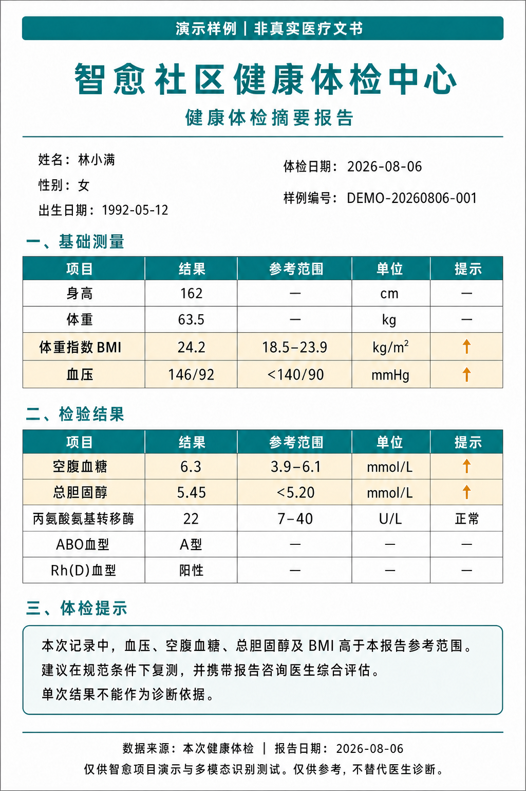

# 健康档案产品调研：智愈该补什么、不该照搬什么

> 调研日期：2026-08-08  
> 范围：中国市场个人/家庭健康档案与健康管理产品，重点腾讯健康、蚂蚁阿福，并参考京东健康、平安健康及国家电子健康档案规范。  
> 证据标准：产品能力仅采用产品官网、开发者发布的应用商店资料、官方隐私政策、官方新闻稿；边界仅采用全国人大、国家卫生健康委等官方法规和标准。用户提供的两张产品实机截图仅用于核对当前界面信息架构，不作为未公开能力的证据。所有链接均于 2026-08-08 检索。

## 结论先行

**智愈当前健康档案在产品呈现上偏简，但在业务骨架上并不简陋。** 已有本人/家人多档案、基础资料、过敏史，以及挂号、电子处方、在线问诊、报告解读、服药打卡的统一时间线。它比蚂蚁阿福截图中的“几个暂无数据指标卡”更接近真正的医疗服务档案；问题是缺少首页概要、既往健康信息、少量可追踪指标和数据来源说明，价值被藏在页面下方的流水里。

不建议复制腾讯的 3D 人体、综合风险分，也不建议一次加入睡眠、体脂、血脂、尿酸、血糖、血压等一排空卡片。对两周医疗 B+C demo，合理升级是：

1. 把页面改成“**当前档案概要首页 + 健康服务时间线**”，首页先回答“这是谁、有哪些重要健康事实、最近发生了什么”。
2. 在现有过敏史之外，补充**既往确诊疾病、手术史、血型**；若需要更丰富的演示，再加入**身高、体重/BMI、血压**三类手工记录和趋势。
3. 每项健康事实和指标必须带**来源、记录/测量时间和确认状态**，区分本人填写、设备测量、报告抽取、医生确认、机构正式诊断。
4. 报告继续进入现有报告解读链路和时间线；可以增加“报告列表/分类”和从结构化结果抽取的趋势，但不应为做“病历夹”而长期保存报告原图。当前即用即弃设计有明确隐私价值。
5. AI 只能生成带免责声明的摘要、一般性解释和“建议咨询医生”的提示；不得把推断包装成诊断、不得自动开方，也不得在 C 端结合档案做个性化用药决策。

## 1. 智愈当前能力与真正缺口

### 1.1 已有能力

仓库当前实现不是单一资料卡，而是一套可用的档案业务模型：

| 维度 | 当前能力 | 证据位置 |
|---|---|---|
| 档案主体 | 一个患者账号下创建并切换本人/家人档案，唯一激活档案 | `health_profiles`、`HealthProfileService` |
| 基础资料 | 姓名/称呼、性别、出生日期、与账号关系 | `miniprogram/pages/health` |
| 安全事实 | 档案级过敏史，供 B 端确定性用药禁忌检查 | `health_profile_allergies`、`CONTEXT.md` |
| 医疗活动 | 挂号、电子处方、在线问诊、报告解读、服药打卡统一按时间倒序投影 | `HealthProfileMapper.selectTimeline` |
| 报告隐私 | 原图只在内存暂存，解读完成移除；持久化结构化结果和摘要 | `CONTEXT.md`“报告解读” |
| 多档案隔离 | 挂号、报告、处方等按健康档案归属，切换档案后只查当前对象 | 票 21 与相关查询 |

因此，当前问题更准确地说是：

- **档案首页没有概要层**：用户先看到建档/选择、基础资料、过敏史，再往下翻时间线，无法一眼判断关键健康状态。
- **长期健康事实不足**：没有既往确诊疾病、手术史、血型等医生最常先看的资料。
- **没有结构化生命体征记录**：无法展示体重/BMI、血压等趋势。
- **来源语义缺失**：用户自填、AI 从报告抽取和医生确认的数据尚不能在同一套可信度模型中表达。
- **授权模型过于简化**：当前“家人档案”是账号内切换，不等同于成人家属对数据查看、共管和撤权的真实授权。

### 1.2 不是缺口的东西

- 3D 人体器官插画、健康风险分和“综合分析”入口是展示形态，不是健康档案的基础能力。
- 一排空指标卡不会自然产生数据；没有测量来源、时间和质量控制时，卡片越多越像占位页。
- 国家规范列出大量人口学、社会经济学和重点人群字段，不意味着商业 demo 应全量收集。
- 完整跨院病历同步、医保/区域平台互联不是纯前端能力，需要真实医疗机构资质、接口、协议和授权。

## 2. 市面产品怎样组织健康档案

### 2.1 腾讯健康：报告驱动的医患协作档案

腾讯健康“患者档案”官方定位是供医生和患者存、查、用医疗报告的智慧电子云病历。患者实名后可上传病历资料、填写病情概况；系统对报告自动分类、按日期排序、形成病情时间线和趋势图，并进行 AI 解读。患者授权医疗机构后，机构医务人员才可查看其上传数据；产品还连接诊前资料收集、诊中指标/用药/不良反应采集和诊后随访。[腾讯健康患者档案](https://healthcare.tencent.com/production/13)

其报告结构化能力支持医院系统文本、纸质报告照片和扫描件，覆盖常见检验、X 线、超声、MR、病理及门诊住院病历，核心是把非结构化报告抽成可查、可排序、可画趋势的字段，而不是让 LLM 自由生成一份健康画像。[腾讯健康医疗报告结构化](https://healthcare.tencent.com/production/4)

用户提供的腾讯截图把“综合分析”“健康关注指标”和“导入检查报告”放在一个人体概览页中，视觉上很有冲击力。但这套体验背后是报告长期存储、结构化引擎、医生端授权与随访平台。对智愈可借鉴的是**概要 + 报告入口 + 趋势**，不能只复制 3D 人体和风险文案。

腾讯的同类医学影像产品进一步说明了家人数据自动拉取所需的真实前提：家庭成员需完善身份并验证，通过证件号/手机号匹配云端检查；分享检查可设置有效期和密码。[腾讯云数智医疗影像平台移动端](https://cloud.tencent.com/document/product/1710/94525)

### 2.2 蚂蚁阿福：个人/家庭仪表盘 + 多源健康数据

蚂蚁阿福开发者在 App Store 的官方产品说明中列出：健康咨询、报告/病历/处方/药盒图片解读、个人和家庭健康档案，以及挂号、云陪诊等服务；同时明确 AI 答复仅供参考，不能替代医生诊断和治疗建议。[蚂蚁阿福 App Store 产品页](https://apps.apple.com/cn/app/id6743828427)

用户提供的阿福截图把首页组织为“当前家庭成员 + 健康仪表盘 + 病历夹”，仪表盘优先身材、睡眠、血糖和血压。这种形态适合消费级长期健康管理，但截图本身也暴露了依赖关系：没有手填、设备或报告数据时，大面积都是“暂无数据”。

阿福官方隐私政策进一步披露了真实数据模型：用户可为家庭成员输入姓名、性别、出生日期和关系，也可绑定既有就诊人；档案可录入身体指标、健康史、用药计划，上传门诊病历、处方和检查检验报告；经授权可邀请家人共管、接收异常提醒和设置用药提醒；智能设备和支付宝运动健康数据也可成为来源。成人家属须先获得合法授权，档案管理员权限可查看和管理。[蚂蚁阿福隐私政策](https://render.alipay.com/p/c/180021120000000751/index.html?agreementId=AG01001075)

这说明阿福值得借鉴的不是“睡眠/血糖卡片”本身，而是：**家庭成员、数据来源、授权共管、报告与指标同属一份档案**。其中设备绑定、多人共管和异常提醒都需要智愈目前没有的授权、撤权和数据质量体系，不适合直接照搬。

### 2.3 京东健康：健康资料范围广，但服务价值来自家庭医生

京东健康隐私政策列出的健康档案信息包括血压、血糖、脉搏、身高、体重、胸围、腰围、臀围，以及门急诊/住院病历、体检报告、生活习惯和健康史；家庭医生服务会把相关健康生理信息提供给家庭医生团队。[京东健康隐私政策](https://u8s0.m.jd.com/healthPrivacy/)

京东健康官方开放平台还将患者档案与智能检测设备、公共卫生管理、健康跟踪和家庭医生服务连接。[京东健康开放平台](https://open.healthjd.com/)

对智愈的启示是：健康档案不是孤立资料库，它应服务于医生接诊、报告解读、随访或慢病管理中的具体动作。智愈已有 B+C 业务链路，优先补医生真正会读的少数字段，比堆几十个消费健康指标更合适。

### 2.4 平安健康：档案 + 专业服务 + 慢病设备监控

平安家医官方披露的主动健康管理链路包括自动化健康档案、体检报告解读、物联网实时监控与高危预警，并由家庭医生提供后续就医、康复和随访服务；医生工作台用于自动更新档案、匹配健康计划和开展医疗质控。[平安家医品牌升级](https://www.pingan.cn/zh/common/cn_news/1718608717045.shtml)

这类“异常预警”不是一个前端阈值卡片：它依赖家庭医生团队、物联网数据、慢病管理路径和质控体系。智愈可以演示指标趋势和确定性超界提示，但没有专业服务闭环时，不应宣称“高危预警”或“个性化健康管理计划”。

## 3. 国家规范给出的更可靠产品骨架

国家卫生健康委 2024 年《居民电子健康档案首页基本内容（试行）》采用“**最小够用**”原则，将首页定义为从完整档案动态提取的重点健康概要和主索引。它由三部分构成：

1. **个人健康标识**：重点人群、慢病/重点疾病、体重状况、血型等；标签应由业务系统产生，动态更新、不可随意更改且可追溯。
2. **个人基本健康信息**：人口学资料、紧急联系人、家庭医生、过敏史、暴露史、既往疾病/手术/外伤/输血、预防接种、家族/遗传史等。
3. **卫生健康服务活动记录**：按时序展示服务时间、机构、类型、主要健康/疾病问题、医学报告和费用。

该文件明确档案由居民本人授权使用，信息主要在医疗卫生服务过程中产生和抓取；明确诊断必须以医疗卫生机构的正式诊断结果为依据。[居民电子健康档案首页基本内容（试行）](https://www.nhc.gov.cn/jws/c100073/202406/f6520c3818c34637ab5f9d3d5232aaf3/files/1733998613556_61307.pdf) 配套[政策解读](https://www.nhc.gov.cn/jws/c100072/202406/619d889527e249b59f0175a84ae01fef.shtml)

这套结构与智愈已有模型天然相容：智愈已经有“卫生健康服务活动时间线”，需要补的是一个最小概要首页，而不是重新发明一套“人体风险地图”。

国家数据字段和值域的现行官方基线是 WS 365-2011《城乡居民健康档案基本数据集》；2011 年发布该系列标准时，2009 年 35 项试行标准已经废止。因此后续若做数据标准化，应对齐 WS 365 及相关数据元/值域标准，不应引用旧版“健康档案基本架构与数据标准（试行）”作为现行规范。[WS 365-2011 官方发布通告](https://www.nhc.gov.cn/fzs/c100048/201108/27ac38dee3d54f1d9b69cd164cb223ab.shtml)

需要强调：上述文件面向公共卫生和区域健康信息化。智愈是商业 demo，可把它作为信息架构和字段可信度的权威参照，但不能因此宣称自己就是国家居民电子健康档案或已实现跨区域互通。

## 4. 建议取舍

### 4.1 现在就要：低风险、高演示价值

| 建议 | 产品形态 | 为什么适合智愈 |
|---|---|---|
| 档案概要首页 | 顶部当前服务对象；“重要健康信息”展示过敏、既往确诊疾病、手术史、血型；“最近动态”摘要时间线 | 补齐当前最明显的信息层级缺口，并与国家“首页 + 活动记录”一致 |
| 来源与时间 | 每项显示“本人填写 / 报告提取 / 医生确认 / 机构记录”和记录时间 | 防止自填或 AI 抽取冒充正式诊断，是后续所有丰富能力的地基 |
| 历史资料编辑 | 既往确诊疾病含名称、确诊时间、来源；手术含名称与时间；明确“无/未填写” | 对接诊和禁忌判断比睡眠、体脂等更直接 |
| 报告列表/分类 | 在当前档案下展示报告解读记录，按报告类型/日期归类，点进现有结构化结果 | 复用现有能力，不改变原图即用即弃的隐私模型 |
| 少量指标 | 第一批只做身高、体重/BMI、血压；记录数值、单位、测量时间、来源，至少两次才画趋势 | 数据易解释、演示直观，且不会形成十几张空卡 |
| 医生端摘要 | B 端接诊抽屉展示当前档案的重要健康事实和最近医疗活动，沿现有患者归属校验读取 | 让档案真正服务 B+C 闭环，而非只供患者自看 |
| 缺失引导 | 用“完善过敏史/既往史”“记录首次体重”等行动卡替代纯空值 | 明确数据从哪里来，避免竞品截图式空仪表盘 |

建议首页的最小顺序：

```text
本人/家人切换 + 新建档案
  → 重要健康信息（过敏 / 既往确诊疾病 / 手术 / 血型）
  → 健康指标（体重/BMI / 血压；有数据才显示趋势）
  → 最近报告
  → 健康服务时间线
```

### 4.2 第二阶段：有业务来源和授权后再做

| 能力 | 启动条件 |
|---|---|
| 血糖、血脂、尿酸等检验指标趋势 | 报告结构化 Schema 稳定；统一项目编码、单位和参考区间；可回看原报告或可信结构化来源 |
| 家人档案共管 | 成人本人授权、邀请/接受、权限范围、撤销/到期、操作审计完整；未满 14 周岁建立监护人验证和专门规则 |
| 智能设备同步 | 明确设备主体、测量时间、单位、质量/异常状态、重复数据合并和撤权删除；先做一个受控设备，不做泛接入 |
| 疫苗、家族史、遗传史 | 出现明确导诊、随访或医生接诊用途，并建立更细的查看权限 |
| 随访计划与指标任务 | 有医生发起、患者执行、异常回到医生处理的业务闭环；不能只由 AI 自动生成计划 |
| 报告原件长期保存/分享 | 用户明确选择保存；MinIO 权限、期限、删除、短期分享链接和水印方案完成；不得偷偷改变当前即用即弃承诺 |
| 跨机构数据导入 | 真实机构合作、实名核验、来源合法性、完整性验证、授权和接口协议齐备 |

### 4.3 暂缓或明确不要

| 能力 | 判断 | 原因 |
|---|---|---|
| 腾讯式 3D 人体器官风险图 | 暂缓 | 没有经验证模型、适用人群、阈值和医生复核时，视觉确定性会放大 AI 推断的可信错觉 |
| 综合健康分/疾病风险分 | 暂缓 | 评分需要明确模型、证据、校准、解释和申诉机制；不适合作为 demo 装饰 |
| 睡眠/体脂/血氧等全量仪表盘 | 暂缓 | 智愈没有设备来源；手填成本高，最终只会形成空卡片 |
| 精神障碍、传染病、孕产风险、残疾等敏感标签 | 默认不要 | 虽在国家首页范围内，但当前业务无充分必要性，且污名化和越权风险更高 |
| 成人家属默认代建代管 | 禁止 | 家属关系不能替代本人授权；创建者不得天然获得全部查看和编辑权 |
| AI 自动写入“确诊疾病” | 禁止 | AI/本人推测不等于医疗机构正式诊断；最多存“用户自述/待医生确认” |
| C 端个性化用药、剂量或替代药建议 | 禁止 | 违反项目硬约束；禁忌检查只在 B 端医生开方流程由 server-java 确定性执行 |
| AI 自动生成处方 | 禁止 | 国家互联网诊疗监管明确禁止，且处方必须由接诊医师本人开具 |
| 健康数据用于广告、保险定价或模型训练 | 默认禁止 | 超出建档目的；必须重新确定合法基础、充分告知、单独同意和完成影响评估，demo 没有必要承担该风险 |

## 5. 隐私、授权与医疗安全边界

《个人信息保护法》将医疗健康信息和不满 14 周岁未成年人信息列为敏感个人信息。处理敏感信息需要特定目的、充分必要、严格保护、单独同意并告知必要性和影响；个人还有撤回、查阅复制、更正和删除等权利。向另一独立处理者提供、进行高影响自动化决策或处理敏感信息前，还需满足相应告知、同意和个人信息保护影响评估要求。[《个人信息保护法》](https://www.npc.gov.cn/npc/c2/c30834/202108/t20210820_313088.html)

对智愈的最小产品要求是：

- 健康档案启用和 AI 报告分析分别做清晰的敏感信息告知与单独同意，不与普通聊天强绑定；普通健康问答不应因拒绝建档而不可用。
- 档案字段逐项最小化，说明用途、来源、保存期限和可见对象；不为“以后可能有用”收集职业、地址、保险等全量字段。
- 成人家属必须本人授权；未满 14 周岁需监护人同意和专门处理规则。当前 demo 的“家人档案切换”应在界面明确为演示性账号内服务对象，不宣传为已实现家属授权共管。
- B 端按医生与患者的真实服务关系、角色、用途和时限授权；管理员不应因 `admin` 身份天然查看所有患者健康原文。
- 查看、导出、修改均审计；日志继续只记脱敏摘要、工具名和结果，不记患者敏感原文。
- 委托 LLM/OCR/对象存储处理健康数据前，明确双方角色、数据位置、子处理者、退出删除和安全责任，并做个人信息保护影响评估。

国家健康医疗大数据管理办法还要求分类分级、授权访问、电子实名、全程留痕、加密和境内可信存储；作为医疗 demo 的工程基线很合适。[《国家健康医疗大数据标准、安全和服务管理办法（试行）》](https://www.nhc.gov.cn/wjw/c100175/201809/a3223ef7768140a786b308c2064de14b.shtml)

互联网诊疗监管规则要求患者知情同意、医师实名认证，AI 不得冒用或替代医师，处方不得由 AI 自动生成；互联网诊疗病历保存不少于 15 年，图文/音视频过程记录不少于 3 年。[《互联网诊疗监管细则（试行）》](https://www.nhc.gov.cn/yzygj/c100068/202203/2072f0e8988249e59d942e1b2a933916.shtml)

“仅供参考，不替代医生诊断”是智愈应继续强制执行的项目硬约束，但它不是万能免责条款，不能弥补未授权处理、AI 冒充医生、自动开方或超资质开展互联网诊疗。

## 6. 产品实施优先级

### P0：先把现有档案讲清楚

1. 重排 C 端为概要首页 + 时间线，保留家人切换和建档入口。
2. 给过敏史和时间线补来源/时间展示。
3. 将已有报告解读记录做成“最近报告”摘要入口。
4. B 端接诊展示档案摘要，但必须沿患者服务关系鉴权。

### P1：补最有价值的结构化数据

1. 新增既往确诊疾病、手术史、血型；明确无/未填写和来源状态。
2. 新增身高、体重/BMI、血压记录与趋势，不上设备同步。
3. 为报告结构化指标建立统一编码、单位、参考区间和来源引用后，再生成检验趋势。

### P2：授权与专业服务成熟后扩展

1. 家属邀请与共管权限。
2. 单类智能设备接入。
3. 医生发起的随访计划与指标任务。
4. 跨机构报告/病历导入和短期授权分享。

## 7. 最终判断

对“是不是太简陋”的回答是：**页面确实显得简陋，但不应该用竞品的指标数量或视觉复杂度来补。** 智愈已经拥有竞品健康仪表盘常缺的业务时间线和 B+C 闭环。下一步最有价值的是在时间线之上增加可信的健康概要，并让每条数据说清来源、时间和授权。

如果只选一个版本升级，建议做成：

> 本人/家人切换 + 重要健康信息（过敏、既往确诊疾病、手术、血型） + 体重/BMI/血压趋势 + 最近报告 + 现有健康时间线。

它会比当前页面明显丰满，也比照搬“3D 人体 + 十几张空指标卡”更符合医疗产品逻辑、国家“最小够用”口径和智愈现有架构边界。

## 黄金示例：多模态体检摘要报告



该样张使用演示患者林小满和虚构机构，明确标注“演示样例｜非真实医疗文书”。它同时覆盖档案归属、报告日期、身高、体重/BMI、血压、空腹血糖、总胆固醇、肝功能与血型；每个数值都带参考范围、单位和异常提示，可直接进入现有 REPORT 场景的 `name/value/reference_range/unit/priority/page` 结构。当前版本可用于报告解读和健康时间线演示；若要把指标长期沉淀为趋势，还需按本文 P1 建议增加带来源和测量时间的结构化健康观测模型。

## 一手来源清单

### 产品

- 腾讯健康：[患者档案](https://healthcare.tencent.com/production/13)
- 腾讯健康：[医疗报告结构化](https://healthcare.tencent.com/production/4)
- 腾讯云：[数智医疗影像平台移动端](https://cloud.tencent.com/document/product/1710/94525)
- 蚂蚁阿福：[App Store 开发者产品说明](https://apps.apple.com/cn/app/id6743828427)
- 蚂蚁阿福：[官方隐私政策](https://render.alipay.com/p/c/180021120000000751/index.html?agreementId=AG01001075)
- 京东健康：[隐私政策](https://u8s0.m.jd.com/healthPrivacy/)
- 京东健康：[开放平台](https://open.healthjd.com/)
- 平安集团：[平安家医品牌升级官方新闻稿](https://www.pingan.cn/zh/common/cn_news/1718608717045.shtml)

### 法规与标准

- 全国人大：[《中华人民共和国个人信息保护法》](https://www.npc.gov.cn/npc/c2/c30834/202108/t20210820_313088.html)
- 国家卫生健康委：[《居民电子健康档案首页基本内容（试行）》通知页](https://www.nhc.gov.cn/jws/c100073/202406/f6520c3818c34637ab5f9d3d5232aaf3.shtml)
- 国家卫生健康委：[《居民电子健康档案首页基本内容（试行）》PDF](https://www.nhc.gov.cn/jws/c100073/202406/f6520c3818c34637ab5f9d3d5232aaf3/files/1733998613556_61307.pdf)
- 国家卫生健康委：[WS 365-2011 等卫生信息标准发布通告](https://www.nhc.gov.cn/fzs/c100048/201108/27ac38dee3d54f1d9b69cd164cb223ab.shtml)
- 国家卫生健康委：[《国家健康医疗大数据标准、安全和服务管理办法（试行）》](https://www.nhc.gov.cn/wjw/c100175/201809/a3223ef7768140a786b308c2064de14b.shtml)
- 国家卫生健康委：[《互联网诊疗监管细则（试行）》](https://www.nhc.gov.cn/yzygj/c100068/202203/2072f0e8988249e59d942e1b2a933916.shtml)
- 国家卫生健康委：[《关于进一步加强医疗机构电子病历信息使用管理的通知》](https://www.nhc.gov.cn/yzygj/c100068/202506/c68abee7c54b4651a774cd533761780b.shtml)
