# 智愈前端系统分析与设计（模板版）

> 文档版本：v2.1  
> 事实基线：2026-07-30 工作区代码、`contracts/`、ADR 与本地票单  
> 适用范围：支付宝原生小程序 C 端与 React/Umi B 端  
> 说明：本文按《前端系分模版》的章节骨架编写，只描述当前代码中已经存在的能力；规划中但未落地的页面不按已实现功能描述。

# 1. 需求背景

智愈是医疗 B+C 平台 demo。C 端以支付宝原生小程序承载医疗 AI Agent，完成“症状描述 → 追问 → 科室/医生推荐 → 选时段 → 挂号”的主闭环，并提供报告解读、健康档案、电子处方与站内消息等患者服务。B 端以 React 管理后台承载组织数据维护、医生接诊、确定性处方安全检查和电子处方审核。

本次文档刷新用于解决旧版系分与当前实现不一致、章节结构不符合模板的问题。前端必须遵守以下边界：

- 端侧业务请求统一进入 server-java（业务后端），不得直连 server-py（Agent 层）。
- 所有 AI 产出必须显示“仅供参考，不替代医生诊断”；红线症状是 server-java 确定性规则结果，不展示 AI 免责声明。
- C 端 Agent 只提供通用药品知识解释，不做个性化用药决策；禁忌检查只出现在 B 端医生开方流程。
- 当前实现不包含知识图谱可视化、运营看板、Agent trace 页面、语音输入/TTS、拍药盒、拍皮肤、拍饮食、拍舌苔和服药打卡。

## 1.1 项目成员

| 模块 | 负责人 | AI 工具 | 备注 |
| --- | --- | --- | --- |
| C 端支付宝小程序 | 项目负责人（待补充） | Codex | 原生小程序 + antd-mini |
| B 端管理后台 | 项目负责人（待补充） | Codex | React + TypeScript + Umi + Ant Design |

## 1.2 项目文档

| 文档/环境 | 地址 | 必填状态 |
| --- | --- | --- |
| PRD | [需求文档-智愈](./需求文档-智愈.md) | 已提供 |
| 产品规格 | [智愈 MVP 规格](../../.scratch/zhiyu-mvp/spec.md) | 已提供 |
| UED/UI 规范 | [UI conventions](../specs/0002-ui-conventions.md) | 已提供 |
| server-java/server-py 系分 | [server-java 与 server-py 系分（模板版）](./server-java-server-py-system-analysis-design-v2.md) | 已提供 |
| 前端公共组件系分 | 无独立文档；公共组件见本文 2.2 | 选填 |
| 迭代地址 | [票 34：对话首响应提速与 WebSocket 实时链路](../../.scratch/zhiyu-mvp/issues/34-chat-ttft-websocket.md) | 当前增量 |
| B 端开发环境 | `http://localhost:5173` | 本地运行 |
| C 端开发环境 | 支付宝开发者工具导入 `miniprogram/`；业务地址由 `miniprogram/utils/config.js` 配置 | 本地运行 |
| 测试环境 | 无独立部署环境；本地前端连接本地 server-java，数据服务使用隔离测试库 | 未独立部署 |

# 2. 详细设计

## 2.1 前端迭代目标

1. C 端形成以 AI 会话页为入口的患者服务闭环，支持实时文本、结构化卡片、红线中断、报告解读和历史恢复。
2. C 端以当前激活健康档案作为挂号、报告和健康时间线的服务对象，会话仍归属患者账号，不随档案切换过滤。
3. B 端按 `admin` 与 `doctor` 两种角色提供不同菜单和首页，完成组织维护、接诊、开方和审核。
4. 状态、事件、消息类型和固定文案优先消费 `contracts/`，避免前端与双栈服务各自维护契约值。
5. 前端失败时提供可恢复反馈，不因实时通道断开自动生成新请求重复执行可能有业务副作用的 Agent 工具。

### 2.1.1 跨端业务主流程

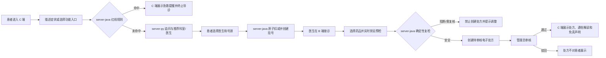

流程边界：C 端不直接调用 server-py；挂号、接诊、处方和审核均以 server-java 返回的业务状态为准。B/C 端不得用本地乐观状态替代业务写入结果。

### 2.1.2 实时对话时序

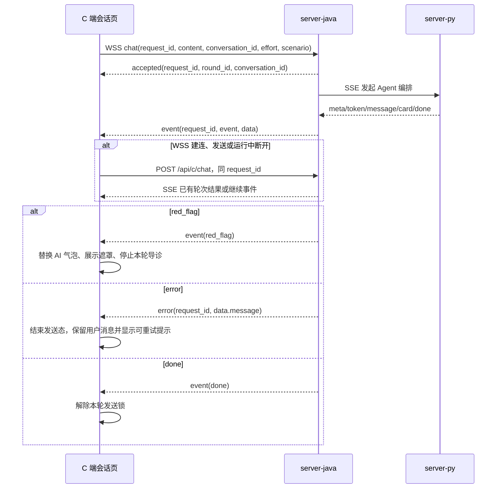

`message` 负责定稿正文并关闭该气泡的 `streaming`；只有 `done` 才释放页面级发送锁。WSS 失败仅允许以同一 `request_id` 回退一次 SSE，不生成新 ID、不自动重放工具。

## 2.2 迭代具体描述

### 2.2.1 C 端 AI 会话页

#### UI&交互

- 路由：`pages/chat/index`，小程序首页。
- 空态展示“小愈”欢迎语、三个推荐提问、健康档案引导卡和“我的挂号”入口。
- 输入区上方展示已启用的功能气泡：AI 诊室、找医院、看报告；未启用气泡不渲染。
- 输入区提供文本输入、推理档位切换、当前咨询人和发送按钮。
- AI 文本按 token 增量展示；最终 `message` 到达后结束生成态并显示免责声明。
- 医生、号源、医院、挂号单使用结构化卡片；红线命中时替换生成气泡并弹出红色遮罩，停止本轮导诊。
- 左上角抽屉展示最近会话，支持新对话、切换、续聊和长按删除。

#### 前端逻辑

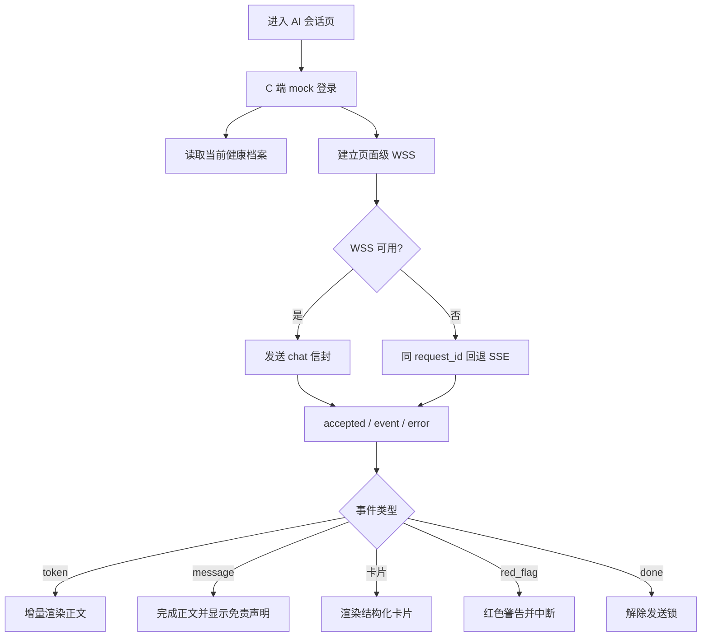

关键规则：

- 页面生命周期只维护一条 WebSocket，同一时刻只允许一轮对话。
- 每轮生成 1–64 字符的 `request_id`；WSS 失败回退 SSE 时复用同一 ID。
- WebSocket 断开不自动重新附着、不创建新 ID 重跑；用户重进页面后从会话消息恢复已完成结果。
- 当前 `chat-stream.js` 会把 `http/https` 机械映射为 `ws/wss` 后先尝试建连，失败再以同一 `request_id` 回退 SSE；“本地 HTTP 直接跳过 `ws://`”是票 34 的设计意图，但尚未在当前工具代码中实现，列入 5.3 已知问题。
- `Authorization: Bearer <JWT>` 只放请求头，不进入 URL。
- 用户消息立即入列表；AI 预置空气泡并进入 `streaming` 状态；收到 `done` 后解除发送锁。

###### 输入与控制字段

| 字段名称 | 说明 | 输入方式 | 必填 | 默认值 | 最大长度/范围 | 字段类型 | 提示文案 | 数据源 |
| --- | --- | --- | --- | --- | --- | --- | --- | --- |
| content | 本轮用户输入 | 单行输入/推荐提问 | Y | 无 | 非空；服务端校验 | string | 当前实现仍显示“发消息或按住说话…”，其中“按住说话”是遗留文案，当前没有语音交互 | 用户输入 |
| effort | 推理档位 | 循环切换 | Y | `auto` | `auto/quick/deep` | string | 自动/快速回答/深度思考 | `contracts/chat-defaults.json` |
| conversation_id | 当前会话 | 隐式状态 | N | `null` | 正整数 | number \| null | 无 | `meta` 事件/历史会话 |
| request_id | 对话轮次幂等键 | 前端生成 | Y | 无 | 1–64 字符 | string | 无 | 时间戳 + 随机串 |
| scenario | 场景 | 前端推导 | Y | `triage` | `triage/interpretation` | string | 无 | `contracts/chat-defaults.json` |
| longitude/latitude | 找医院定位 | 授权定位 | N | 不传 | 经度 ±180、纬度 ±90 | number | 授权定位后推荐附近医院 | `my.getLocation` |
| currentProfile | 当前咨询人 | 页面跳转选择 | N | 当前激活档案 | 正整数 ID | object \| null | 咨询人：未建档 | 健康档案接口 |

###### 功能入口与工具栏

| 名称 | 交互 | 显示、禁用控制 |
| --- | --- | --- |
| AI 诊室 | 插入客户端引导卡，提示描述不适 | 始终显示 |
| 找医院 | 先请求定位；失败切换“按区域查找”引导 | 始终显示；发送中不响应 |
| 看报告 | 打开图片/PDF 选择器 | 有当前健康档案才执行，否则跳转建档 |
| 拍药盒/皮肤/饮食/舌苔 | 当前版本不展示 | `enabled: false` |
| 推理档位 | 自动 → 快速回答 → 深度思考循环 | 本轮请求发送后参数不可变；当前代码仍可在生成期间切换 UI 档位，但只影响下一轮 |
| 新对话 | 清空当前页面会话状态 | 不删除历史业务实体 |
| 删除会话 | 长按历史项 → action sheet 选择“删除” → 二次确认 | 正在生成的当前会话禁用；只允许删除当前患者自己的会话 |

###### 消息展示字段

| kind/事件 | 展示内容 | 免责声明 |
| --- | --- | --- |
| `text` / `token` / `message` | AI 文本气泡、生成光标 | 仅最终 `message` 展示 |
| `doctor_recommendations` | 医生姓名、职称、擅长、照片、剩余号源 | 卡片携带时展示 |
| `doctor_slots` | 日期、时段、剩余号源、选择按钮 | 卡片携带时展示 |
| `hospital_recommendations` | 医院、等级、地址、距离 | 卡片携带时展示 |
| `appointment/appointments` | 医生、科室、日期、时段、序号、状态、病情摘要 | 病情摘要存在时展示 |
| `report_interpretation` | 摘要、指标、参考范围、优先级、解释和行动建议 | 必须展示 |
| `red_flag` | 规则名、警告正文、急救建议 | 不展示，因其是确定性规则结果 |

###### 操作按钮

| 名称 | 交互 | 二次确认 | 显示、禁用控制 |
| --- | --- | --- | --- |
| 发送 | 发起本轮请求 | N | 输入非空且当前无运行轮次 |
| 选择医生 | 生成带 `doctor_id` 的自然语言请求 | N | 医生推荐卡片 |
| 选择时段 | 生成带 `schedule_id` 的挂号请求 | N | 时段卡片且有剩余号源 |
| 我知道了 | 关闭红线遮罩 | N | 红线遮罩显示时 |
| 发送并解读 | 分页上传并最终解读 | N | 文件校验通过且未发送中 |

#### 所需 API

| 方法/协议 | 地址 | 用途 |
| --- | --- | --- |
| WebSocket | `/api/c/chat/ws` | 小程序实时主链路 |
| POST + SSE | `/api/c/chat` | WSS 失败时的同 ID 适配器与诊断入口 |
| GET | `/api/c/conversations` | 会话列表 |
| GET | `/api/c/conversations/{id}/messages` | 恢复历史消息 |
| DELETE | `/api/c/conversations/{id}` | 删除会话 |
| GET | `/api/c/health-profiles/current` | 当前咨询人 |

#### 国际化

当前产品只提供中文，不加载 i18n 资源。固定契约文案不得由页面自行翻译。

| key | 中文 | 英文 |
| --- | --- | --- |
| `ai.disclaimer` | 仅供参考，不替代医生诊断 | 暂不提供 |
| `chat.redFlag.title` | 紧急提醒 | 暂不提供 |
| `chat.input.placeholder` | 发消息或按住说话… | 暂不提供 |

### 2.2.2 C 端报告上传与解读

#### UI&交互

- “看报告”支持相机/相册图片和 PDF；图片最多 5 张，可调整顺序和移除；PDF 单次只能选择 1 份。
- 待发送区展示文件名、数量和脱敏提醒：“请先遮盖身份信息，原件不保存”。
- 多文件按页上传后调用 finalize；上传进度和“正在安全处理”状态可见。
- 结果卡按红/黄/蓝/绿优先级展示指标，但红色表示“尽快咨询（非急救）”，不能替代红线症状规则。

###### 文件字段

| 字段 | 必填 | 限制 | 类型 | 来源 |
| --- | --- | --- | --- | --- |
| request_id | Y | 1–64 字符 | string | 前端生成 |
| conversation_id | N | 当前会话 ID | number | 页面状态 |
| files | Y | JPEG/PNG/PDF；单文件 ≤10 MiB；图片总量 ≤20 MiB；1–5 个文件；PDF 单文件 | binary[] | 文件选择器 |
| page_index | Y（分片上传） | 从 0 起且不能重复 | integer | 上传队列 |
| total_files | Y（分片上传） | 1–5 | integer | 上传队列 |
| media_type | Y | 契约允许类型 | string | 文件元数据 |

#### 所需 API

| 方法 | 地址 | 用途 |
| --- | --- | --- |
| POST multipart | `/api/c/report-interpretation-uploads` | 单页/单文件暂存 |
| POST | `/api/c/report-interpretations/finalize` | 合并暂存文件并生成解读 |
| POST multipart | `/api/c/report-interpretations` | 非分片兼容入口 |

### 2.2.3 C 端健康档案页

#### UI&交互

- 路由：`pages/health/index`。
- 页面支持新建本人/家人档案、切换当前档案、维护过敏史和查看健康时间线。
- 新档案保存后自动设为当前档案；同一患者账号最多只有一份 `active=true` 的档案。
- 时间线聚合挂号、电子处方、报告解读；AI 内容展示免责声明。

###### 表单字段

| 字段名称 | 说明 | 输入方式 | 必填 | 默认值 | 最大长度 | 字段类型 | 提示文案 | 数据源 |
| --- | --- | --- | --- | --- | --- | --- | --- | --- |
| display_name | 姓名或称呼 | 输入 | Y | 无 | 50 | string | 姓名或称呼 | 用户输入 |
| gender | 性别 | picker | Y | 第一个选项 | 10 | string | 性别 | 页面枚举 |
| birth_date | 出生日期 | date picker | Y | 无 | 日期 | string(date) | 请选择 | 用户选择 |
| relationship | 与账号持有人关系 | picker | Y | 第一个选项 | 20 | string | 与我的关系 | 页面枚举 |
| allergies | 过敏药品或成分 | 输入 + 标签 | N | `[]` | 最多 30 项、每项 100 | string[] | 没有可不填 | 用户输入 |

###### 操作按钮

| 名称 | 交互 | 二次确认 | 显示、禁用控制 |
| --- | --- | --- | --- |
| 新建 | 展开创建表单 | N | 始终显示 |
| 保存并设为当前档案 | 创建并激活 | N | 表单校验通过 |
| 切换档案 | 激活所选档案并刷新时间线 | N | 已有档案 |
| 添加/移除过敏项 | 整体替换过敏史列表 | N | 当前档案存在 |

#### 所需 API

`GET/POST /api/c/health-profiles`、`GET /api/c/health-profiles/current`、`POST /api/c/health-profiles/{id}/activate`、`PUT /api/c/health-profiles/{id}/allergies`、`GET /api/c/health-profiles/{id}/timeline`。

### 2.2.4 C 端我的挂号页

#### UI&交互

- 路由：`pages/appointments/index`。页面顶部展示当前服务对象，并提供健康档案、电子处方和站内消息入口。
- `onShow` 先确保 mock 登录，再并行加载挂号列表和当前健康档案；从其他页面返回时会重新拉取。
- `loading` 时展示“正在加载”；成功且列表为空时展示空态；任一并行请求失败时 toast“挂号记录加载失败”，结束 loading 并保留当前内存数据。
- 挂号卡展示科室、医生、日期、时段、序号和状态；病情摘要为空时隐藏，存在时必须同时展示 `summary_disclaimer`。
- 仅状态为“已约”的挂号显示“取消挂号”；确认文案说明号源将自动返还。确认后调用接口，成功 toast 并全量刷新，失败保留原卡片。

#### 前端逻辑

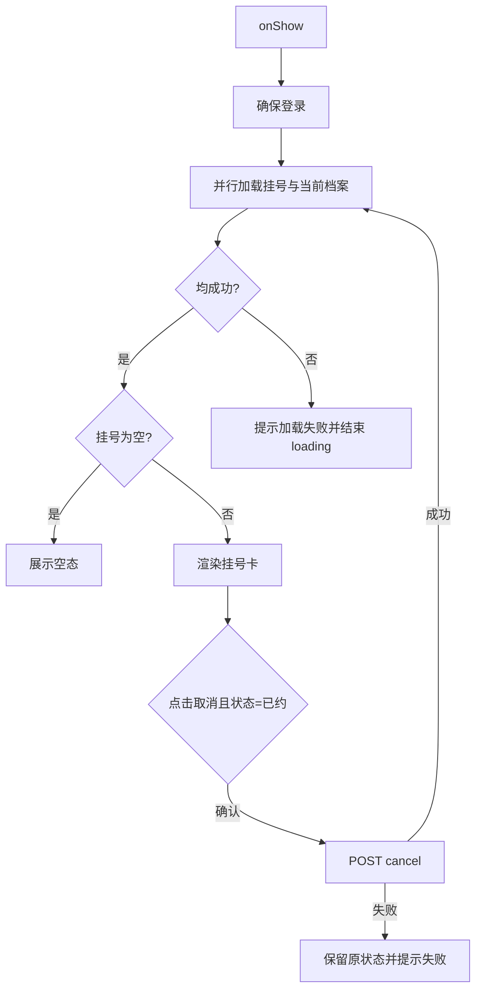

###### 列表展示字段

| 字段 | 说明 | 默认值/空值行为 |
| --- | --- | --- |
| department_name / doctor_name | 科室与医生 | 无 |
| schedule_date / time_slot | 就诊日期与时段 | 无 |
| sequence_number | 就诊序号 | 无 |
| status | 已约/已取消/已接诊 | 未知值按原文展示且不显示取消按钮 |
| condition_summary | Agent 病情摘要 | 空时隐藏 |
| summary_disclaimer | 摘要免责声明 | 有摘要时必须显示 |

###### 操作按钮

| 名称 | 交互 | 二次确认 | 显示、禁用控制 |
| --- | --- | --- | --- |
| 取消挂号 | 确认后取消并刷新 | Y，“确认取消这次挂号吗？号源将自动返还。” | 仅“已约”；请求期间应防重复点击 |
| 电子处方/站内消息/健康档案 | 页面跳转 | N | 始终显示 |

#### 所需 API

`GET /api/c/appointments`、`POST /api/c/appointments/{id}/cancel`、`GET /api/c/health-profiles/current`；详细契约见 2.6。

### 2.2.5 C 端我的电子处方页

#### UI&交互

- 路由：`pages/prescriptions/index`。`onShow` 重新拉取当前患者可见处方，server-java 只返回审核通过的数据。
- 加载时展示 loading；空数组展示“暂无可查看电子处方”；失败时 toast“电子处方加载失败”并结束 loading。
- 每张卡展示医生、日期、药品明细、处方备注、通俗解读和免责声明。AI 生成的 `interpretation` 存在时，`disclaimer` 不得省略。
- “模拟下单”仅在本地延迟 500ms 后显示成功，不创建订单、不支付、不调用接口；处理中记录 `orderingId`，成功后以 `orderedId` 禁用同一处方按钮。重新进入页面后该 Mock 状态不持久化。

#### 前端逻辑

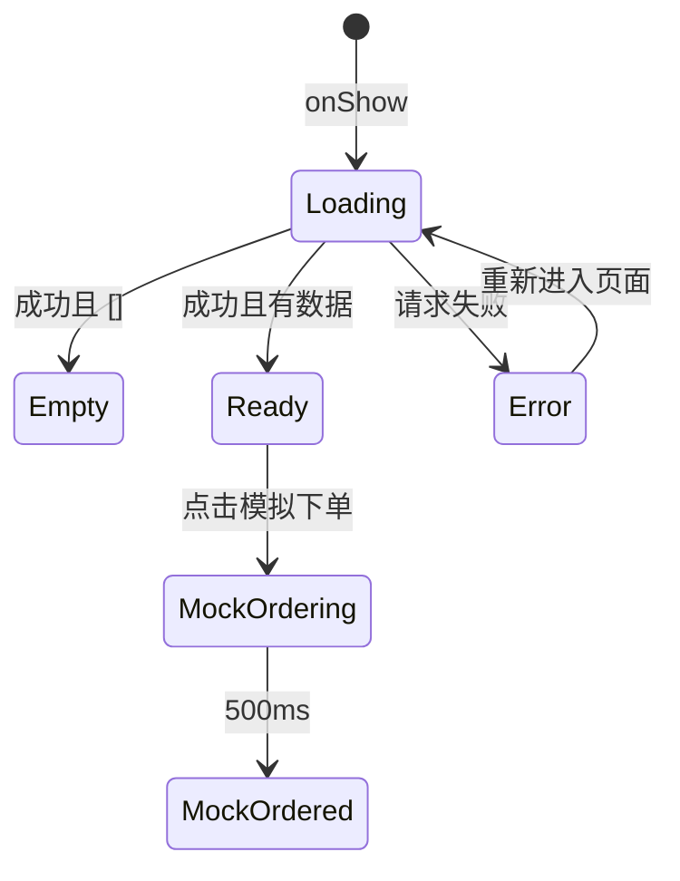

###### 展示字段

| 字段 | 说明 | 空值行为 |
| --- | --- | --- |
| id | 处方标识 | 必有 |
| department_name / doctor_name / date | 科室、医生和日期 | 缺失时不补造业务值 |
| items[] | 药名、规格、剂量、频次、疗程、备注 | 空数组视为异常响应并显示空明细 |
| interpretation | AI 通俗解读 | 空时隐藏 |
| disclaimer | AI 免责声明 | 有 AI 解读时必须展示 |

###### 操作按钮

| 名称 | 交互 | 二次确认 | 显示、禁用控制 |
| --- | --- | --- | --- |
| 模拟下单 | 本地展示 Mock 成功态 | N | 已审核处方；处理中 loading，成功后禁用 |

#### 所需 API

`GET /api/c/prescriptions`；详细契约见 2.6。

### 2.2.6 C 端站内消息页

#### UI&交互

- 路由：`pages/messages/index`。`onShow` 确保登录并全量刷新消息。
- 首次 loading 时展示加载态；成功空数组展示“暂无消息”；失败时 toast“消息加载失败”并结束 loading。当前 `onShow` 没有重新置 `loading=true`，再次进入时会保留旧列表直到新请求完成。
- 展示标题、正文和创建时间。当前没有未读数、已读状态、删除、分页和下拉刷新，不能在 UI 或验收口径中描述为已支持。

#### 前端逻辑

逻辑状态应为 `loading → ready/empty/error`。当前实现没有独立 `error` 数据位：首次请求失败后会先 toast，再因 `messages=[]` 呈现空态，无法持续区分“确实为空”和“加载失败”；此差异列入 5.3。用户通过重新进入页面重试。消息仅由 server-java 返回，本页不解析消息正文中的业务指令。

###### 展示字段

| 字段 | 说明 | 空值行为 |
| --- | --- | --- |
| id / type | 消息标识与类型 | `type` 当前不驱动交互 |
| title | 消息标题 | 按接口原值展示 |
| content | 消息正文 | 按纯文本展示 |
| disclaimer | AI 消息免责声明 | 接口携带时展示 |
| created_at | 创建时间 | 格式化失败时展示原值 |

#### 所需 API

`GET /api/c/messages`；详细契约见 2.6。

### 2.2.7 B 端登录页

#### UI&交互

- 路由：`/login`，不显示后台布局。
- 用户名和密码均必填；登录成功后拉取 `/me`，根据角色完整跳转到角色首页。
- token 失效或接口返回 401 时清理本地会话并返回登录页。

###### 表单字段

| 字段 | 输入方式 | 必填 | 最大长度 | 类型 | 提示文案 |
| --- | --- | --- | --- | --- | --- |
| username | 文本输入 | Y | 50 | string | 用户名 |
| password | 密码输入 | Y | 128 | string | 密码 |

#### 所需 API

`POST /api/b/auth/login`、`GET /api/b/auth/me`。

### 2.2.8 B 端医院、科室、医生管理

#### UI&交互

- 三个页面均使用 ProTable + ModalForm；当前全量加载、不分页。
- 新建/编辑成功后关闭弹窗并刷新列表；删除前二次确认。
- 科室表把 `hospital_id` 映射为医院名称；医生表把 `department_id` 映射为科室名称。
- 仅 `admin` 可见并可访问。

###### 列表筛选与展示字段

| 页面 | 可搜索字段 | 展示字段 |
| --- | --- | --- |
| 医院 | 医院名称、等级 | ID、医院名称、等级、地址、经度、纬度 |
| 科室 | 科室名称 | ID、科室名称、所属医院、楼层、位置 |
| 医生 | 姓名 | ID、姓名、所属科室、职称、擅长、照片 URL |

###### 表单字段

| 页面 | 字段 | 必填 | 最大长度/范围 | 输入方式 | 数据源 |
| --- | --- | --- | --- | --- | --- |
| 医院 | name | Y | 100 | 文本 | 用户输入 |
| 医院 | level | Y | 30 | 文本 | 用户输入 |
| 医院 | address | Y | 255 | 文本 | 用户输入 |
| 医院 | longitude | Y | -180～180 | 数字 | 用户输入 |
| 医院 | latitude | Y | -90～90 | 数字 | 用户输入 |
| 科室 | hospital_id | Y | 正整数 | 下拉单选 | 医院列表接口 |
| 科室 | name/floor/location | Y | 100/30/255 | 文本 | 用户输入 |
| 医生 | department_id | Y | 正整数 | 下拉单选 | 科室列表接口 |
| 医生 | name/title/specialty/photo_url | Y/Y/Y/Y（服务端） | 50/50/文本/500 | 文本 | 用户输入 |

> 注意：当前医生表单未把 `photo_url` 标为前端必填，但 server-java 要求非空；这是已知前后端校验差异，发布前应统一。

###### 操作按钮

| 名称 | 交互 | 二次确认 | 显示、禁用控制 |
| --- | --- | --- | --- |
| 新建 | 打开空表单 | N | admin |
| 编辑 | 打开回填表单 | N | admin |
| 删除 | 调用 DELETE 后刷新 | Y，“确认删除该…？” | admin；关联数据导致 409 时保留当前行并提示 |

#### 所需 API

`GET/POST /api/b/hospitals`、`PUT/DELETE /api/b/hospitals/{id}`；科室和医生使用同样的 REST 结构，资源名分别为 `departments`、`doctors`。

### 2.2.9 B 端医生接诊台

#### UI&交互

- 路由：`/workbench`，仅 `doctor` 可见。
- 首页展示当前医生今日排班和已用/总号源，挂号患者表展示序号、患者、时段、状态。
- 点击“接诊/查看”并行加载挂号详情和药品列表，抽屉中展示 AI 病情摘要及免责声明。
- 开方选择变化后 300ms 防抖调用确定性禁忌检查；`blocked=true` 时展示原因并禁用提交。
- 提交电子处方后显示“等待管理员审核”；完成接诊需填写诊断结论和医嘱。

###### 接诊与开方字段

| 字段 | 说明 | 输入方式 | 必填 | 最大长度 | 数据源 |
| --- | --- | --- | --- | --- | --- |
| medication_id | 药品 | 下拉单选，可多行 | Y | 正整数 | 药品接口 |
| dosage | 单次剂量 | 输入 | Y | 100 | 医生输入 |
| frequency | 频次 | 输入 | Y | 100 | 医生输入 |
| duration | 疗程 | 输入 | Y | 100 | 医生输入 |
| item.notes | 单药备注 | 输入 | N | 500 | 医生输入 |
| prescription.notes | 处方备注 | 多行输入 | N | 1000 | 医生输入 |
| diagnosis | 诊断结论 | 多行输入 | Y | 2000 | 医生输入 |
| advice | 医嘱 | 多行输入 | Y | 2000 | 医生输入 |

#### 所需 API

`GET /api/b/reception`、`GET /api/b/reception/appointments/{id}`、`GET /api/b/reception/medications`、`POST /api/b/reception/appointments/{id}/contraindication-check`、`POST /api/b/reception/appointments/{id}/prescriptions`、`POST /api/b/reception/appointments/{id}/complete`。

### 2.2.10 B 端电子处方审核页

#### UI&交互

- 路由：`/prescriptions`，仅 `admin` 可见。
- 默认只加载 `PENDING` 处方；表格展示处方、挂号单、患者、医生、药品和状态。
- “通过”直接提交；“驳回”打开原因弹窗，原因为空时禁用确认。

###### 操作按钮

| 名称 | 交互 | 二次确认 | 显示、禁用控制 |
| --- | --- | --- | --- |
| 通过 | 决定值 `APPROVE`，成功后刷新 | N | 待审核处方 |
| 驳回 | 决定值 `REJECT`，必须填写原因 | Y（弹窗） | 待审核处方且原因非空 |

#### 所需 API

`GET /api/b/prescriptions?status=PENDING`、`POST /api/b/prescriptions/{id}/review`。

## 2.3 菜单与权限变动

| 角色 | 首页 | 可见菜单 | 禁止访问 |
| --- | --- | --- | --- |
| `admin` | `/hospitals` | 医院管理、科室管理、医生管理、电子处方审核 | 接诊台 |
| `doctor` | `/workbench` | 接诊台 | 医院/科室/医生管理、处方审核 |
| 未登录 | `/login` | 无 | 除登录外全部路由 |

权限由 Umi `access.ts` 控制菜单可见性，由 `onRouteChange` 做前端路由守卫，server-java 再做最终角色校验。前端权限只改善体验，不能作为安全边界。

当前 server-java 已有排班 CRUD，但 B 端没有排班管理路由和页面；本文不把它描述为已交付前端能力。

## 2.4 前端核心数据模型与状态设计

### 2.4.1 核心 TypeScript 形状

以下类型用于表达跨页面契约；小程序虽使用 JavaScript，也必须按相同字段形状消费，不得另造状态值。状态、决定和消息类型分别从 `contracts/chat-realtime.json`、`contracts/sse-events.json`、`contracts/prescription-flow.json` 与 `contracts/contraindication.json` 推导。

```ts
type Role = 'admin' | 'doctor';
interface CurrentUser { username: string; role: Role; doctor_id: number | null }

type ChatRoundStatus = 'ACCEPTED' | 'RUNNING' | 'COMPLETED' | 'FAILED';
type ChatUiStatus = 'idle' | 'connecting' | 'sending' | 'streaming' | 'fallback' | 'done' | 'error';
type ChatEvent =
  | 'meta' | 'knowledge' | 'token' | 'message' | 'done' | 'red_flag'
  | 'doctor_recommendations' | 'doctor_slots' | 'hospital_recommendations'
  | 'appointment' | 'appointments';
interface ChatEnvelope<T = unknown> {
  type: 'chat' | 'accepted' | 'event' | 'error';
  request_id: string;
  event?: ChatEvent;
  data: T;
}
interface ChatMessage {
  id: number;
  role: 'user' | 'assistant';
  kind: string;
  content?: string;
  card?: unknown;
  disclaimer?: string;
  streaming?: boolean;
}

interface HealthProfile {
  id: number; display_name: string; gender: string; birth_date: string;
  relationship: string; allergies: string[]; active: boolean;
}
interface Appointment {
  appointment_id: number; schedule_id: number; doctor_id: number;
  doctor_name: string; department_name: string; schedule_date: string;
  time_slot: string; sequence_number: number; status: string;
  condition_summary?: string; summary_disclaimer?: string; created_at: string;
}

type PrescriptionStatus = 'PENDING' | 'APPROVED' | 'REJECTED';
type SafetyDecision = 'SAFE' | 'BLOCKED' | 'REVIEW_REQUIRED';
interface SafetyCheckResult {
  decision: SafetyDecision; message_type: string; blocked: boolean;
  reasons: string[]; message: string; advice?: string | null;
}
```

注意：B 端现有 `Prescription` 展示类型使用中文状态标签，契约事实源仍是英文状态码及其 label 映射。新增代码不得把中文 label 当成可提交的状态值。

### 2.4.2 状态归属与生命周期

| 状态 | 事实源/存放位置 | 初始化 | 更新与清理 | 恢复策略 |
| --- | --- | --- | --- | --- |
| C 端 JWT、患者 | 小程序同步 storage | `ensureLogin` | mock 登录成功写入；当前无显式退出入口 | 请求失败不打印 token；重新进入页面再次确保登录 |
| B 端 JWT、当前用户 | localStorage + Umi initialState | 登录后 `/me` | 401 或退出时同时清 token 和用户缓存 | 有 token 时启动调用 `/me`，失败回登录 |
| 当前健康档案 | server-java；页面仅持有快照 | 页面 `onShow` 拉取 | 新建/激活/过敏史更新成功后刷新或替换 | 不跨账号缓存；接口结果覆盖本地快照 |
| 会话与历史消息 | server-java 持久化；chat 页内存渲染态 | 冷启动为空会话 | `meta` 设置 conversationId；切历史全量覆盖；新对话只清本地 | 页面重进不自动附着运行轮次，只能恢复已持久化消息 |
| 当前对话轮次 | 页面级 channel + `sending` | idle | 同时最多一个；`done/error` 清理 | WSS 失败同 ID 回退 SSE；不得新 ID 重跑 |
| 报告待发送队列 | chat 页内存 | 空 | 选择、排序、移除；finalize 成功清空 | 页面卸载即丢弃；服务端暂存清理由 server-java 负责 |
| admin 列表/表单 | React 页面 state + ProTable | 进页拉取 | 写成功后 reload；失败保留原表格数据 | 不做跨页缓存 |
| 接诊与处方草稿 | Workbench/Drawer/Form 局部 state | 打开抽屉加载 | 关闭或切挂号时销毁；处方成功标记 created | 不持久化草稿；业务状态以重新拉取为准 |
| Mock 下单 | 电子处方页内存 | null | 500ms 后 `orderedId=id` | 离页后不恢复，明确不代表订单状态 |

### 2.4.3 状态机

#### Chat 状态机

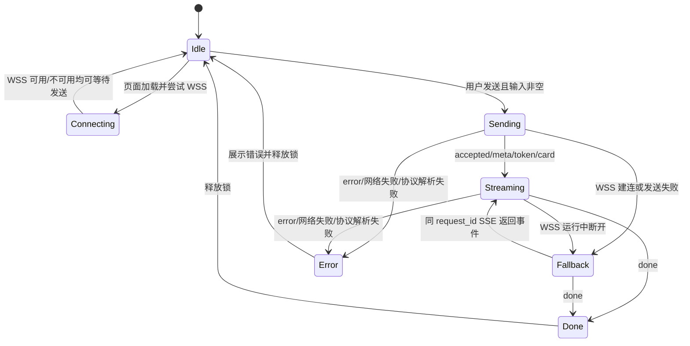

#### Auth 状态机

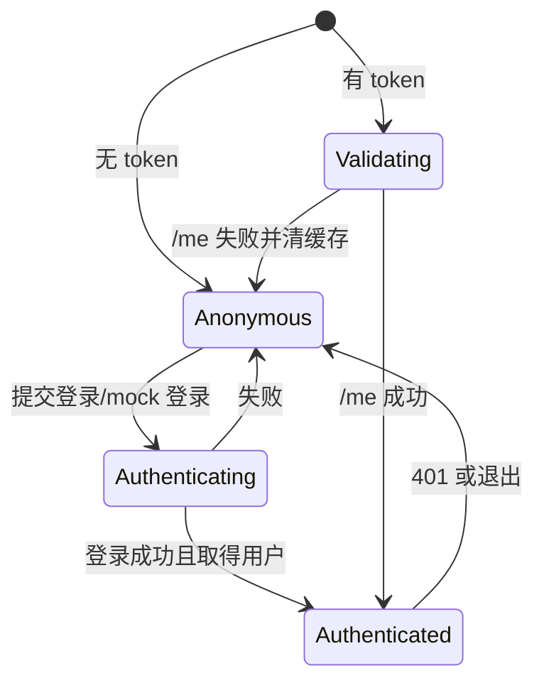

#### Upload 状态机

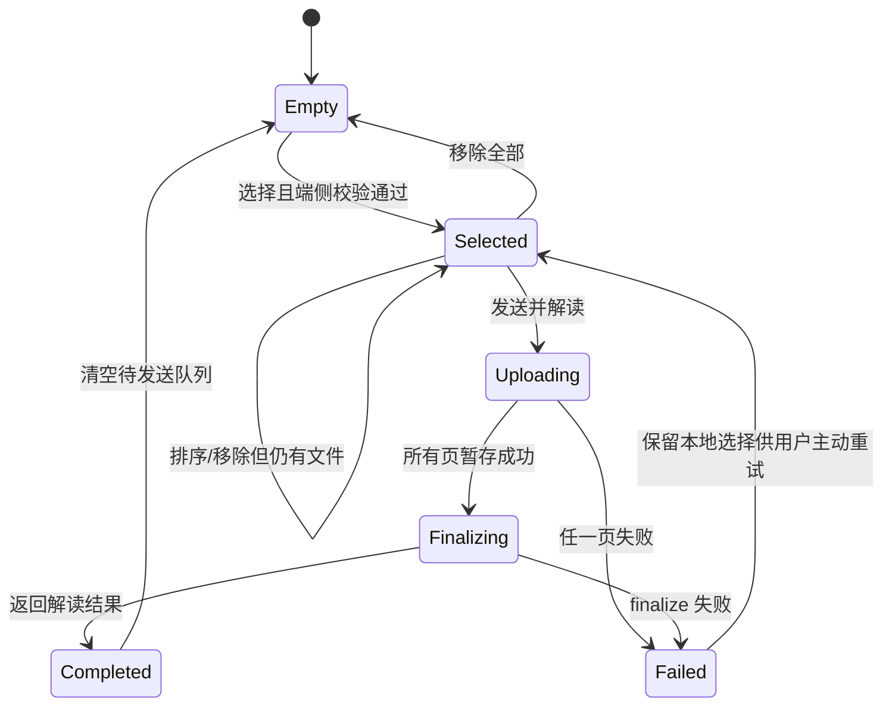

#### Contraindication 状态机

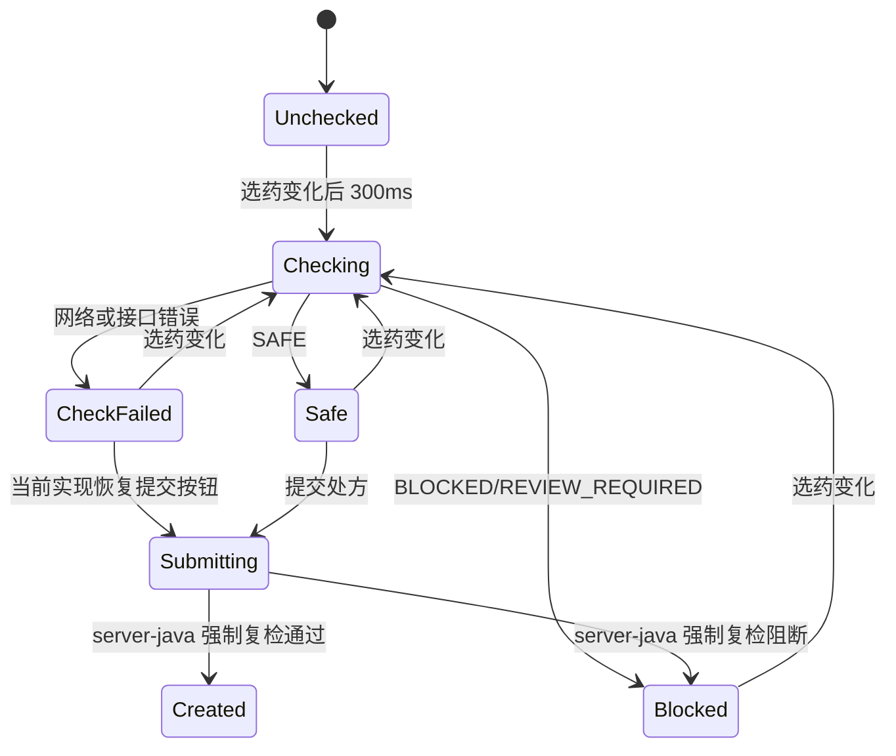

当前实现中，预检请求失败会清空 `safety` 并在 `checking=false` 后恢复提交按钮；这不是安全绕过，因为创建处方接口会在 server-java 内复跑同一确定性规则并 fail closed。UI 应显示“预检失败，将在提交时再次检查”，避免用户把空卡片理解为安全。

## 2.5 报告上传与跨端诊疗流程

### 2.5.1 报告上传时序

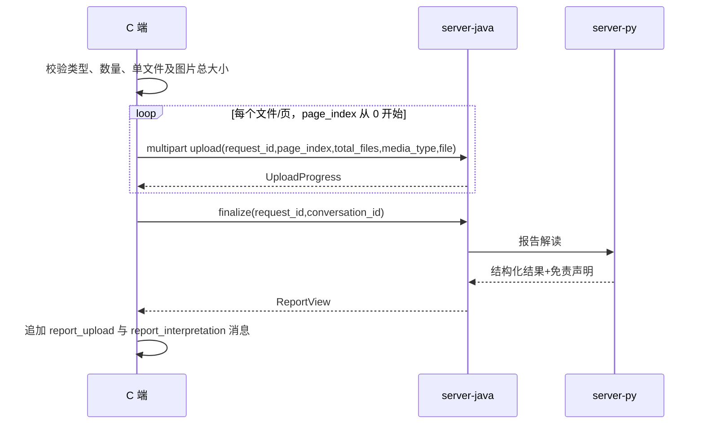

任一暂存上传失败时不调用 finalize；当前前端保留所选文件，但每次用户重新点击“发送并解读”都会生成新的 `request_id`，并从第 0 页重新上传整批文件。它不会自动重试，也不会续传旧批次；旧暂存批次由 server-java 清理。单次提交内部必须始终复用同一 `request_id`，finalize 也只能引用该批次。

### 2.5.2 接诊、开方与审核时序

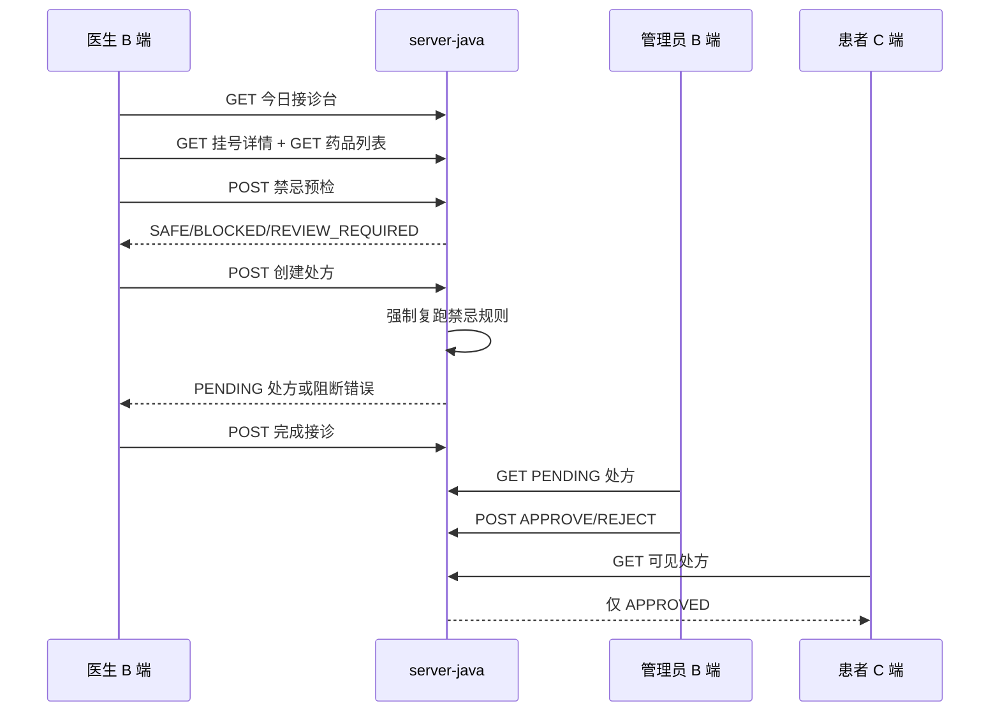

## 2.6 API 适配规约

### 2.6.1 通用约定

- B/C 端所有业务接口均请求 server-java 的 `/api` 路径；C 端 service 内写 `/c/...` 是因为 `apiBaseUrl` 已含 `/api`。
- 除登录外均使用 `Authorization: Bearer <JWT>`；token 禁止进入 URL、日志、埋点和错误文案。
- JSON 使用 `snake_case` 与 server-java DTO 对齐；时间按接口返回的 ISO 字符串展示，不由前端猜测时区。
- 统一错误体为 `{"detail":"文案"}` 或 `{"detail":{"code":"业务码","message":"文案"}}`。B 端优先显示 `detail.message/detail`，C 端普通 JSON 请求当前只显示状态码，属于 5.3 已知问题。
- 读取接口可以由用户重新进入页面重试；写接口不得无条件自动重试。对话和报告以 `request_id` 幂等，其他写操作以服务端当前状态判定，前端需防重复点击。

### 2.6.2 C 端接口

| 接口 | 请求 | 2xx 响应 | 关键失败与前端处理 | 幂等/刷新 |
| --- | --- | --- | --- | --- |
| `POST /api/c/auth/mock-login` | `{nickname: string(1..50)}`；无需 token | 200 `{token,patient}` | 400 校验失败；5xx/断网提示登录失败 | 非业务写入；成功覆盖本地 token/patient |
| `GET /api/c/health-profiles` | 无 | 200 `HealthProfile[]` | 401 重新确保登录；失败保留页面数据 | 可重试；新建/激活后刷新 |
| `GET /api/c/health-profiles/current` | 无 | 200，profile 为 `HealthProfile` 或 null | 失败按未加载处理，不能伪造档案 | 可重试 |
| `POST /api/c/health-profiles` | `display_name,gender,birth_date,relationship,allergies[]` | 201 `HealthProfile` | 400 字段/日期错误；创建失败保留表单 | 非幂等；提交期间禁重复，成功刷新 |
| `POST /api/c/health-profiles/{id}/activate` | 无 | 200 `HealthProfile` | 403/404 不属于当前患者；失败保留当前档案 | 对同 ID 结果幂等；成功刷新时间线 |
| `PUT /api/c/health-profiles/{id}/allergies` | `{allergies: string[0..30]}`，单项 1..100 | 200 `HealthProfile` | 400/403/404；失败回退本地草稿 | 整体替换；成功替换当前快照 |
| `GET /api/c/health-profiles/{id}/timeline` | 无 | 200 `TimelineEntry[]` | 403/404 或加载失败提示 | 可重试 |
| `GET /api/c/conversations` | 无 | 200 `{id,title,last_active_at}[]`，最多 50 | 失败保持抽屉打开并提示 | 可重试 |
| `GET /api/c/conversations/{id}/messages` | 无 | 200 `MessageOut[]` | 403/404/损坏卡片；失败不覆盖当前会话 | 可重试；成功全量覆盖回放区 |
| `DELETE /api/c/conversations/{id}` | 无 | 204 无 body | 403/404；失败保留列表项 | 不自动重试；成功本地移除，当前会话被删则清空页面 |
| `GET /api/c/appointments` | 无 | 200 `Appointment[]` | 失败显示 toast 并结束 loading | 可重试；取消成功后刷新 |
| `POST /api/c/appointments/{id}/cancel` | 无 | 200 更新后的 `Appointment` | 404 非本人/不存在；409 状态不可取消 | 服务端按状态保护；前端确认且防重复 |
| `GET /api/c/prescriptions` | 无 | 200 仅已审核 `Prescription[]` | 失败展示加载失败 | 可重试 |
| `GET /api/c/messages` | 无 | 200 `InAppMessage[]` | 失败展示加载失败 | 可重试；当前无已读写入 |

### 2.6.3 对话与报告协议

| 协议/接口 | 请求 | 成功响应 | 失败/结束 | 幂等规则 |
| --- | --- | --- | --- | --- |
| `WSS /api/c/chat/ws` | `{type:'chat',request_id,data:{content,conversation_id?,effort,scenario,longitude?,latitude?}}` | `accepted` 后若干 `event`；每个信封带相同 request_id | `error` 结束；`event:done` 释放发送锁 | 页面同一时刻一轮；断线同 ID 转 SSE |
| `POST /api/c/chat` | JSON 同 WSS data，并把 `request_id` 放顶层 | 200 `text/event-stream` | 非 200 或解析失败进入 error | 同 patient+request_id 复用既有轮次，不新建工具执行 |
| `POST /api/c/report-interpretation-uploads` | multipart：`request_id,page_index,total_files,media_type,file` | 200 `UploadProgress` | 422 参数/类型/大小非法；409 批次数量不一致；失败停止后续页 | 同一批 request_id 与 page_index 不得代表不同文件 |
| `POST /api/c/report-interpretations/finalize` | request_id 必填，conversation_id 为数字或 null | 200 `{report_interpretation_id,conversation_id,status,page_count,result,disclaimer}` | 文件不齐、暂存不存在、Agent 失败时不追加结果卡 | 同 request_id 重试不得生成重复业务结果 |
| `POST /api/c/report-interpretations` | multipart：`request_id,conversation_id?,files[]` | 200 同 ReportView | 兼容入口，前端主流程不使用 | request_id 幂等 |

事件消费规则：`meta` 更新会话 ID；`token` 只追加展示；`message` 以最终正文覆盖 token 累积并写免责声明；卡片事件追加独立消息；`red_flag` 替换当前 AI 文本气泡；`done` 只改变轮次状态。当前 `dispatchEvent` 对 `knowledge` 和未知事件均静默忽略，尚未记录事件类型或展示知识源状态；目标实现应仅记录脱敏类型后忽略，禁止渲染为 HTML。

### 2.6.4 B 端接口

| 接口 | 请求 | 2xx 响应 | 关键失败与前端处理 | 写后行为 |
| --- | --- | --- | --- | --- |
| `POST /api/b/auth/login` | `{username,password}` | 200 `{access_token,token_type}` | 400/401 显示失败且不缓存；成功后必须 GET `/me` | 写 token 后按角色跳转 |
| `GET /api/b/auth/me` | Bearer token | 200 `{username,role,doctor_id}` | 401 清 token 和用户缓存并回 `/login` | 刷新 initialState |
| `GET/POST /api/b/hospitals`；`PUT/DELETE /api/b/hospitals/{id}` | POST/PUT body：`name,level,address,longitude,latitude` | GET/PUT 200；POST 201；DELETE 204 | 400 校验；404；409 关联约束；403 非 admin | 写成功关闭弹窗并 reload，失败保留表单/行 |
| `GET/POST /api/b/departments`；`PUT/DELETE /api/b/departments/{id}` | POST/PUT body：`hospital_id,name,floor,location` | 同上 | 同上；下拉医院加载失败时表单不可提交 | 同上 |
| `GET/POST /api/b/doctors`；`PUT/DELETE /api/b/doctors/{id}` | POST/PUT body：`department_id,name,title,specialty,photo_url` | 同上 | 同上；`photo_url` server-java 必填 | 同上 |
| `GET /api/b/reception` | doctor token | 200 `{date,schedules[],appointments[]}` | 403 非医生/未绑定医生；失败展示错误态 | 完成接诊后刷新 |
| `GET /api/b/reception/appointments/{id}` | 无 body | 200 `{appointment,diagnosis?,advice?,completed_at?}` | 404 非当前医生或不存在；403 非 doctor/未绑定 doctor | 可重试，不覆盖其他抽屉数据 |
| `GET /api/b/reception/medications` | 无 body | 200 `Medication[]` | 失败时开方表单不可用 | 打开接诊抽屉时与详情并行加载 |
| `POST .../{id}/contraindication-check` | `{medication_ids:number[1..20]}` | 200 `SafetyCheckResult` | 400/403/404；依赖不可用返回 REVIEW_REQUIRED/阻断语义 | 300ms 防抖；旧请求结果不得覆盖新选择 |
| `POST .../{id}/prescriptions` | `{notes?,items[1..20]}` | 200 `Prescription`，状态 PENDING | 400；403；404；409 重复/状态冲突；禁忌阻断 | 提交中禁用；成功标记已创建，不自动重复 |
| `POST .../{id}/complete` | `{diagnosis,advice}`，各 1..2000 | 200 `AppointmentDetail` | 400/403/404/409；失败保留表单 | 成功刷新接诊台 |
| `GET /api/b/prescriptions?status=PENDING` | query 状态来自契约 | 200 `Prescription[]` | 403 非 admin；失败保留当前表格 | 审核后刷新 |
| `POST /api/b/prescriptions/{id}/review` | decision 为 APPROVE 或 REJECT，reason 可选但 REJECT 时必填 | 200 更新后的 `Prescription` | 400；403；404；409 已被审核 | 提交中应禁用该行；成功关闭弹窗并刷新 |

## 2.7 统一边界与异常矩阵

| 场景 | 检测位置 | 用户反馈 | 状态恢复/重试 | 禁止行为 |
| --- | --- | --- | --- | --- |
| 输入为空、超长或格式错误 | 表单 + server-java 400 | 字段就地提示；服务端消息作补充 | 保留输入，修正后提交 | 不发送无效请求 |
| 401/token 失效 | 请求适配器 | B 端回登录；C 端重新 ensureLogin，失败 toast | 清理失效缓存后重新认证 | 不循环重试，不打印 token |
| 403 越权 | server-java | “无权访问该数据/页面” | B 端回角色首页；C 端保留原页面 | 不以隐藏按钮替代服务端鉴权 |
| 404 资源不存在或不属于当前主体 | server-java | “数据不存在或已变化” | 关闭详情或刷新列表 | 不继续用旧 ID 写入 |
| 409 状态冲突/关联数据不可删/已审核 | server-java | 展示业务原因 | 刷新受影响行或列表 | 不自动重复写操作 |
| 429 限流 | server-java | “操作频繁，请稍后再试” | 用户主动重试；保留输入 | 不立即循环重试 |
| 5xx、断网、超时 | 请求层 | 通用失败文案，报告优先展示详细错误 | 读取可重试；写操作先刷新确认状态 | 不假定写入失败，不盲目重放 |
| 列表为空 | 页面 | 明确空态和下一步入口 | `onShow`/手动重进刷新 | 不把加载失败伪装为空态 |
| 连续点击提交 | 页面状态 | 按钮 loading/disabled | 请求完成后恢复 | 不并发创建档案、处方、审核或取消 |
| WSS 建连/发送失败 | chat channel | 页面不中断，切 SSE | 仅同 request_id 回退一次 | 不新建 request_id，不把 JWT 放 URL |
| WSS 运行中断开 | chat channel | 可显示通道切换状态 | 同 ID SSE 继续；最终可从历史恢复 | 不自动附着并行轮次 |
| SSE 非 200/格式损坏/无 done | chat parser | 当前 AI 气泡显示错误 | 释放发送锁；用户主动重试 | 不把半截正文标为完成结果 |
| 未知 SSE 事件 | event dispatcher | 不打扰用户 | 记录事件类型并忽略 | 不执行未知卡片动作 |
| 红线症状 | server-java 规则 | 红色遮罩和急救建议 | 用户关闭遮罩后可新开一轮 | 不继续医生推荐/挂号工具，不加 AI 免责声明 |
| 定位拒绝/失败 | 支付宝能力 | 提示按区域查找 | 发送无经纬度的降级引导 | 不阻塞普通对话 |
| 报告类型、数量、大小超限 | 端侧 + server-java | 明确指出限制 | 返回选择态 | 不开始上传 |
| 报告部分页上传失败 | 上传队列 | 显示失败原因和已完成进度 | 保留选择；用户主动整批重试 | 不调用 finalize |
| finalize 失败 | server-java/server-py | “报告解读失败” | 保留本地文件选择 | 不追加成功卡片，不伪造解读 |
| 历史卡片 JSON 损坏 | 回放解析 | 降级为不可交互原始卡片/文本 | 允许切换其他会话 | 不执行缺 ID 的卡片按钮 |
| 挂号已售罄/重复挂号 | server-java 原子号源逻辑 | 展示冲突原因 | 刷新医生时段/挂号列表 | 不乐观生成挂号卡 |
| 取消时状态已变化 | server-java 409 | 提示不可取消 | 刷新挂号列表 | 不本地改成已取消 |
| 禁忌预检 BLOCKED/REVIEW_REQUIRED | server-java + 表单 | 红色原因和建议 | 修改药品后重检 | 禁止提交按钮 |
| 禁忌预检网络失败 | 表单 | 当前实现应补“预检失败，提交时将复检” | 恢复按钮；提交接口强制复检 | 不显示“安全”结论 |
| 审核被其他管理员先完成 | server-java 409 | 提示状态已变化 | 关闭弹窗并刷新列表 | 不覆盖已完成决定 |
| AI 内容缺免责声明 | 卡片/消息适配层 | 使用 `contracts/disclaimer.json` 固定文案兜底 | 记录脱敏异常类别 | 不展示无免责声明的 AI 结果 |

## 2.8 页面可编码完成条件

每个页面进入开发或重构前，必须同时具备：路由和权限、区域/UI 说明、字段定义、loading/empty/error/submitting 状态、主流程和异常流程、接口请求/响应、刷新策略、契约事实源和验收条件。仅有接口路径或静态页面截图不视为系分完成。

## 2.9 模块划分与工作量评估

以下为按当前实现重新开发或大幅改造的参考估算，单位为人日，不代表既有票单实际耗时。

| 模块 | 细节 | 开发 | 联调 | 自测 | 前端 | server-java/server-py |
| --- | --- | ---: | ---: | ---: | --- | --- |
| C 端 AI 会话 | WSS/SSE、流式消息、卡片、红线、历史 | 4.0 | 2.0 | 1.5 | 小程序 | 双栈 |
| 报告解读 | 文件选择、分片上传、结构化卡片 | 2.5 | 1.5 | 1.0 | 小程序 | 双栈 |
| 健康档案 | 新建、切换、过敏史、时间线 | 2.0 | 1.0 | 1.0 | 小程序 | server-java |
| 患者业务页 | 挂号、处方、消息 | 1.5 | 1.0 | 0.5 | 小程序 | server-java |
| B 端组织管理 | 登录、医院/科室/医生 CRUD | 2.5 | 1.0 | 0.5 | React | server-java |
| B 端诊疗闭环 | 接诊、开方、安全检查、审核 | 3.5 | 2.0 | 1.0 | React | 双栈 |
| 发布验收 | 双端人工主流程、控制台检查 | 0.5 | 0.5 | 1.0 | 双端 | 双栈 |

建议节奏：系分评审 1 天 → C/B 端分线实现 5–7 天 → 双栈联调 2 天 → 浏览器与支付宝开发者工具验收 1–2 天 → 演示发布 0.5 天。

## 3. 监控和埋点

当前前端未接入独立埋点平台，发布验收以 server-java 脱敏日志、浏览器控制台和支付宝开发者工具控制台为主。

| 观察项 | 记录位置 | 内容 | 隐私要求 |
| --- | --- | --- | --- |
| 对话 accepted/首事件/首 token/完成耗时 | server-java | roundId、事件数、耗时、错误类别 | 不记录患者原文 |
| WSS 建连/回退 | C 端开发日志 | 通道状态和错误类别 | 不打印 JWT |
| API 失败 | B/C 端统一错误提示 | HTTP 状态与用户可见文案 | 不展示内部堆栈 |
| 页面验收 | 浏览器/开发者工具 | 登录、主流程、无控制台错误 | 不截图真实患者数据 |

后续若接入正式埋点，建议至少增加：会话发送成功率、WSS 使用率、SSE 回退率、首 token P50/P95、报告解读成功率、挂号成功/售罄率、禁忌拦截次数和处方审核转化；参数只允许记录枚举、ID 哈希或脱敏摘要。

### 3.1 可验收性能预算

以下是本地 demo 的前端验收预算，不承诺云数据服务或真实模型的公网 SLA；超出预算时需记录环境、请求 ID（不得含患者原文）和瓶颈归属。

| 指标 | 预算/验收口径 | 超限处理 |
| --- | --- | --- |
| B 端首屏可交互 | 本地开发机冷启动后 ≤ 3s，不含首次依赖安装 | 检查 bundle、重复请求和阻塞脚本 |
| B/C 普通 JSON API | 本地 server-java 条件下 P95 ≤ 1s | 显示 loading；超过 30s 按超时失败 |
| 对话 accepted | WSS 发送后 P95 ≤ 1s | 未 accepted 且通道失败时同 ID 回退 SSE |
| 首 token | 真实模型演示目标 P50 ≤ 3s、P95 ≤ 8s | 展示生成态；记录脱敏耗时，不伪造 token |
| token 渲染 | 连续输出时不明显卡顿；单次 setData 只更新目标消息 | 禁止每次重建无关卡片或写 storage |
| 报告上传反馈 | 点击后 300ms 内出现进度；每页完成更新一次 | 超时保留文件并允许主动重试 |
| B 端组织列表 | 当前全量加载建议单资源 ≤ 500 条 | 超过后必须先设计服务端分页再扩容 |
| 会话历史 | 接口上限 50 个会话；单会话当前全量消息 | 长会话出现卡顿时引入分段渲染，不自行截断服务端数据 |

### 3.2 监控核对清单

- 发布前记录一次 WSS 成功和一次强制 SSE 回退的 accepted、首 token、done 耗时。
- 分别核对 401、409、429、5xx 的用户提示，确认控制台无未处理 Promise rejection。
- 核对所有 AI 文本、推荐卡、报告解读、病情摘要与通俗处方解读均显示固定免责声明。
- 报告上传核对 1 张、5 张、单 PDF、超限文件和中途失败；不得记录文件内容或患者原文。

## 4. 发布计划

本项目当前是本地运行 demo，不部署 server-java、server-py、B 端或小程序代码到云服务器。发布指“形成可演示构建并完成本地联排”。

| 阶段 | 操作 | 准入条件 |
| --- | --- | --- |
| 发布前 | `npm --prefix admin run typecheck`、`npm --prefix admin run build`、`npm --prefix miniprogram ci` | 命令通过 |
| 双栈准备 | 本地启动 server-py、server-java、admin | `/api/health` 正常；不得执行日常 `docker compose up` |
| B 端验收 | 浏览器走通 admin 登录 → 组织页；doctor 登录 → 接诊台 | 无控制台错误，权限跳转正确 |
| C 端验收 | 开发者工具走通登录 → 对话流式 → 挂号 → 历史恢复 → 报告解读 | 无控制台错误，免责声明完整 |
| 灰度方式 | 先使用 fake/固定演示数据，再切真实模型演示 | 真实模型 TTFT 与失败降级已检查 |
| 发布确认 | 固化本地版本、演示账号和录屏兜底 | 不修改云端 Compose，不上传应用 |

回滚方案：回到上一可演示 Git 提交并重新执行本地构建；数据库 schema 变更按项目约定由维护者执行 drop + recreate + seed，禁止在演示库上临时手改结构。若 WSS 不可用，C 端使用同 `request_id` 的 SSE 回退；若真实模型不可用，停止真实 Agent 演示并使用预先验证的录屏或 fake 环境，不伪造线上成功。

## 5. 其他

### 5.1 风险评估

| 风险 | 影响 | 当前措施 |
| --- | --- | --- |
| 支付宝开发者工具对 WebSocket header 加字面双引号 | 握手 401 | server-java 兼容剥离外层引号；token 仍只放 header |
| 本地 HTTP 环境不能使用 WSS | 控制台连接失败或无法实时展示 | 当前实现先尝试 `ws://` 再回退 SSE；发布前应增加显式 SSE-only 配置或协议判断 |
| 连接断开后重复提交 | 可能重复挂号 | 同 `request_id` 幂等；不自动新 ID 重跑 |
| 前后端校验差异 | 表单通过但 API 400 | 已标记医生照片 URL 必填差异，需统一 |
| AI 免责声明漏显 | 违反硬约束 | 最终消息/AI 卡片统一渲染；server-java 出口兜底 |
| 禁忌数据源不可用 | 无法证明处方安全 | server-java fail closed，禁用处方提交 |
| 旧 PRD 含未实现页面 | 验收范围失真 | 本文只按当前代码列已实现能力 |

### 5.2 稳定性保障

- C 端同一时刻单轮发送，避免消息与卡片交叉。
- WSS/SSE 共用同一 `request_id` 和 server-java `ChatRoundService`，传输切换不改变业务语义。
- 对话断开后由 server-java 继续执行并持久化；前端通过历史消息恢复，不自动重放。
- 报告文件在端侧和双栈入口重复校验类型、数量和大小。
- B 端所有请求经统一拦截器注入 Bearer token，401 自动清理会话。
- 组织 CRUD、接诊、处方均以 API 成功响应为准，前端不乐观伪造业务状态。

#### 5.2.1 兼容性矩阵

| 客户端/环境 | 支持范围 | 必测项 | 降级/限制 |
| --- | --- | --- | --- |
| 支付宝开发者工具 | 项目当前 `mini.project.json` 对应版本及团队统一版本 | 登录、页面跳转、`my.request`、`my.uploadFile`、授权定位、确认弹窗 | 开发者工具给 WebSocket header 值增加字面双引号，由 server-java 兼容剥离 |
| 支付宝小程序真机 | Android/iOS 各至少一台当前主流系统 | 安全区、键盘遮挡、相册/相机/PDF、定位拒绝、弱网恢复 | 未完成真机核验前只能标记开发者工具验收通过 |
| Chrome / Edge | 当前稳定版及前一个稳定大版本 | 登录、路由守卫、表格、Modal/Drawer、控制台无错误 | 不承诺 IE；其他浏览器需单独补测 |
| 本地 HTTP | `localhost:5173` + 本地 server-java | B 端全流程、C 端 SSE 回退 | 当前小程序仍会先尝试 `ws://`；验收需记录该失败并确认同 ID SSE 回退成功 |
| 本地 HTTPS/WSS | 工程笔记中的 8443 覆盖与自签证书 | WSS header、accepted/event/error、断线回退 | 证书未信任时明确报连接失败，不降级鉴权 |
| 屏幕与可访问性 | B 端 1366×768 起；小程序常见窄屏及安全区 | 表格横向滚动、抽屉可关闭、错误不只靠颜色 | 红/黄/蓝/绿优先级必须同时显示文字；关键按钮需可辨识文案 |

兼容结论必须记录实际工具/浏览器版本与日期；上表是验收范围，不代表未经执行即已通过。

#### 5.2.2 前端安全与隐私

- 所有用户提供的文本和报告按不可信输入处理；React 默认转义，小程序使用文本绑定，禁止用富文本直接渲染 Agent HTML。
- JWT 只放 Authorization header；不得出现在 URL、console、埋点或截图。401 时清理 B 端 token 与用户缓存。
- 控制台和前端埋点只记录状态、耗时、错误类别和脱敏 ID，不记录症状原文、报告内容、诊断、医嘱或处方备注。
- 定位仅在“找医院”动作中申请，拒绝后走无坐标降级，不把位置持久化到前端 storage。
- 报告选择前展示脱敏提示；上传完成不在前端永久保存文件路径，页面卸载后清除内存引用。

### 5.3 已知问题与发布前决策

| 问题 | 当前代码事实 | 风险 | 处理要求 |
| --- | --- | --- | --- |
| 语音占位文案误导 | 输入框显示“发消息或按住说话…”，但当前无语音按钮、录音、ASR 或 TTS | 用户误以为可按住说话 | 发布前改为纯文本文案，或明确列为演示限制；不得宣称支持语音 |
| 医生照片校验不一致 | B 端表单未标 `photo_url` 必填，server-java 要求非空且 ≤500 | 表单通过后 API 400 | 前端补必填和长度规则，并做一次负向验收 |
| 禁忌预检失败反馈不足 | 请求失败会清空 `safety`，`checking=false` 后恢复提交按钮 | 医生可能误把无提示当成 SAFE | 补预检失败 Alert；保留 server-java 提交时强制复检与 fail closed |
| 组织 CRUD 无分页 | ProTable 当前全量请求 | 数据增大后首屏和下拉变慢 | demo 容量按 500 条验收；超过前先补服务端分页契约 |
| 部分加载异常被空 catch | 组织关联下拉、接诊台和审核页部分初始加载只依赖全局提示 | 页面可能呈现空白而非明确错误态 | 增加可见 error/重试状态，避免把失败当空数据 |
| C 端普通请求丢失详细错误 | `utils/request.js` 非 2xx 只生成“请求失败（状态码）” | 409 等业务原因不可见 | 与报告上传解析逻辑统一，支持两种 `detail` 形状 |
| 消息失败态与空态混同 | 首次消息请求失败后 toast，随后因空数组显示“暂无消息” | 用户无法持续判断是否真的无消息 | 增加独立 `error` 状态和重试按钮；`onShow` 重新置 loading |
| 当前档案失败与未建档混同 | chat 页获取当前档案失败后写入 `currentProfile:null, profileLoaded:true` | 网络失败可能被解释为未建档 | 增加 profileError，失败时不跳转创建流程 |
| 审核/取消防重复不完整 | 部分按钮没有行级 submitting 锁 | 快速点击产生并发写请求 | 增加操作级 loading/disabled；仍以 server-java 状态冲突为最终保护 |
| 状态类型存在 label/code 混用 | B 端 `Prescription` 展示类型使用中文 label，契约使用英文状态码 | 新功能可能提交错误值 | 状态码和 label 分型，所有提交值从 `contracts/` 推导 |
| HTTP 环境仍先尝试 WebSocket | `chat-stream.js` 总是把 `http` 替换为 `ws` 后调用 `connectSocket` | 与票 34“HTTP 直接 SSE”的决策不一致，可能产生预期外控制台错误 | 增加显式 transport 配置或按协议跳过；修复前按当前“失败后同 ID 回退”验收 |
| `knowledge` 事件未消费 | server-py 会发送知识源状态，当前 C 端 dispatcher 没有分支 | 演示无法观察 RAG 降级/不可用 | 增加只记录脱敏 source/status/count 的处理；不把知识元事件渲染成 AI 结论 |

### 5.4 变更记录

| 日期 | 版本 | 变更说明 | 作者 |
| --- | --- | --- | --- |
| 2026-07-30 | v2.1 | 按 100 分审查标准补齐页面状态、跨端流程、状态模型、接口规约、异常矩阵与非功能验收指标 | Codex |
| 2026-07-30 | v2.0 | 按前端系分模板新增；以当前代码重建页面、字段、API、权限、监控与发布章节 | Codex |

### 5.5 项目总结 / 复盘

当前前端已经形成可演示的“C 端导诊挂号 → B 端接诊开方/审核 → C 端查看处方”的最小闭环。后续扩展应优先补齐排班管理页面、统一表单与 server-java 校验，再决定是否实现旧 PRD 中的看板、图谱、语音和拍照类支线；未落地能力不得提前进入验收口径。
