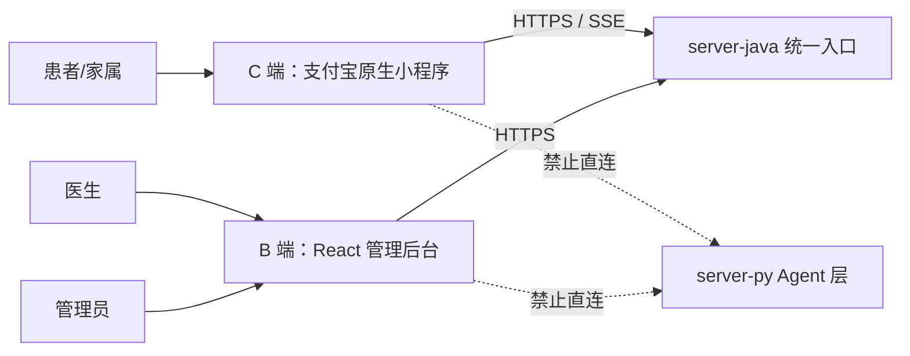
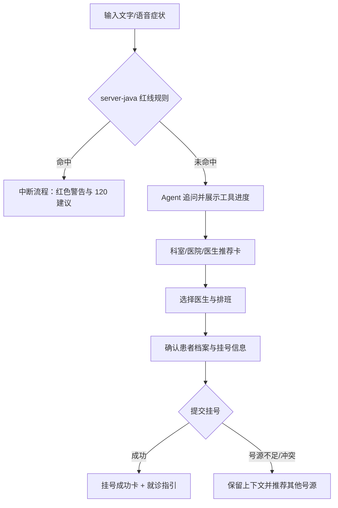
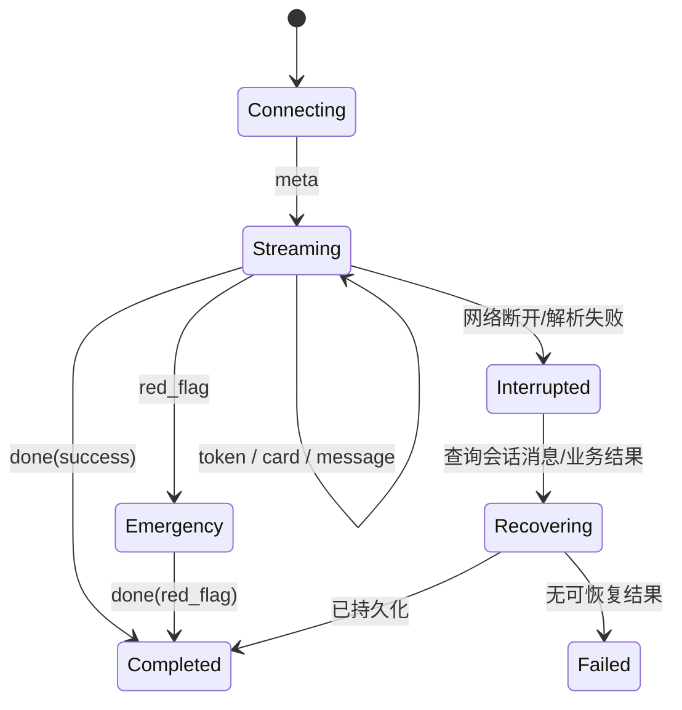

# 智愈前端系统分析与设计

## 1. 文档目的

本文用于指导“智愈”前端编码、联调与验收，描述支付宝原生小程序 C 端和 React B 端的业务目标、用户任务、信息架构、交互模型、前端架构及质量要求。本文以编码前方案为视角，不记录实现状态、开发进度或版本差异。

## 2. 系统目标与范围

前端系统承担患者、医生与医院运营者的人机交互，并统一通过 server-java（业务后端）访问平台能力。

- C 端：以医疗 AI Agent 为第一联系人，完成症状描述、智能导诊、医生推荐、挂号、健康档案、报告/处方解读与健康关怀。
- B 端：为管理员提供医院、科室、医生、排班、号源、处方审核、知识图谱和运营数据管理；为医生提供接诊、病情摘要查看、诊疗记录与电子处方能力。
- 共同目标：让 AI 的推理过程可感知、业务结果可确认、医疗安全边界始终可见。

以下内容不在真实生产闭环范围内：支付宝真实身份认证、支付结算、药店履约、药品下单、医院 HIS/EMR 对接。演示中这些能力采用明确的 Mock 反馈，不伪装为真实交易。

## 3. 用户与关键任务

| 角色 | 使用端 | 核心任务 | 关键关注点 |
|---|---|---|---|
| 患者/家属 | C 端 | 导诊、找医院、挂号、查记录、读报告/处方、管理家人档案 | 易用、安心、结果明确、隐私 |
| 医生 | B 端 | 查看排班与候诊患者、阅读病情摘要、完成接诊、开电子处方 | 信息密度、效率、用药安全 |
| 管理员 | B 端 | 维护组织与排班、审核处方、查看数据与审计 | 准确、可追溯、权限隔离 |
| 演示者 | C 端+B 端 | 展示跨端闭环、AI 工具调用、防超卖与知识增强 | 稳定、路径短、状态可解释 |

## 4. 设计原则

1. **安全优先**：红线症状警告、过敏/相互作用警告优先于普通内容和下一步操作。
2. **AI 与业务结果分层**：自然语言回答、工具进度、结构化业务卡片使用不同视觉语义，避免把建议误认为诊断或已办理结果。
3. **免责声明全覆盖**：任何 AI 产出都展示“仅供参考，不替代医生诊断”，卡片、详情页、语音场景均无例外。
4. **关键操作二次确认**：挂号、取消挂号、处方提交与审核等状态变更必须明确对象、后果及成功结果。
5. **渐进披露**：首屏围绕主任务，复杂信息进入抽屉、详情页或展开区，降低患者认知负担。
6. **跨端一致**：消息类型、处方状态与审核决定、禁忌判定决定、错误码等从 `contracts/` 契约推导，不在端内另行定义；挂号状态无契约枚举，由服务端返回中文展示值，端侧直接渲染。

## 5. 总体前端架构



### 5.1 C 端技术形态

- 支付宝原生小程序，使用 AXML、ACSS、JavaScript 与 `my.*` API。
- 通用交互组件优先采用 antd-mini；业务卡片使用原生自定义组件封装。
- 普通业务请求集中在 services/ 的资源模块（文件名使用 kebab-case）；鉴权、SSE 流解析、报告分片上传等机制封装在 utils/，供页面与 services 复用；页面脚本不直接拼接网络请求。
- SSE 由独立流解析器处理，输出标准事件给页面状态机。
- 录音通过 `my.getRecorderManager` 获取，位置能力仅在用户授权后调用。

### 5.2 B 端技术形态

- React + TypeScript + Umi + Ant Design；图表与图谱使用 AntV；跨页面轻量状态使用 Zustand。
- 按 `pages/[Module]/index.tsx` 与页内 `components/` 组织；请求集中在 `services/`，权限集中在 `access.ts`。
- 页面组件只负责展示与交互编排，不承载接口协议转换和业务规则。
- 服务端是权限与业务规则的最终裁决者，前端权限控制只负责导航和操作可见性。

## 6. C 端信息架构

| 页面 | 主要内容 | 主要入口/去向 |
|---|---|---|
| AI 诊室 | 当前档案、推荐提问、功能气泡、会话消息、输入与语音、推理档位 | 医院/医生卡、挂号、报告上传、历史会话 |
| 我的挂号 | 已约/已取消/已接诊列表、详情、取消、就诊指引 | 对应会话、处方、健康时间线 |
| 健康档案 | 本人/家人档案切换、基础信息、过敏史、健康时间线 | 报告解读、挂号、处方 |
| 电子处方 | 已审核处方、通俗解读、用法用量、打卡 | 药品详情、Mock 购药 |
| 消息 | 就诊提醒、处方通知、接诊后小结 | 挂号或处方详情 |

小程序不设底部 tabBar：五个页面为平级页面，AI 诊室为启动页，其余页面通过页内导航入口（`my.navigateTo`）互相跳转。

会话归属患者账号，不绑定健康档案；切换健康档案不筛选会话历史。每轮依赖个人信息的能力只读取当前激活档案。

## 7. C 端关键交互设计

### 7.1 智能导诊与挂号主流程



- 未创建健康档案时，AI 诊室展示档案引导卡；普通会话仍可使用，但挂号及个性化安全能力需引导补齐档案。
- 初始态展示导诊、用药注意、健康管理三类推荐提问。
- 工具执行使用阶段状态，如“正在检索医学知识”“正在查询号源”“正在提交挂号”；状态不得冒充成功结果。
- 医生推荐卡展示照片、姓名、职称、擅长、所属机构、距离与剩余号源；距离不可用时隐藏距离，不显示伪精度。
- 挂号成功后展示挂号单号、就诊时间、地点、序号、携带材料和病情摘要已发送提示。

### 7.2 会话与消息模型

- 首条用户消息发送时创建会话，标题取首条消息的截断摘要。
- 历史会话按最近活跃时间倒序，最多展示 50 条，支持新建、切换、续聊与单条删除。
- 消息种类以契约为准：文本、医生推荐、医生号源、医院推荐、挂号结果、挂号列表、报告上传、报告解读、报告上下文与用药禁忌提醒。
- 端侧另有私有的引导提示类消息（如导诊引导、找医院引导卡片）：仅客户端渲染，不经 SSE、不持久化、不携带免责声明。
- 文本 token 增量渲染；结构化卡片以完整事件落屏。
- 免责声明标注组件内置固定文案，与 `contracts/disclaimer.json` 逐字一致，一切 AI 产出必须携带。
- 页面离开、切换会话或网络中断时终止当前流订阅，避免事件串入错误会话。

### 7.3 多模态与特色入口

聊天框上方提供 AI 诊室、找医院、看报告、拍药盒、拍皮肤、拍饮食、拍舌苔入口。入口点击后先显示用途、上传要求和边界说明，再进入拍摄/选择文件。

- 报告支持 JPEG、PNG、PDF；图片批次 1–5 张，单文件不超过 10 MiB、批次不超过 20 MiB；PDF 单次一个。
- 报告上传采用两阶段协议：先逐文件上传分片（携带上传批次标识、页序与文件总数），全部完成后提交合并解读请求；任一文件失败即终止并提示重传。
- 首次上传报告前展示一次性知情同意说明：告知内容将发送至多模态模型处理、建议遮盖姓名与证件号等敏感信息、原件不保存，并附免责声明；同意后记住选择，图片上传前在客户端压缩。
- 找医院入口优先申请定位授权（小程序声明位置权限用途）；授权失败时降级为按区域手动查找，不阻断导诊。
- 原始医学影像不作为报告文字页处理，需显示明确的范围错误。
- 视觉结果使用结构化卡片展示识别摘要、重点指标、通俗解释、建议和免责声明。
- 语音输入需显示录音、上传、识别三个状态；TTS 播放提供开始、暂停与停止，不能自动连续播报敏感信息。
- 推理档位为自动、快速回答、深度思考，默认自动；切换只影响后续请求。

### 7.4 健康档案与时间线

- 同一患者账号可创建本人或家人档案，同一时刻仅一个激活档案。
- 档案展示称谓、性别、出生日期、关系与过敏史；切换前明确当前服务对象。
- 时间线统一聚合挂号单、电子处方、报告解读和接诊小结，按时间倒序，并提供类型筛选。
- 过敏史在推荐药品、处方解读和拍药盒等场景中以高优先级警示展示。

## 8. B 端信息架构与模块设计

### 8.1 登录与权限

- B 端账号体系与 C 端分离，角色仅管理员与医生两类。
- 管理员可访问医院、科室、医生、排班、处方审核、数据看板、知识图谱、Agent 日志与演示数据重置。
- 医生仅访问与本人关联的工作台、接诊任务与开方能力。
- 未登录跳转登录页；无权路由进入 403 状态页；接口返回 401 时清理会话并回到登录页。

### 8.2 组织与排班管理

- 医院：名称、等级、地址、经纬度的查询、新增、编辑和删除。
- 科室：按医院筛选，维护名称、楼层与位置。
- 医生：按医院/科室筛选，维护姓名、职称、擅长和照片。
- 排班：按医生、日期、时段维护总号源和启用状态；剩余号源只读展示，不允许前端直接覆写。
- 删除前展示关联影响；服务端拒绝时保留表单并展示可操作的原因。

### 8.3 医生工作台

- 顶部展示今日排班摘要，主体为待接诊队列与患者详情工作区。
- 患者详情包含健康档案摘要、过敏史、病情摘要、挂号信息和历史时间线入口。
- 完成接诊需填写诊断结论与医嘱，提交后挂号单转为已接诊。
- 电子处方以药品目录选择药品，填写剂量、频次、疗程和备注；提交前先执行禁忌预检，过敏或相互作用命中时阻止或强警告，并解释依据。

### 8.4 处方审核、数据与审计

- 处方审核列表支持待审核优先、详情查看、通过与驳回；驳回必须填写原因。
- 数据看板展示今日挂号量、科室分布、号源使用率、Agent 会话量和工具调用次数，并标明统计口径与刷新时间。
- 医学知识图谱使用力导向图显示症状、疾病、科室、药品、禁忌节点，支持筛选、缩放和节点详情；禁止将医生、患者和号源混入图谱。
- Agent 日志展示会话轮次、脱敏摘要、工具名、参数类型、耗时和结果状态，不展示患者敏感原文。
- 演示数据重置属于高风险操作，需二次确认并显示影响范围与执行结果。

## 9. 状态、接口与错误处理

### 9.1 前端状态分层

- 服务端状态：会话、消息、档案、挂号单、排班、处方等，以接口返回为准。
- 页面状态：筛选、分页、弹窗、抽屉、当前选择和加载状态，保持在页面或局部 store。
- 会话态：登录凭证、角色、当前患者档案，集中管理并持久化必要字段。
- 流状态：连接标识、当前会话、累计文本、工具步骤、终止原因，独立于普通请求状态。

### 9.2 API 使用约定

- C 端仅调用 `/api/c/*`，B 端仅调用 `/api/b/*`；两端不得访问 server-py。
- 请求统一注入访问令牌；不得在日志中记录患者原文、文件内容或完整令牌。
- 写操作按钮提交后立即进入不可重复提交状态；挂号、报告解读等使用服务端幂等标识。
- SSE 消费 `meta`、`knowledge`、`token`、`message`、`red_flag`、`done` 与结构化卡片事件；`knowledge` 等无需端侧展示的事件不渲染，未识别的事件安全忽略、不影响后续事件处理。
- 消息种类、处方状态与审核决定、禁忌判定决定、免责声明、上传限制和用户可见视觉错误均来自根目录 `contracts/`；挂号状态为特例，服务端直接返回中文展示值（已约/已接诊/已取消），两端按展示值渲染。

#### 前端 service 与资源映射

C 端 services/ 只承载业务资源的普通 JSON 请求；鉴权、SSE 流解析、报告分片上传封装在 utils/。医生推荐、号源、禁忌提醒等卡片数据经 SSE 事件到达页面，不走普通请求 service。

| 前端 service / 工具模块 | 访问资源 | 主要 View Model |
|---|---|---|
| C 端 `services/conversations` | `/api/c/conversations/*`；对话流 `POST /api/c/chat`（SSE，经 utils/chat-stream 解析） | `ConversationSummary`、`MessageView`、`StreamState`、`DoctorCard`、`SlotCard` |
| C 端 `services/health-profiles` | `/api/c/health-profiles/*` | `HealthProfileView`、`TimelineEntry` |
| C 端 `services/appointments` | `/api/c/appointments/*` | `AppointmentView` |
| C 端 `services/patient-care` | `/api/c/prescriptions`、`/api/c/messages` | `PrescriptionView`、`InAppMessageView` |
| C 端 `utils/auth`、`utils/report-upload` | `/api/c/auth/mock-login`；`/api/c/report-interpretation-uploads`、`/api/c/report-interpretations/finalize` | `PatientSession`、`ReportTaskView`、`ReportInterpretationView` |
| B 端 `services/auth` | `/api/b/auth/login`、`/api/b/auth/me` | `CurrentUser` |
| B 端 `services/organization` | `/api/b/hospitals`、`/api/b/departments`、`/api/b/doctors` | 对应表单与列表模型 |
| B 端 `services/reception` | `GET /api/b/reception`（当日排班与候诊队列聚合）、`/api/b/reception/appointments/{id}`、`/api/b/reception/appointments/{id}/complete` | `ReceptionDashboard`、`AppointmentDetail` |
| B 端 `services/prescription` | `/api/b/reception/medications`、`/api/b/reception/appointments/{id}/prescriptions`、`/api/b/reception/appointments/{id}/contraindication-check`（开方前禁忌预检）、`/api/b/prescriptions/*` | `PrescriptionForm`、`SafetyCheckResult`、`PrescriptionReviewView` |

service 方法返回接口响应中的业务数据本体。B 端统一请求层负责注入访问令牌、错误提示归一化与 401 处理（清理会话并回到登录页）；C 端请求层注入令牌并解析错误体，不做统一 401 跳转，由各页面按错误反馈处理。页面不得直接依赖数据库字段名或持久化 Entity。

#### 基础响应 schema

成功响应无统一信封，响应体即业务数据本体（对象或数组）；列表接口直接返回数组，不使用分页包装。错误出口统一为 `{"detail": ...}`，分两种形态：

```ts
// 成功：响应体即业务数据本身，如 T 或 T[]

// 失败：统一错误体
type ApiErrorBody =
  | { detail: string }                              // 通用错误
  | { detail: { code: string; message: string } };  // 带业务错误码
```

接口字段命名统一为 snake_case，两端直接使用服务端字段名，不做 camelCase 转换；C 端在请求边界按 `detail`/`message` 解析错误文案，B 端 TypeScript 类型由共享契约和接口 View 定义推导，不复制状态字符串。

#### 核心 View Model schema

| 模型 | 必备字段 | 渲染要求 |
|---|---|---|
| `ConversationSummary` | `id/title/last_active_at` | 最近活跃倒序；切换档案不筛选 |
| `MessageView` | `id/role/kind/content/created_at/disclaimer?` | 按 `kind` 分派组件；AI 消息校验免责声明 |
| `DoctorCard` | `doctor/department/hospital/specialty/distance?/next_slot?` | 缺少距离时隐藏，不使用默认假值 |
| `SlotCard` | `id/date/time_slot/remaining_slots/available` | `available=false` 时禁止提交 |
| `AppointmentView` | `id/status/sequence_number/profile/hospital/department/doctor/schedule` | 所有操作按状态机控制，提交仍由服务端裁决 |
| `HealthProfileView` | `id/display_name/gender/birth_date/relationship/active/allergies[]` | 明确显示当前服务对象 |
| `PrescriptionView` | `id/status/items/review_reason?/interpretation?/disclaimer?` | C 端仅渲染已审核可见数据 |
| `ReportInterpretationView` | `id/request_id/status/file/result?/error?/disclaimer` | 根据任务状态显示进度、结果或契约错误 |

#### SSE 消费状态机



- `meta` 确认服务端最终 `conversationId`；此前不得把临时消息绑定到其他会话。
- `token.delta` 只追加到当前临时文本；收到完整 `message` 后用 `message.id` 替换临时文本，避免重复。
- 结构化卡片使用事件中的 `messageId` 去重；重复 SSE 帧不得重复插入或重复触发挂号成功反馈。
- `red_flag` 立即清空普通工具进度、停止语音播报并锁定普通导诊操作，直至 `done`。
- `done` 仅标志流结束，不携带校准数据；异常结束后重新进入会话，以服务端持久化消息和业务查询接口恢复，不自动重放非幂等写操作。

### 9.3 错误体验

| 错误类别 | 端侧处理 |
|---|---|
| 网络/超时 | 保留用户输入，允许重试；不得显示虚假成功态 |
| 鉴权失效 | 清理会话并引导重新登录 |
| 业务冲突 | 展示服务端原因和可选下一步，如改选号源 |
| SSE 中断 | 保留已接收内容并标注未完成，允许从会话历史恢复 |
| 文件不合规 | 上传前校验，仍以 server-java 返回的错误为准，使用契约文案 |
| AI 输出异常 | 不渲染不可信结构，显示可重试提示和免责声明 |

## 10. 视觉、可用性与适配

- C 端采用温和、可信的医疗视觉，普通 AI 内容与紧急红线不得仅依赖颜色区分。
- 最小触控区域满足移动端操作需求；核心操作在单手可达区域。
- B 端以 1440px 桌面视口为主要设计基线，同时保证 1280px 可用；表格列过多时采用固定操作列与横向滚动。
- 所有加载态、空态、错误态、无权限态均提供明确说明和下一步。
- 时间、距离、号源、状态标签需统一格式化；涉及患者和医生的展示使用中文业务术语。

## 11. 安全与隐私设计

- 患者敏感信息只在完成任务所需范围展示；列表默认最小披露，详情按权限展开。
- 文件上传前提示用途和支持范围；预览与临时文件在任务结束后及时释放。
- 前端不得保存密码、模型密钥、数据库地址或 Agent 回调密钥。
- HTML/富文本内容按白名单渲染，防止模型输出或服务端文本造成脚本注入。
- 前端红线提示不能替代 server-java 规则判断，也不能允许用户手动跳过后继续导诊。

## 12. 性能与可靠性要求

- 首屏优先加载主任务资源，图谱、图表和非首屏模块按需加载。
- 列表由服务端控制数据量（如历史会话上限 50 条、当日接诊聚合视图）；图片上传前可做不改变医学可读性的压缩和方向校正。
- token 渲染应合并刷新，避免每个字符触发完整页面重排。
- 普通请求提供可取消机制；离开页面清理计时器、录音、音频和流连接。
- 所有成功提示必须来自服务端确认，尤其是挂号、取消、接诊、开方和审核。

## 13. 验收设计

前端不以“构建成功”作为验收结论，应在支付宝开发者工具与浏览器分别完成人工验收：

1. C 端走通“登录 → 创建/切换档案 → 症状对话 → 推荐医生 → 选择号源 → 挂号成功 → 查看/取消挂号”。
2. C 端验证红线症状立即中断、报告上传限制、SSE 中断恢复、免责声明全覆盖与无档案降级。
3. B 端分别以管理员和医生角色登录，验证路由权限、组织/排班管理、接诊、开方与处方审核。
4. 验证 B+C 联动：挂号结果进入接诊队列，病情摘要可见，处方审核后在 C 端可见。
5. 浏览器及小程序控制台无错误；网络失败、空数据、重复提交和权限拒绝均有明确反馈。

## 14. 编码约束

- C 端页面文件使用 `index.js`、`index.axml`、`index.acss`、`index.json`，禁止微信小程序的 `.wxml`、`.wxss` 和 `wx.*`。
- B 端启用 TypeScript 严格检查，接口响应建立明确类型，不以 `any` 绕过契约。
- 页面组件超过单一职责时拆分；业务卡片、免责声明、状态标签和错误反馈形成可复用组件。
- 新增跨栈枚举或常量时先修改 `contracts/`，再由两端消费，禁止复制字符串形成第二事实源。
