# 智愈 server-java 与 server-py 系统分析与设计（精简版）

> 文档版本：v2.1-slim  
> 事实基线：2026-07-30 工作区代码、`contracts/`、`schema.sql`、ADR 与本地票单  
> 说明：本文按《后端系分模板》章节骨架编写，由 v2.1 去重精简而来。双栈语境下分别称为 server-java（业务后端）和 server-py（Agent 层）。

---

## 变更记录

| 日期 | 版本 | 修订说明 | 作者 |
| --- | --- | --- | --- |
| 2026-07-30 | v2.0 | 按后端系分模板新增 | Codex |
| 2026-07-30 | v2.1 | 补齐可编码接口、数据字典、用例、安全与 NFR | Codex |
| 2026-07-30 | v2.1-slim | 去重精简：合并重复表格、统一约束引用、消除图/表交叉复述 | Codex |

---

## 项目背景

智愈是医疗 B+C 平台 demo。C 端患者以自然语言完成智能导诊、医生选择和挂号，并查看报告解读、健康档案与电子处方；B 端医生和管理员维护组织资源、完成接诊开方与处方审核。系统须在两周 demo 约束下形成可演示闭环，同时保证医疗安全规则、号源防超卖、隐私和免责声明不依赖 LLM 自律。

ADR-0009 将原单体拆为两个本地进程，职责划分见下方"架构不变量"。运行拓扑硬约束：server-java、server-py、B 端和支付宝开发者工具全部本地运行；云服务器只提供 PostgreSQL 16 + pgvector、Redis、Neo4j 数据服务。日常开发不得 SSH、上传应用、远程部署或执行 `docker compose up`。

本版只描述当前代码已实现的能力。知识图谱可视化、运营看板、Agent trace 页面、语音、拍药盒/皮肤/饮食/舌苔、服药打卡不在范围内。

---

## 相关资料

- [智愈 MVP 规格](../../.scratch/zhiyu-mvp/spec.md)
- [需求文档-智愈](./需求文档-智愈.md)
- [前端系统分析与设计（模板版）](./frontend-system-analysis-design-v2.md)
- [领域语言](../../CONTEXT.md)
- [ADR-0009：双栈拆分](../adr/0009-competition-stack-pivot.md)
- [ADR-0010：跨栈契约](../adr/0010-cross-stack-contracts.md)
- [ADR-0011：号源补偿](../adr/0011-slot-accounting-compensation.md)
- [ADR-0014：断连后继续生成](../adr/0014-chat-round-survives-client-disconnect.md)
- [ADR-0015：默认对话关闭模型思考](../adr/0015-default-chat-disables-model-thinking.md)
- [ADR-0016：C 端不做个性化用药决策](../adr/0016-agent-does-not-make-personalized-medication-decisions.md)
- [WSS 与 Windows 服务排障](../engineering-notes/wss-and-windows-service-pitfalls.md)

---

## 参与人

| 角色 | 负责人 |
| --- | --- |
| 项目负责人 | 待项目组补充 |
| 产品/设计 | 待项目组补充 |
| server-java 工程 | 项目组（AI 辅助开发） |
| server-py 工程 | 项目组（AI 辅助开发） |
| 测试与联调 | 项目组 |

---

## 架构不变量

以下约束全文统一编号，后续章节以 INV-N 引用，不再展开复述。

| 编号 | 约束 |
| --- | --- |
| INV-1 | server-java 是唯一对外入口和唯一业务写入方（PostgreSQL/Redis） |
| INV-2 | server-py 只编排 Agent；业务工具必须 HTTP 回调 server-java，禁止直接写业务库 |
| INV-3 | 号源 Redis 操作只经 `SlotAccounting`；禁止先查后改 |
| INV-4 | 跨栈状态、消息类型、免责声明、上传限制、错误码只从 `contracts/` 加载 |
| INV-5 | 免责声明由 server-py 生成时注入、server-java 出口兜底；红线规则不是 AI 产出，不附免责声明 |
| INV-6 | PostgreSQL 存业务实体；Neo4j 只存医学知识；禁止双写 |
| INV-7 | 审计/trace 不记录患者敏感原文，只记脱敏摘要、工具名、参数类型与结果 |
| INV-8 | controller/路由处理函数只做校验与装配，不含 SQL 或业务逻辑 |
| INV-9 | C 端 Agent 不做个性化用药决策，只提供通用药品知识并引导咨询医生/药师 |

> **已知架构漂移**：ADR-0009 规定 Neo4j 仅由 server-py 直连；当前 `Neo4jContraindicationFactRepository` 由 server-java 只读 Driver 直接查询。后续须新增 ADR 二选一收口；收口前不得扩大 server-java 的 Neo4j 访问范围。

---

## 功能模块树

```text
智愈双栈服务
├── server-java（业务后端）[INV-1]
│   ├── C 端 API
│   │   ├── mock 登录、健康档案、会话与实时对话
│   │   ├── 报告解读、挂号单、电子处方、站内消息
│   │   └── WebSocket/SSE 传输适配
│   ├── B 端 API
│   │   ├── 员工登录、医院/科室/医生/排班
│   │   ├── 接诊、处方、审核
│   │   └── 确定性处方安全检查
│   ├── Agent 工具回调 API
│   │   ├── 医生推荐、号源、附近医院
│   │   └── 创建/查询挂号、保存病情摘要
│   ├── 业务一致性
│   │   ├── PostgreSQL 事务与唯一约束
│   │   ├── Redis 原子号源计数与补偿 [INV-3]
│   │   └── 对话轮次 request_id 幂等
│   └── 安全与治理
│       ├── JWT、角色、Agent 回调认证
│       ├── 审计、限流、脱敏日志 [INV-7]
│       └── 红线/禁忌/免责声明 [INV-5]
└── server-py（Agent 层）[INV-2]
    ├── LangGraph 对话编排与模型流式输出
    ├── 业务工具薄壳（HTTP 回调 server-java）
    ├── pgvector RAG 只读检索
    ├── 报告视觉解读
    └── 处方通俗解读与就诊小结生成
```

---

## 流程图

仅保留决策分支复杂、时序图无法清晰表达的链路。对话主干和挂号时序见"时序图"章节。

### 4-3 医生开方与审核流程

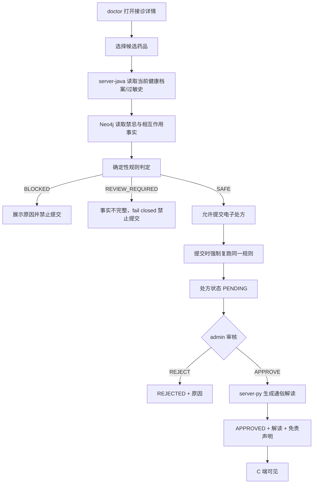

### 4-4 报告解读流程

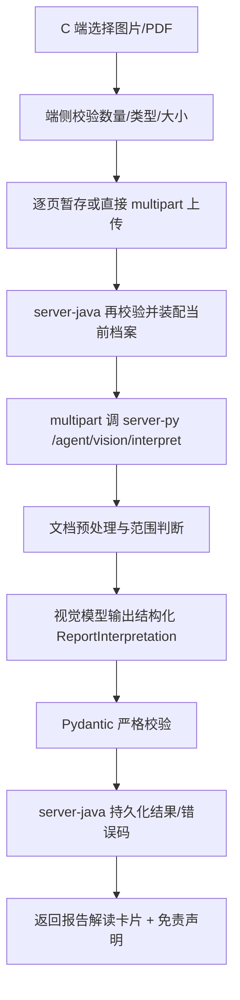

### 4-5 认证与授权流程

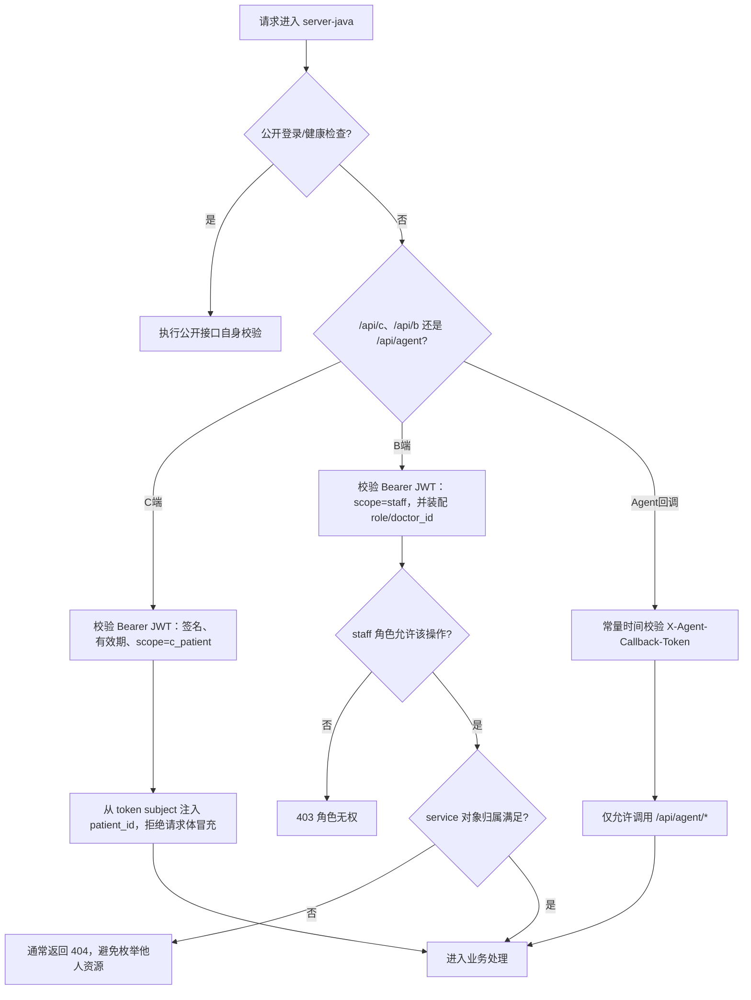

### 4-6 健康档案切换流程

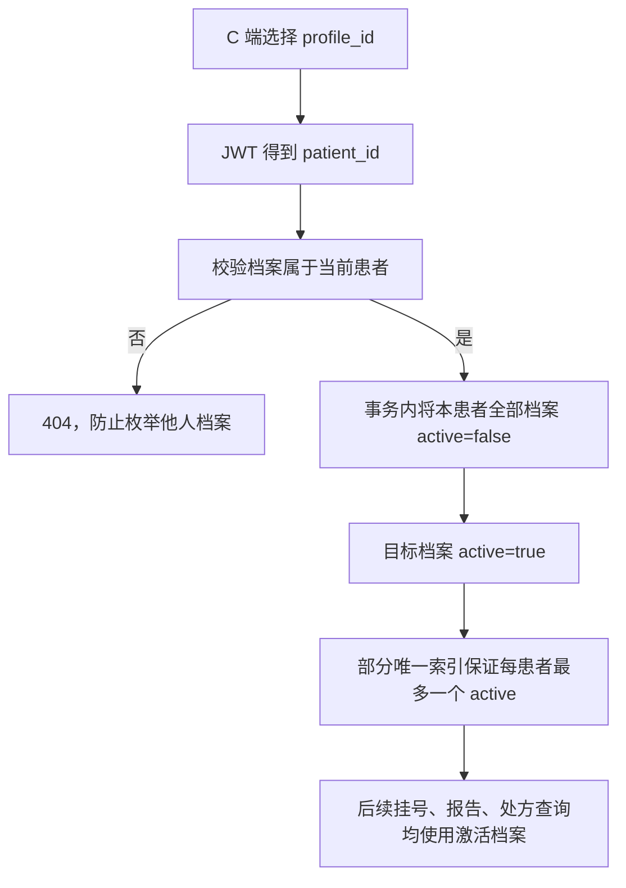

### 4-7 取消挂号流程

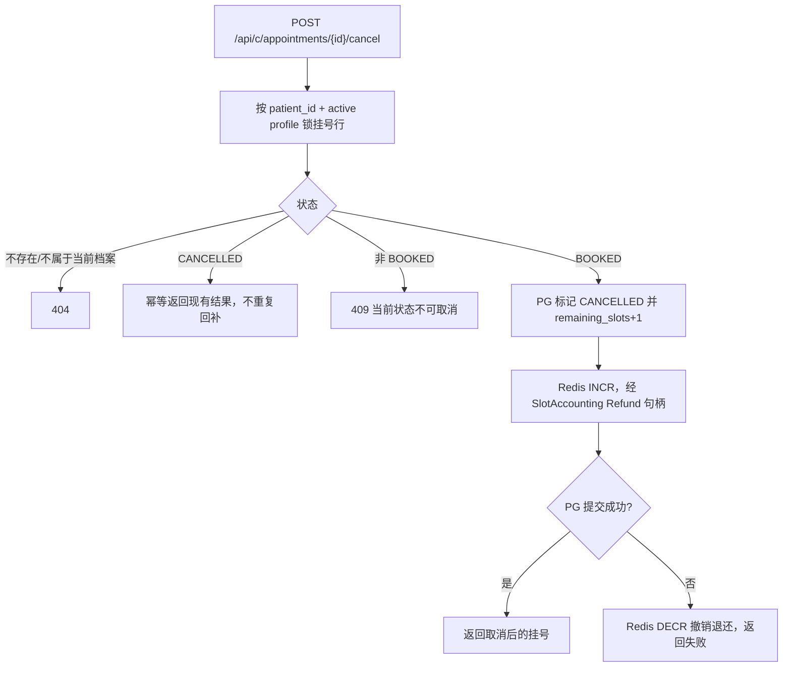

### 4-8 状态机

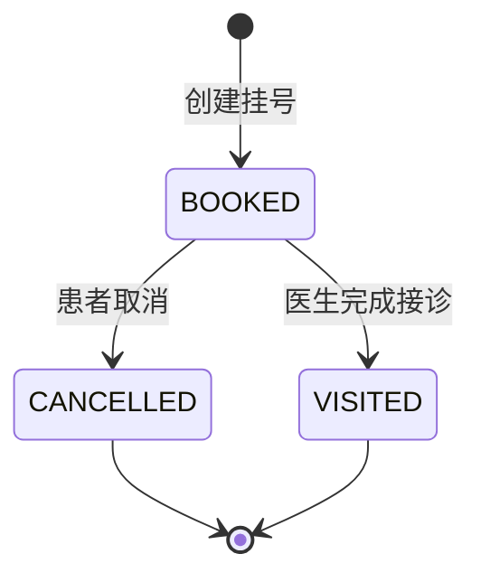

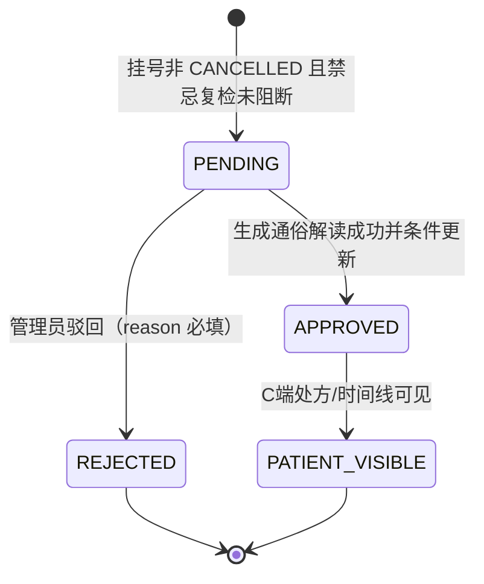

聚合边界：`Appointment` 与 `Prescription` 是两个独立状态机。当前代码允许医生在挂号仍为 `BOOKED` 时先创建 `PENDING` 处方，只拒绝 `CANCELLED` 挂号；完成接诊不是开方的前置条件。挂号取消与完成接诊互斥；一张挂号单最多一条接诊记录和一张处方；并发审核通过 `WHERE status='PENDING'` 条件更新保证只有一个决定成功。处方通过前须先得到 server-py 通俗解读，生成失败时仍保持 `PENDING`。

### 完成接诊事务边界

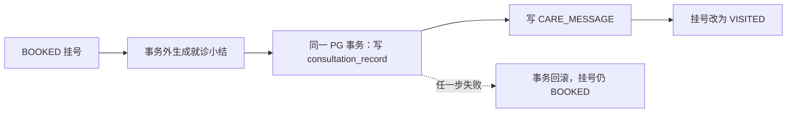

---

## UML 图

### 核心领域模型

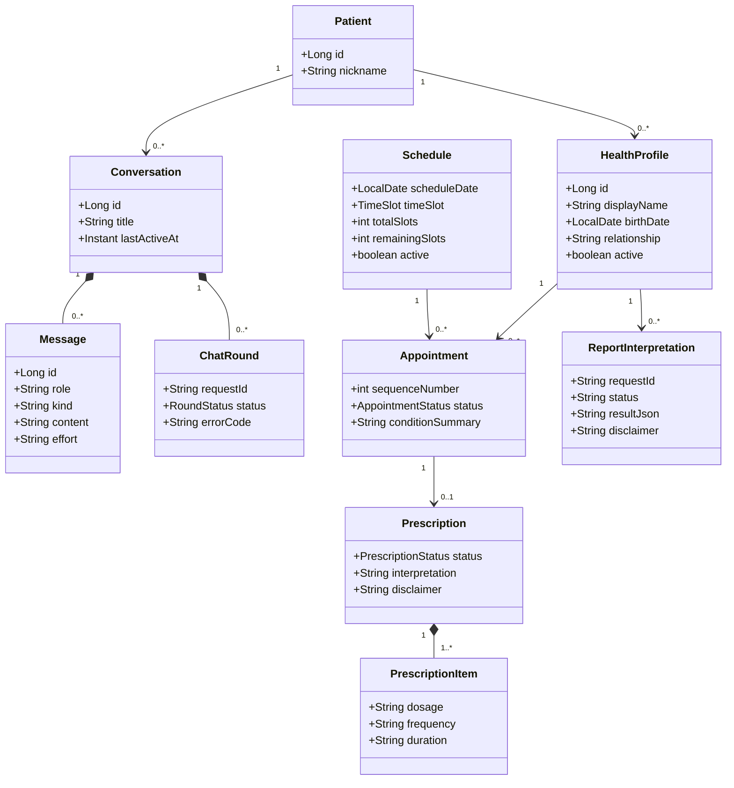

完整业务实体还包括 Hospital、Department、Doctor、StaffUser、Medication、ConsultationRecord、HealthProfileAllergy、KnowledgeChunk 与 InAppMessage，关系见 ER 图。状态值一律来自 `schema.sql` CHECK 或 `contracts/` [INV-4]。

### 业务实体 ER 图

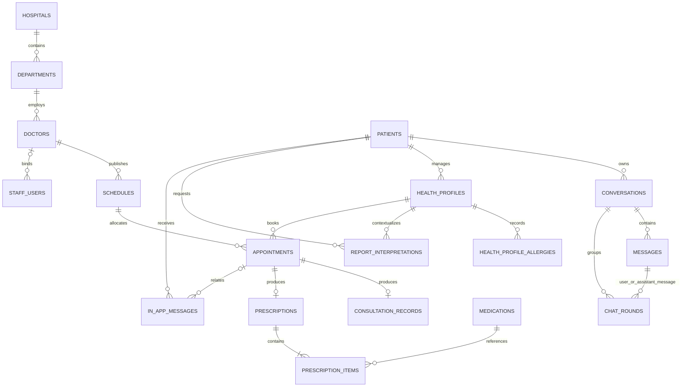

### 双栈组件与包依赖

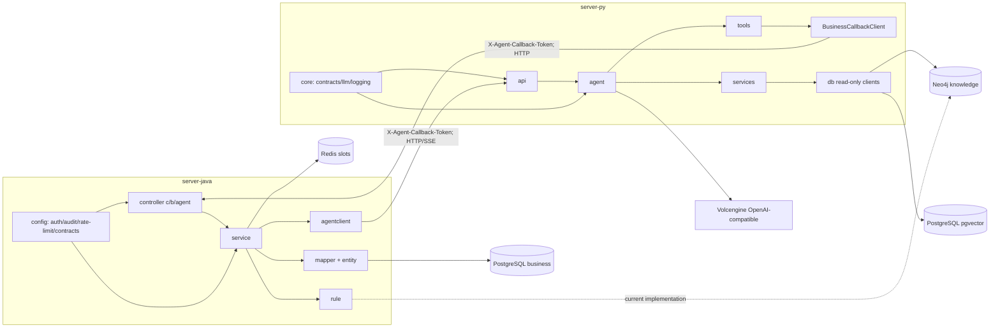

依赖规则见 INV-1/2/8。mapper 不反向依赖 service。

---

## 时序图

### 5-1 WebSocket 对话时序（含断连恢复）

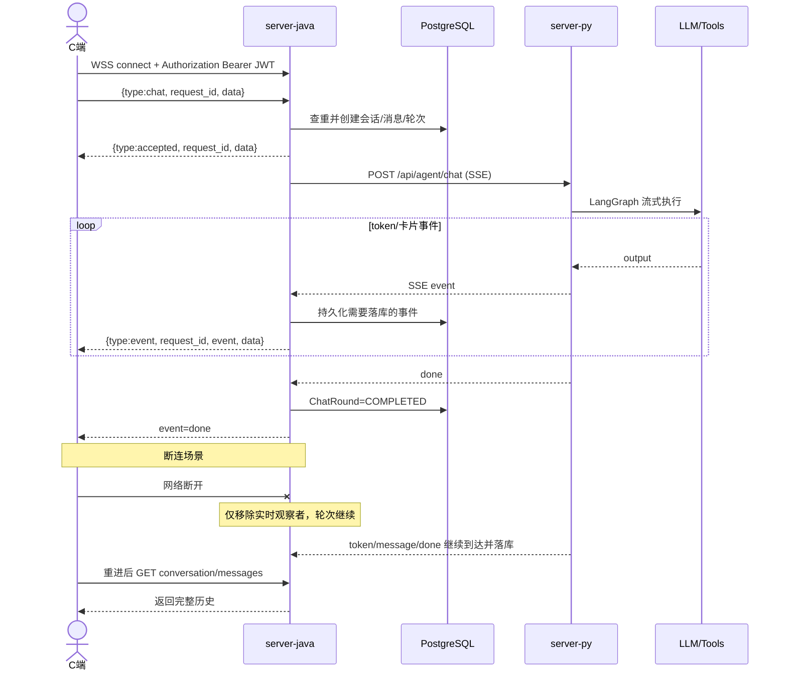

### 5-2 挂号与摘要 best-effort 时序

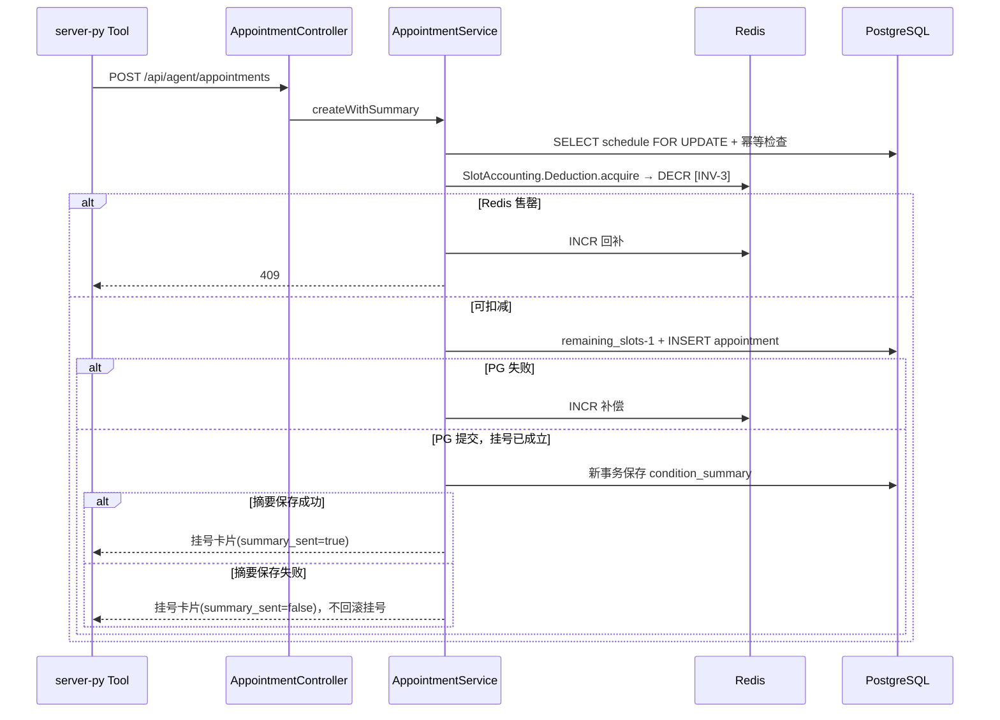

---

## 数据库设计

唯一建模来源为 `server-java/src/main/resources/schema.sql`。开发期不使用迁移工具，结构变更统一 drop + recreate + 幂等 seed [INV-6]。

### 字段字典

`N` = NOT NULL，`Y` = 可空。所有 `id` 均为 `BIGINT GENERATED BY DEFAULT AS IDENTITY PK`。

| 表 | 字段定义（类型；可空；默认） | 外键、约束与索引 |
| --- | --- | --- |
| `hospitals` | `name varchar(100);N`，`level varchar(30);Y`，`address varchar(255);Y`，`longitude/latitude double precision;Y` | `name UNIQUE` |
| `departments` | `hospital_id bigint;N`，`name varchar(100);Y`，`floor varchar(30);Y`，`location varchar(255);Y` | `hospital_id → hospitals.id` |
| `doctors` | `department_id bigint;N`，`name/title varchar(50);Y`，`specialty text;Y`，`photo_url varchar(500);Y` | `department_id → departments.id` |
| `schedules` | `doctor_id bigint;N`，`schedule_date date;N`，`time_slot varchar(30);N`，`total_slots/remaining_slots int;N`，`is_active boolean;N;true` | `doctor_id → doctors.id`；`total_slots>0`；`0≤remaining≤total` |
| `patients` | `nickname varchar(50);N`，`created_at timestamptz;N;now()` | `nickname UNIQUE` |
| `staff_users` | `username varchar(50);N`，`password_hash varchar(255);Y`，`role varchar(20);Y`，`doctor_id bigint;Y` | `username UNIQUE`；`doctor_id → doctors.id ON DELETE SET NULL` |
| `conversations` | `patient_id bigint;N`，`title varchar(50);N`，`created_at/last_active_at timestamptz;N;now()` | `patient_id → patients.id`；`idx_conversations_patient` |
| `health_profiles` | `patient_id bigint;N`，`display_name varchar(50);N`，`gender varchar(10);N`，`birth_date date;N`，`relationship varchar(20);N`，`active boolean;N;false`，`created_at/updated_at timestamptz;N;now()` | `patient_id → patients.id`；部分唯一索引 `(patient_id) WHERE active=true`；`idx_health_profiles_patient(patient_id,id)` |
| `health_profile_allergies` | `health_profile_id bigint;N`，`allergen varchar(100);N` | `health_profile_id → health_profiles.id ON DELETE CASCADE`；`UNIQUE(health_profile_id,allergen)` |
| `report_interpretations` | `patient_id/health_profile_id bigint;N`，`conversation_id bigint;Y`，`request_id varchar(64);N`，`file_type varchar(20);N`，`file_name varchar(255);N`，`page_count int;Y`，`status varchar(20);N`，`result_json/context_summary text;Y`，`error_code varchar(50);Y`，`disclaimer varchar(100);N`，时间戳 | FK 分别到 patient/health_profile/conversation（conversation 删除置空）；`UNIQUE(patient_id,request_id)`；状态 `PROCESSING/SUCCEEDED/FAILED`；患者档案时间倒序索引 |
| `messages` | `conversation_id bigint;N`，`role varchar(20);N`，`kind varchar(32);N;text`，`content text;N`，`effort varchar(10);Y`，`report_interpretation_id bigint;Y`，`created_at timestamptz;N;now()` | conversation 删除级联；report FK；`idx_messages_conversation`；`kind` 需容纳 contracts 最长值 |
| `chat_rounds` | `patient_id bigint;N`，`request_id varchar(64);N`，`conversation_id/user_message_id bigint;N`，`assistant_message_id bigint;Y`，`status varchar(20);N`，`error_code varchar(50);Y`，`accepted_at;N;now()`，`started_at/completed_at;Y` | `UNIQUE(patient_id,request_id)`；状态 `ACCEPTED/RUNNING/COMPLETED/FAILED`；conversation/user message 删除级联，assistant message 删除置空 |
| `appointments` | `patient_id/health_profile_id/schedule_id bigint;N`，`conversation_id bigint;Y`，`sequence_number int;N`，`status varchar(20);N;BOOKED`，`condition_summary text;Y`，`created_at;N;now()`，`cancelled_at;Y` | FK 到 patient/health_profile/schedule，conversation 删除置空；`UNIQUE(health_profile_id,schedule_id)`、`UNIQUE(schedule_id,sequence_number)`；状态 `BOOKED/CANCELLED/VISITED`；患者档案索引 |
| `consultation_records` | `appointment_id bigint;N`，`doctor_id bigint;N`，`diagnosis/advice text;N`，`created_at timestamptz;N;now()` | `appointment_id UNIQUE → appointments.id`；doctor FK；`idx_consultation_records_doctor` |
| `medications` | `name/generic_name/specification varchar(100);N`，`instructions text;N`，`is_active boolean;N;true` | `name UNIQUE` |
| `knowledge_chunks` | `department varchar(100);N`，`title varchar(200);N`，`content text;N`，`vector vector(1024);Y`，`created_at;N;now()` | HNSW cosine 向量索引；department 索引；运行时仅 server-py 读取 |
| `prescriptions` | `appointment_id/doctor_id bigint;N`，`status varchar(20);N;PENDING`，`notes/review_reason text;Y`，`reviewed_by bigint;Y`，`interpretation text;Y`，`disclaimer varchar(100);Y`，`created_at;N;now()`，`reviewed_at;Y` | appointment 唯一；doctor/reviewer FK；状态 `PENDING/APPROVED/REJECTED`；APPROVED 必须有 interpretation+disclaimer（见下方 CHECK）；状态时间索引 |
| `prescription_items` | `prescription_id/medication_id bigint;N`，`dosage/frequency/duration varchar(100);N`，`notes varchar(500);Y` | prescription 删除级联；medication FK |
| `in_app_messages` | `patient_id bigint;N`，`type varchar(40);N`，`title varchar(100);N`，`content text;N`，`disclaimer varchar(100);N`，`related_appointment_id bigint;Y`，`created_at;N;now()` | patient/appointment FK；`UNIQUE(appointment,type)`；患者时间倒序索引 |

建模不变量：业务身份从认证上下文派生；同一患者最多一个激活档案；同档案同排班最多一个挂号；同排班序号不重复；同挂号最多一个接诊记录和一个处方；只有具备解读及免责声明的 `APPROVED` 处方才可由 C 端查询。

### 处方患者可见性约束（复合条件，SQL 表达）

```sql
CONSTRAINT ck_prescriptions_patient_visibility CHECK (
    (status = 'APPROVED' AND interpretation IS NOT NULL AND disclaimer IS NOT NULL)
    OR status <> 'APPROVED'
)
```

### Redis 与 Neo4j

| Key | 类型 | 写入方 | 语义 |
| --- | --- | --- | --- |
| `schedule:{scheduleId}:remaining_slots` | integer string | 仅 server-java `SlotAccounting` [INV-3] | 排班剩余号源原子计数 |

对话轮次不进入 Redis。Neo4j 只保存症状、疾病、科室、药品、禁忌等医学知识及其关系 [INV-6]。

---

## API 设计

### 全局协议

- 端侧统一前缀 `/api/c/*`、`/api/b/*`；端侧不得访问 `/api/agent/*` 或 server-py。
- C 端 JWT scope `c_patient`；B 端 `staff`，角色 `admin/doctor`。
- `/api/agent/*` 使用 `X-Agent-Callback-Token` 常量时间比较认证。
- 成功响应直接返回业务 JSON，不包 `code/message/data`。
- 错误统一 `{"detail":"..."}` 或 `{"detail":{"code":"...","message":"..."}}`。
- JSON 字段统一 `snake_case`；新增 DTO 禁止输出 camelCase。
- 日期 `YYYY-MM-DD`，时间带时区 ISO-8601；ID 正整数；经纬度成对且 longitude ∈ [-180,180]、latitude ∈ [-90,90]。
- 请求体中的 patient/staff 身份不被端侧 API 信任。
- 状态码：200 查询/更新，201 创建（有标注者），204 删除，400 参数/状态值非法，401 未认证，403 角色无权，404 不存在或归属不符，409 冲突/售罄，422 上传参数非法，429 限流，502/504 Agent/模型失败。

### C 端 API

| 方法 | 路径 | 请求字段 | 响应核心字段 | 幂等/错误 | 认证 |
| --- | --- | --- | --- | --- | --- |
| POST | `/api/c/auth/mock-login` | `nickname?:≤50`；空值用虚构默认 | `token`、`patient:{id,nickname}` | 同 nickname 复用；超长 400 | 公开 |
| WSS | `/api/c/chat/ws` | 信封 `{type:chat,request_id*,data}` | accepted/event/error 信封 | `(patient_id,request_id)` 幂等；同会话运行中 409 | C JWT |
| POST SSE | `/api/c/chat` | `request_id*:≤64,content*,conversation_id?,effort*:auto/quick/deep,scenario*:triage/interpretation,knowledge_source?:rag/graph/none,longitude?/latitude?` | SSE 事件流（见实时事件契约） | 同上；红线不调 Agent | C JWT |
| GET | `/api/c/conversations` | 无 | `[{id,title,last_active_at}]` | — | C JWT |
| GET | `/api/c/conversations/{id}/messages` | path id | `[{id,role,kind,content,effort,disclaimer,created_at}]` | 404 不归属 | C JWT |
| DELETE | `/api/c/conversations/{id}` | path id | 204 | 404 不归属 | C JWT |
| GET/POST | `/api/c/health-profiles` | POST `display_name*:≤50,gender*:≤10,birth_date*:date,relationship*:≤20,allergies?:[≤30]` | `{id,display_name,gender,birth_date,relationship,active,allergies,created_at}` | POST 201；过敏 >30 或超长 400 | C JWT |
| GET | `/api/c/health-profiles/current` | 无 | `{profile}` object 或 null | — | C JWT |
| POST | `/api/c/health-profiles/{id}/activate` | path id | 激活档案 | 事务幂等；404 防枚举 | C JWT |
| PUT | `/api/c/health-profiles/{id}/allergies` | `allergies:[≤30]` | 更新后档案 | 404 防枚举 | C JWT |
| GET | `/api/c/health-profiles/{id}/timeline` | path id | `[{record_id,type,title,summary,occurred_at,disclaimer}]` | 404 不归属 | C JWT |
| GET | `/api/c/appointments` | 当前激活档案 | `[{appointment_id,schedule_id,doctor_id,doctor_name,department_name,schedule_date,time_slot,sequence_number,status,condition_summary,summary_disclaimer,created_at}]` | 无激活档案 409 | C JWT |
| POST | `/api/c/appointments/{id}/cancel` | path id | 取消后挂号单 | 重复幂等；非 BOOKED 409；不归属 404 | C JWT |
| POST multipart | `/api/c/report-interpretations` | `request_id*:≤64,conversation_id?,files*:1..5` | `{report_interpretation_id,conversation_id,status,result,page_count,error_code,disclaimer}` | `(patient_id,request_id)` 幂等；类型/大小/数量按 contracts；模型错误用 vision 白名单码 | C JWT |
| POST multipart | `/api/c/report-interpretation-uploads` | `request_id*,page_index*:int,total_files*:1..5,media_type*,file*` | `{uploaded,total,ready}` | 非法页/类型/大小 422；批次不一致 409 | C JWT |
| POST | `/api/c/report-interpretations/finalize` | `request_id*,conversation_id?` | 同报告直传响应 | 缺页 409；finalize 后清理暂存 | C JWT |
| GET | `/api/c/prescriptions` | 当前激活档案 | 仅 `APPROVED` 列表：处方头、items、interpretation、disclaimer | 无激活档案 409；不返回 PENDING/REJECTED | C JWT |
| GET | `/api/c/messages` | 无 | `[{id,type,title,content,disclaimer,created_at}]` | 仅自身数据 | C JWT |

### B 端 API

| 方法 | 路径 | 请求字段 | 响应核心字段 | 幂等/错误 | 角色 |
| --- | --- | --- | --- | --- | --- |
| POST | `/api/b/auth/login` | `username*:≤50,password*:1..128` | `{access_token,token_type:"bearer"}` | 凭据错误 401；不区分账号不存在/密码错误 | 公开 |
| GET | `/api/b/auth/me` | 无 | `{username,role,doctor_id}` | — | staff |
| GET/POST | `/api/b/hospitals` | `name*:≤100,level*:≤30,address*:≤255,longitude*:number,latitude*:number` | `{id,name,level,address,longitude,latitude}` | POST 201；重名/被引用 409 | admin |
| PUT/DELETE | `/api/b/hospitals/{id}` | 同上/path id | 实体/204 | 被引用 409 | admin |
| GET/POST | `/api/b/departments` | `hospital_id*:positive,name/floor/location` | 科室实体及 hospital 关联 | hospital 不存在 400/404；被引用删除 409 | admin |
| PUT/DELETE | `/api/b/departments/{id}` | 同上/path id | 实体/204 | 同上 | admin |
| GET/POST | `/api/b/doctors` | `department_id*:positive,name,title,specialty,photo_url` | 医生实体及科室信息 | department 不存在 400/404；被引用删除 409 | admin |
| PUT/DELETE | `/api/b/doctors/{id}` | 同上/path id | 实体/204 | 同上 | admin |
| GET/POST | `/api/b/schedules` | `doctor_id*:positive,schedule_date*:date,time_slot*:contract enum,total_slots*:positive` | `{id,doctor_id,schedule_date,time_slot,total_slots,remaining_slots,is_active}` | POST 201；DTO 不接收 is_active；有挂号时删除/非法缩容 409 | admin |
| GET/PUT/DELETE | `/api/b/schedules/{id}` | path id/字段 | 实体/204 | 更新容量按 delta 原子调整 | admin |
| PATCH | `/api/b/schedules/{id}/disable` | path id | 停用实体 | 幂等 | admin |
| GET | `/api/b/reception` | 当前员工 | 今日排班与挂号 | 仅绑定 doctor | doctor |
| GET | `/api/b/reception/appointments/{id}` | path id | 接诊详情 | 非本人 404 | doctor |
| POST | `/api/b/reception/appointments/{id}/complete` | `diagnosis*:nonblank,advice*:nonblank` | 接诊详情；status=VISITED | 取消/重复完成 409 | doctor |
| GET | `/api/b/reception/medications` | 无 | 在用药品列表 | — | doctor |
| POST | `/api/b/reception/appointments/{id}/contraindication-check` | `medication_ids*:positive[1..20]` | `{decision,message_type,blocked,reasons,message,advice}` | Neo4j 不可用/事实不全 → REVIEW_REQUIRED, blocked=true | doctor |
| POST | `/api/b/reception/appointments/{id}/prescriptions` | `notes?:≤1000,items*:1..20[{medication_id*,dosage*:≤100,frequency*:≤100,duration*:≤100,notes?:≤500}]` | `PrescriptionView` | 提交强制复检；已开方/非 SAFE 409；同 appointment 唯一约束兜底 | doctor |
| GET | `/api/b/prescriptions?status=` | query `status?:PENDING/APPROVED/REJECTED` | 处方列表 | — | admin |
| POST | `/api/b/prescriptions/{id}/review` | `decision*:APPROVE/REJECT,reason?:≤1000` | 审核后 PrescriptionView | REJECT reason 必填；并发仅一次成功，后到 409；解读失败保持 PENDING | admin |

### Agent 工具回调 API（server-py → server-java）

所有接口须携带 `X-Agent-Callback-Token`。patient_id、conversation_id、定位由 server-py 运行时上下文注入，模型不得自行提供。

| 方法 | 路径 | 参数 | 返回 |
| --- | --- | --- | --- |
| GET | `/api/agent/doctors/recommend` | query `department_name*:string` | `{doctors:[{doctor_id,name,title,specialty,photo_url,remaining_slots}]}` |
| GET | `/api/agent/doctors/{doctorId}/slots` | path `doctor_id*:positive` | `{doctor_id,slots:[{schedule_id,schedule_date,time_slot,remaining_slots}]}` |
| GET | `/api/agent/hospitals/nearby` | query `longitude*,latitude*`（可信 AgentContext） | `{hospitals:[{hospital_id,name,level,address,distance_km}]}` |
| POST | `/api/agent/appointments` | JSON `patient_id*,conversation_id*,schedule_id*,condition_summary*` | AppointmentCard（含 summary_sent/summary_disclaimer/notice） |
| GET | `/api/agent/appointments` | query `patient_id*:positive` | `{appointments:[AppointmentCard]}` |
| POST | `/api/agent/appointments/{id}/summary` | path id；JSON `patient_id*,conversation_id*,condition_summary*` | AppointmentCard |

工具执行异常被 server-py 规整为模型可解释文本，不投影成成功卡片；售罄、参数臆造和 server-java 暂不可用不掐断 Agent 流。

### server-py 内部 API（server-java → server-py）

| 方法 | 路径 | 请求 | 响应 | 认证 |
| --- | --- | --- | --- | --- |
| GET | `/api/health` | 无 | 存储健康状态 | 健康检查策略 |
| POST SSE | `/api/agent/chat` | AgentChatRequest（见下） | SSE 事件流 | Agent callback secret |
| POST multipart | `/api/agent/vision/interpret` | `scenario*:report,files*:UploadFile[],health_profile?:JSON` | `{result,page_count,disclaimer}` | Agent callback secret |
| POST | `/api/agent/clinical/prescription-explanation` | 药品事实数组 | `{content,disclaimer}` | Agent callback secret |
| POST | `/api/agent/clinical/consultation-summary` | diagnosis/advice | `{content,disclaimer}` | Agent callback secret |

认证失败 401，校验失败 422，模型/处理错误由 server-java 映射为 502/504 或 vision 白名单业务码。

#### AgentChatRequest

| 字段 | 类型 | 必填 | 说明 |
| --- | --- | --- | --- |
| messages | ChatMessage[] | Y | server-java 组装的近期会话上下文 |
| patient_id | positive int | Y | 可信患者身份 |
| conversation_id | positive int | Y | 当前会话 |
| health_profile | object/null | N | 当前激活档案 |
| effort | auto/quick/deep | Y | 推理档位 |
| scenario | triage/interpretation | Y | 场景 |
| knowledge_source | rag/graph/none | N | 知识源选择器 |
| longitude/latitude | number | N | 授权定位，必须成对 |

### 核心契约示例

#### WebSocket 客户端请求

```json
{
  "type": "chat",
  "request_id": "1722331200000-a1b2c3d4",
  "data": {
    "content": "我头疼两天了，该挂什么科",
    "conversation_id": null,
    "effort": "auto",
    "scenario": "triage",
    "knowledge_source": "rag"
  }
}
```

#### WebSocket 服务端事件

```json
{
  "type": "event",
  "request_id": "1722331200000-a1b2c3d4",
  "event": "token",
  "data": { "text": "我先了解一下疼痛部位。" }
}
```

信封类型 `chat/accepted/event/error`；每条必须携带 `request_id`。

#### 禁忌检查响应

```json
{
  "decision": "BLOCKED",
  "message_type": "contraindication_warning",
  "blocked": true,
  "reasons": ["过敏史与候选药品成分匹配"],
  "message": "检测到用药禁忌，已阻止本次药品推荐。请咨询医生或药师后再用药。",
  "advice": "请咨询医生或药师，并主动告知完整过敏史和正在使用的药品。"
}
```

固定值由 `contracts/contraindication.json` 提供 [INV-4]。前端只按 `blocked` 控制提交。

### 实时事件契约

WebSocket 信封 `{"type":"accepted|event|error","request_id":"...","event":"...|null","data":{...}}`；HTTP SSE 使用 `event: <name>\ndata: <JSON>\n\n`。两种传输 event/data 同构，共用同一轮次，不得各自产生业务副作用。

| event/type | data schema | 持久化/终止语义 |
| --- | --- | --- |
| `accepted` 信封 | `{conversation_id,status}` | 已创建或命中幂等轮次；红线路径也会先发送 accepted，因此不代表已通过红线检查 |
| `meta` | `{effort,request_id,conversation_id}`（重放可能缺 effort） | 不落消息 |
| `knowledge` | `{source,status,count,request_id}`，status `ok/degraded/unavailable` | 不因降级终止 |
| `token` | `{text,request_id}` | 仅展示增量，不逐 token 落库，不含免责声明 |
| `doctor_recommendations` | 工具 payload + `{disclaimer,request_id,message_id}` | 同名 kind 落库 |
| `doctor_slots` | 同上 | 同名 kind 落库 |
| `hospital_recommendations` | 同上 | 同名 kind 落库 |
| `appointment` | AppointmentCard + `{disclaimer,request_id,message_id}` | 工具真实成功后落库 |
| `appointments` | `{appointments:[...],disclaimer,request_id,message_id}` | 查询结果落库 |
| `message` | `{role,content,effort,disclaimer,request_id,message_id}` | 最终助手正文，完整落库 |
| `done` | `{request_id}`（重放/红线含 conversation_id） | 轮次 COMPLETED |
| `red_flag` | `{request_id,conversation_id,message_id,rule,content,advice}` | 规则产物落库并直接完成 [INV-5] |
| `error` 信封 | `{code,message}` | `INVALID_ENVELOPE/ROUND_IN_PROGRESS/CHAT_REJECTED/ROUND_FAILED`；不把堆栈或敏感原文返回客户端 |

事件顺序：WSS `accepted → meta → knowledge? → (token|card)* → message → done`；HTTP SSE 从 `meta` 开始。红线路径 WSS `accepted → meta → red_flag → done`，SSE `meta → red_flag → done`。上游在 done 前异常 → 轮次 FAILED；客户端断连不改变状态机。

---

## 关键技术设计

### 对话轮次幂等与实时通道

1. `request_id` 患者维度唯一；首次接受在单进程同步区执行，数据库唯一约束兜底。
2. 接受时惰性创建会话，写用户消息和 `chat_rounds`；状态 `ACCEPTED → RUNNING → COMPLETED/FAILED`。
3. 红线判断先于 Agent 调用，命中后直接持久化并结束。
4. WSS 和 SSE 都是薄传输适配器，共用 `ChatRoundService`。
5. 订阅者断开只移除观察者；上游继续，最终消息和状态继续落库。
6. 进程重启后发现数据库仍 ACCEPTED/RUNNING 但内存无实例 → 标记 `PROCESS_RESTARTED` 失败，不自动重放。
7. 完成轮次幂等重试返回持久化结果；失败轮次返回错误，由用户新建请求重试。

### 推理档位与 TTFT

| 用户选择 | 普通对话/导诊 | 复杂解读 |
| --- | --- | --- |
| quick | `thinking.type=disabled` | disabled |
| auto | disabled | high |
| deep | high | high |

模型 `doubao-seed-2.1-turbo`（火山方舟 OpenAI 兼容协议）。验收线：quick/auto 普通对话连续 5 次首 token 中位数 ≤3s、最大 ≤5s；deep 只记录。fake 测试要求 server-py 首 token 到 WSS 转发额外延迟 ≤100ms。

### 号源一致性与补偿 [INV-3]

- 创建排班：初始化 Redis key；PG 提交失败则删除 key。
- 挂号：排班行锁内幂等检查 → DECR 预扣 → 判负立即 INCR 回补 → PG 条件扣减失败反向补偿。
- 取消：PG 行锁保证重复取消只首次生效 → PG 回补 + Redis INCR → 事务失败 DECR 撤销。
- 调整容量：Redis INCRBY delta，不以旧快照覆盖；事务失败按相反 delta 补偿。
- PostgreSQL 唯一约束提供最终防重复保障。严禁先查后改。

### 确定性安全规则

#### 红线症状

server-java 在 C 端对话入口用关键词组合确定性判断（胸痛伴冷汗、意识障碍、呼吸窘迫、中风征兆、大出血/呕血咯血、持续抽搐、急性中毒）。命中后立即建议就近就医或拨打 120 并中断导诊；LLM 不参与、不覆盖。

#### 用药禁忌

仅在 B 端开方流程执行。可信业务上下文来自 PostgreSQL（档案、过敏史、候选药品、既往已审核药品）；医学事实来自 Neo4j。输出 `SAFE`（允许）、`BLOCKED`（命中禁忌）、`REVIEW_REQUIRED`（事实不全，fail closed）。提交处方时强制复跑，防止绕过 UI。[INV-9]

#### 免责声明 [INV-5]

固定文案来自 `contracts/disclaimer.json`。对话流只在最终 `message` 展示；病情摘要、报告解读、处方解读、就诊小结无例外携带。红线规则不附。

### 知识检索与 Agent 工具

- `search_knowledge`：pgvector Top-K 余弦检索，默认 Top 3、阈值 0.3。
- RAG 成功发 `knowledge(status=ok)`；空/失败发 degraded 走裸 LLM。
- `graph` 契约允许但当前未落地，返回 unavailable/degraded 并降级。
- 业务工具均经带回调密钥的 HTTP 访问 server-java。
- 定位坐标从可信 AgentContext 传入，不作为 LLM 工具参数。

### 报告解读

- 上传限制由 `contracts/upload-limits.json` 统一：JPEG/PNG/PDF，单文件 10 MiB，图片批次 20 MiB，1–5 个文件，PDF 单文件。
- server-java 暂存按 patient + request_id 隔离，finalize 后交 server-py；双端校验。
- server-py 拒绝加密 PDF、超页、超像素、不可读文件和原始医学影像诊断范围。
- 输出通过严格 Pydantic schema：summary、items、actions、unreadable；指标优先级 red/yellow/blue/green。
- 错误码白名单由 `contracts/vision-errors.json` 统一；不透传模型堆栈。
- 原文件只用于本次处理，不长期保存 [INV-7]。

### 认证、权限与隐私

- C/B 账号体系分离，JWT scope 不可跨端复用。server-py 不持有患者 JWT。
- B 端 admin 管组织/排班/审核；doctor 绑定 doctor_id，service 二次校验归属。
- Agent 回调共享密钥 + `MessageDigest.isEqual`。
- 支付宝开发者工具可能给 Authorization 包字面双引号，server-java 兼容剥离。
- JWT、`.env`、连接串、患者原文不得输出到日志/文档/测试 [INV-7]。

### 可观测性与故障处理

| 场景 | 处理 | 观测 |
| --- | --- | --- |
| server-py SSE 未发 done 就结束 | 轮次 FAILED | roundId、事件数、错误类别 |
| WSS 客户端断开 | 轮次继续，移除观察者 | 不记患者正文 |
| 工具回调 4xx/5xx | 转模型可解释文本 | 工具名、HTTP 类别 |
| 知识检索空/失败 | 降级裸 LLM | source/status/count |
| Neo4j 禁忌事实不可用 | REVIEW_REQUIRED 阻断 | 只记结果枚举 |
| PG 事务失败 | Redis 反向补偿 | scheduleId、动作、结果 |
| 模型/视觉超时 | 502/504 或契约错误码 | 场景、耗时、错误码 |

server-java 对话日志记录 accepted、first-event、first-token、complete/fail 耗时。健康检查只验证连接状态，不返回凭据。

---

## 安全设计

### 权限矩阵

| 能力 | C patient | doctor | admin | server-py |
| --- | :---: | :---: | :---: | :---: |
| 自身档案/会话/挂号/报告/已审核处方 | 读写自身 | — | — | 仅可信上下文 |
| 接诊、禁忌检查、开方 | — | 仅本人排班患者 | — | 仅生成文本 |
| 组织 CRUD、处方审核 | — | — | 允许 | — |
| `/api/agent/*` | 禁止 | 禁止 | 禁止 | 回调密钥允许 |
| PG 业务写/Redis 号源写 | — | — | — | 禁止 [INV-1/3] |

### 威胁与控制

| 威胁 | 控制与验证 |
| --- | --- |
| 身份伪造/越权枚举 | JWT 签名/exp/scope；subject 注入；service 归属二次校验；无权 404；负向 MockMvc |
| 双栈接口伪造/重放 | 强随机回调密钥、常量时间比较、仅内部监听；生产 HTTPS；密钥环境变量注入、定期轮换 |
| 传输窃听 | 生产强制 HTTPS/WSS；跨主机 TLS；证书校验不得关闭 |
| 注入/恶意文件 | Bean Validation/Pydantic；MyBatis 参数绑定/固定 Cypher；MIME/大小/页数/像素/加密 PDF 双端校验；文件名不参与路径拼接 |
| 敏感信息泄露 | 审计仅脱敏摘要 [INV-7]；不透传堆栈 |
| 重复副作用/竞态 | request_id/唯一约束/行锁/条件更新；SlotAccounting 原子补偿；断连不重放 |
| 存储越权 | PG 业务账号最小权限；server-py pgvector 只读；Neo4j READ；Redis 仅 server-java |
| 临时文件残留 | patient+request_id 隔离；take/finalize 后移除；5 分钟惰性清理 |
| 凭据生命周期 | B 端 JWT 480 min，C 端 720 min；demo 无撤销列表，泄露轮换 secret；回调密钥与 JWT secret 分离 |
| 数据丢失 | 云 PG 加密备份/恢复演练待确认；RPO≤24h/RTO≤4h 为验收目标；Redis 可从 PG 对账恢复；Neo4j 可重建 |

---

## 非功能需求与容量基线

| 指标 | demo 基线/SLO | 验证方式 |
| --- | --- | --- |
| 可用性 | 演示窗口双栈健康检查成功；外部依赖失败有降级 | `/api/health`、故障注入 |
| 普通 API | 本地 p95 ≤300ms，错误率 <1% | 100 并发 5 分钟压测 |
| 对话 TTFT | quick/auto 中位数 ≤3s、最大 ≤5s；Java 转发 ≤100ms | fake + 真实模型采样 |
| 挂号一致性 | 100 并发抢最后 1 号恰好 1 成功，Redis/PG 一致 | 并发集成测试 |
| 数据规模 | 患者 1万、会话 10万、消息 100万、排班 10万、chunk 10万；峰值 100 RPS、20 并发 Agent 轮次 | explain analyze + 压测 |
| 上传容量 | 单文件 10MiB、批次 20MiB、1–5 文件、PDF 单文件；暂存 5 分钟过期 | contracts 一致性测试 |
| Agent 超时 | 单轮 300s；子调用更短；不无限重试副作用工具 | 超时 fake 测试 |
| 日志隐私 | 0 条敏感原文、0 个凭据 [INV-7] | 日志扫描 |
| 恢复 | PG RPO≤24h/RTO≤4h；Redis 对账重建；进程重启不重放 | 恢复演练 |

---

## 实现追踪矩阵

| 业务能力 | server-java 关键类 | server-py 关键类 | 对应测试 |
| --- | --- | --- | --- |
| C/B 认证 | AuthFilter/AdminInterceptor/AuthService | — | MockMvc 认证负向 |
| 实时对话 | ChatWebSocketHandler/ChatRoundService/AgentClient | api.agent/agent.runner/services.chat | WSS 黑盒 + TestClient SSE |
| 红线规则 | RedFlagRuleEngine | — | 规则单测（命中+不误触） |
| 挂号/号源 | AppointmentService/SlotAccounting | tools.business | 并发集成 + 补偿 |
| 健康档案 | HealthProfileController/Service/MapStruct | — | MockMvc 归属/并发激活 |
| 报告解读 | staging/ReportService/AgentClient | api.vision/agent.vision | 边界 + fake 视觉 |
| 接诊/处方 | ReceptionService/PrescriptionService/ContraindicationRule | clinical 生成 | 规则三态 + 并发审核 |
| RAG | 透传事件 | services.knowledge/db pgvector | 降级 + 空召回 |

### 用例与异常矩阵

仅列出边界/异常与期望后置状态；主成功路径见流程图、时序图和 API 表。

| 用例 | 关键边界/异常 | 期望后置状态 |
| --- | --- | --- |
| C/B 登录 | 空字段 400；错误凭据 401；C token 调 B 或反向均 401/403 | 不颁发 token |
| 提交对话 | 重复 request_id 返回既有轮次；同会话运行中 409；红线直接 red_flag；断连继续；进程重启遗留 RUNNING → FAILED/PROCESS_RESTARTED | 轮次状态一致 |
| 推荐与挂号 | 无档案/排班停用/售罄/并发最后一号；PG 失败回补 Redis；摘要失败保留挂号 `summary_sent=false`；同档案同排班重试不重复扣减 | Redis/PG 最终一致 |
| 取消挂号 | 重复取消幂等；VISITED 409；PG 失败撤销 Redis INCR；越权 404 | 号源回补或不变 |
| 创建/激活档案 | 过敏史 >30 或字段超长 400；越权 404；并发激活由部分唯一索引兜底且事务回滚 | 最多一个 active |
| 报告直传/分片 | 类型/数量/大小、加密 PDF、超页/像素、缺页、重复 finalize；模型超时 → FAILED+白名单码；同 request_id 返回既有结果 | 暂存清理 |
| 完成接诊 | 取消/非本人/重复完成 409；临床小结生成失败 → 事务回滚，挂号仍 BOOKED | 不泄露他人数据 |
| 安全检查与开方 | 过敏/相互作用 BLOCKED；图谱失败/事实缺失 REVIEW_REQUIRED；停用药品/已开方/取消挂号 400/409；均不写处方 | 处方未产生 |
| 审核处方 | REJECT 无 reason 400；并发仅一个成功；解读生成失败保持 PENDING；APPROVED 必有 interpretation+disclaimer | 状态唯一决定 |
| 知识/Agent 降级 | RAG 空/失败降级裸 LLM；工具 4xx/5xx 转解释文本不产成功卡片；graph 未落地明确 unavailable | 轮次不中断 |

---

## 测试设计

### server-java

- MockMvc 覆盖 C/B/Agent HTTP 外部行为、认证、权限、错误形状和负向场景。
- 规则单测同时覆盖危险输入命中和正常输入不误触；禁忌覆盖 SAFE/BLOCKED/REVIEW_REQUIRED。
- `SlotAccounting` 并发测试覆盖预扣、售罄、PG 回滚补偿、取消回补和容量调整。
- WebSocket 黑盒覆盖握手 JWT、信封、首 token、单会话单轮和断连持久化。
- ArchUnit 强制号源只经 SlotAccounting、契约值从 contracts/ 加载、ServiceImpl 继承、MapStruct 映射。

### server-py

- TestClient 覆盖 chat、视觉与临床接口。
- fake LLM + fake BusinessCallbackClient 断言工具调用顺序和回调参数。
- 覆盖推理档位映射、SSE 事件顺序、RAG 降级、工具错误规整、视觉校验。
- 运行 pytest/ruff/mypy/lint-imports；测试不导入 `.env`。

### 跨栈与人工验收

- 契约一致性测试校验 Java/Python/TypeScript 对事件、状态、免责声明、上传限制和错误码的消费。
- 本地双栈 fake 验证首 token 转发 ≤100ms；真实模型 TTFT 采样。
- 支付宝开发者工具走通登录 → 对话 → 断网 → 恢复；浏览器走通 admin/doctor 主流程，无控制台错误。
- 所有测试本地执行；连接失败只检查本地配置和安全组白名单。

---

## 排期

| 阶段 | 内容 | 预估工期 |
| --- | --- | ---: |
| 需求与系分评审 | 对齐 PRD、领域语言、双栈边界与契约 | 1 天 |
| 数据与契约 | schema/seed、contracts、DTO 与错误形状 | 2 天 |
| server-java 基础能力 | 认证、组织、排班、号源、统一错误/审计 | 4 天 |
| 双栈对话主干 | ChatRound、WSS/SSE、Agent 编排、业务工具 | 5 天 |
| 患者业务闭环 | 健康档案、推荐、挂号、会话记录 | 3 天 |
| 报告解读 | 上传暂存、视觉接口、结构化结果 | 3 天 |
| 接诊与电子处方 | 接诊、禁忌规则、审核、临床生成 | 4 天 |
| 测试与联调 | 双栈自动化、并发、TTFT、前端人工验收 | 3 天 |
| 演示收口 | seed、录屏兜底、发布检查 | 1 天 |

> 总参考工期：约 26 人日。正式施工按 `.scratch/zhiyu-mvp/issues/` 一票一分支执行。
