# 智愈后端系统分析与设计

> 文档版本：v2.4  
> 事实基线：2026-07-30 工作区代码、`contracts/`、`schema.sql`  
> 说明：本文按《后端系分模板》的章节骨架编写。双栈语境下分别称为 server-java（业务后端）和 server-py（Agent 层），不使用含混的“后端”。

---

## 目录
- [1 变更记录](#1-变更记录)
- [2 项目背景](#2-项目背景)
- [3 相关资料](#3-相关资料)
- [4 参与人](#4-参与人)
- [5 功能模块](#5-功能模块)
- [6 功能模块树](#6-功能模块树)
- [7 系统架构](#7-系统架构)
  - [7.1 运行拓扑与双栈职责](#71-运行拓扑与双栈职责)
  - [7.2 组件与依赖关系](#72-组件与依赖关系)
  - [7.3 核心领域模型](#73-核心领域模型)
  - [7.4 业务实体 ER 图](#74-业务实体-er-图)
- [8 业务流程](#8-业务流程)
  - [8.1 实时对话与断连恢复流程](#81-实时对话与断连恢复流程)
  - [8.2 导诊、挂号与摘要降级流程](#82-导诊挂号与摘要降级流程)
  - [8.3 医生开方与审核流程](#83-医生开方与审核流程)
  - [8.4 报告解读流程](#84-报告解读流程)
  - [8.5 认证与授权流程](#85-认证与授权流程)
  - [8.6 健康档案切换流程](#86-健康档案切换流程)
  - [8.7 取消挂号流程](#87-取消挂号流程)
  - [8.8 挂号、处方与接诊副作用状态](#88-挂号处方与接诊副作用状态)
- [9 时序图](#9-时序图)
  - [9.1 WebSocket 对话时序](#91-websocket-对话时序)
  - [9.2 WebSocket 断连时序](#92-websocket-断连时序)
  - [9.3 挂号与摘要 best-effort 时序](#93-挂号与摘要-best-effort-时序)
  - [9.4 报告解读时序](#94-报告解读时序)
  - [9.5 处方开方与审核时序](#95-处方开方与审核时序)
- [10 数据库设计](#10-数据库设计)
  - [10.1 业务表总览](#101-业务表总览)
  - [10.2 字段字典](#102-字段字典)
  - [10.3 对话轮次关键约束](#103-对话轮次关键约束)
  - [10.4 挂号关键约束](#104-挂号关键约束)
  - [10.5 处方患者可见性约束](#105-处方患者可见性约束)
  - [10.6 Redis 号源计数](#106-redis-号源计数)
  - [10.7 Neo4j 数据边界](#107-neo4j-数据边界)
- [11 API 设计](#11-api-设计)
  - [11.1 全局协议](#111-全局协议)
  - [11.2 资源接口契约](#112-资源接口契约)
  - [11.3 C 端 API](#113-c-端-api)
  - [11.4 B 端 API](#114-b-端-api)
  - [11.5 Agent 工具回调 API（server-py -> server-java）](#115-agent-工具回调-apiserver-py--server-java)
  - [11.6 server-py 内部 API（server-java -> server-py）](#116-server-py-内部-apiserver-java--server-py)
  - [11.7 核心契约示例](#117-核心契约示例)
  - [11.8 实时事件契约](#118-实时事件契约)
- [12 关键技术设计](#12-关键技术设计)
  - [12.1 对话轮次幂等与实时通道](#121-对话轮次幂等与实时通道)
  - [12.2 推理档位与 TTFT](#122-推理档位与-ttft)
  - [12.3 号源一致性与补偿](#123-号源一致性与补偿)
  - [12.4 确定性安全规则](#124-确定性安全规则)
  - [12.5 知识检索与 Agent 工具](#125-知识检索与-agent-工具)
  - [12.6 报告解读](#126-报告解读)
  - [12.7 认证、权限与隐私](#127-认证权限与隐私)
- [13 质量保障](#13-质量保障)
  - [13.1 用例与异常矩阵](#131-用例与异常矩阵)
  - [13.2 安全设计](#132-安全设计)
  - [13.3 非功能需求与容量基线](#133-非功能需求与容量基线)
  - [13.4 可观测性与故障处理](#134-可观测性与故障处理)
  - [13.5 测试设计](#135-测试设计)
- [14 实现追踪矩阵](#14-实现追踪矩阵)
- [15 排期](#15-排期)
---

## 1 变更记录

| 日期 | 版本 | 修订说明 | 作者 |
| --- | --- | --- | --- |
| 2026-07-30 | v2.0 | 按后端系分模板新增；以双栈代码、契约和数据库结构重建全文 | 项目组 |
| 2026-07-30 | v2.1 | 按系分审查标准补齐可编码接口、数据字典、用例、依赖、安全与 NFR，并纠正挂号摘要事务语义 | 项目组 |
| 2026-07-31 | v2.2 | 补齐时序图：9.1 增红线/降级/FAILED 分支，新增 9.4 报告解读、9.5 处方开方与审核时序 | 项目组 |
| 2026-07-31 | v2.3 | 对照双栈代码核实并修订第 8 节业务流程：纠正过滤器顺序、报告解读路径与范围判断时机、认证装配语义，补幂等/补偿/降级分支，按小节配导语与要点 | 项目组 |
| 2026-07-31 | v2.4 | 按前端联调反馈展开 11.3-11.6 各端点响应为字段级 schema：补齐 C/B 端、Agent 回调与 server-py 内部接口的完整字段表、可空性、错误体示例与示例 JSON | 项目组 |

---

## 2 项目背景

智愈是医疗 B+C 平台。C 端患者希望以自然语言完成智能导诊、医生选择和挂号，并查看报告解读、健康档案与电子处方；B 端医生和管理员需要维护组织资源、完成接诊开方与处方审核。系统须在保证医疗安全规则、号源防超卖、隐私和免责声明不依赖 LLM 自律的前提下，形成端到端业务闭环。

---

## 3 相关资料

- [智愈 MVP 规格](../../.scratch/zhiyu-mvp/spec.md)
- [需求文档-智愈](./需求文档-智愈.md)
- [前端系统分析与设计（模板版）](./frontend-system-analysis-design-v2.md)
- [领域语言](../../CONTEXT.md)
- [WSS 与 Windows 服务排障](../engineering-notes/wss-and-windows-service-pitfalls.md)

---

## 4 参与人

| **角色**           | **负责人**   |
| ------------------ | ------------ |
| **后端兼 AI 工程** | 闫其武，郑帅 |
| **后端兼前端**     | 高晓鹏       |
| **后端兼质量测试** | 朱婧文       |

---

## 5 功能模块

1. **统一认证与安全入口**：C/B 两套 JWT scope、B 端角色校验、Agent 回调密钥、入口审计与限流。
2. **组织与号源**：医院、科室、医生、排班 CRUD；Redis 原子号源计数与 PostgreSQL 事务对账。
3. **会话与实时 Agent**：会话、消息、对话轮次持久化；WebSocket 主通道、SSE 兼容通道；server-java 到 server-py 的 SSE 逐事件转发。
4. **智能导诊工具**：医生推荐、号源查询、就近医院、创建/查询挂号；业务读写全部回调 server-java。
5. **健康档案**：一个患者账号管理多份档案、唯一激活档案、过敏史与健康时间线。
6. **报告解读**：图片/PDF 校验、暂存合并、视觉模型结构化解读、结果持久化和错误码白名单。
7. **接诊与电子处方**：医生工作台、病情摘要、诊断和医嘱、开方、处方审核、患者可见处方与站内消息。
8. **确定性医疗安全**：C 端入口红线症状规则；B 端开方过敏/相互作用规则；所有 AI 产出免责声明。
9. **知识增强**：pgvector RAG 检索增强；Neo4j 提供医学知识事实；业务数据不写 Neo4j。

---

## 6 功能模块树

```text
智愈双栈服务
├── server-java（业务后端，唯一对外入口/写入方）
│   ├── C 端 API
│   │   ├── C 端登录、健康档案、会话与实时对话
│   │   ├── 报告解读、挂号单、电子处方、站内消息
│   │   └── WebSocket/SSE 传输适配
│   ├── B 端 API
│   │   ├── 员工登录、医院/科室/医生/排班
│   │   ├── 接诊、处方、审核
│   │   └── 确定性处方安全检查
│   ├── Agent 工具回调 API
│   │   ├── 医生推荐、号源、附近医院
│   │   └── 创建/查询挂号、保存病情摘要
│   ├── 业务一致性
│   │   ├── PostgreSQL 事务与唯一约束
│   │   ├── Redis 原子号源计数与补偿
│   │   └── 对话轮次 request_id 幂等
│   └── 安全与治理
│       ├── JWT、角色、Agent 回调认证
│       ├── 审计、限流、脱敏日志
│       └── 红线/禁忌/免责声明
└── server-py（Agent 层，无业务写入权）
    ├── LangGraph 对话编排与模型流式输出
    ├── 业务工具薄壳（HTTP 回调 server-java）
    ├── pgvector RAG 只读检索
    ├── 报告视觉解读
    └── 处方通俗解读与就诊小结生成
```

---

## 7 系统架构

### 7.1 运行拓扑与双栈职责

医疗场景下，LLM 产出不可完全信任：号源扣减、处方审核、免责声明等业务写入必须由可控代码执行，不能交给 Agent 自律。因此系统将业务后端与 Agent 层物理拆分为两个进程，依赖只能向下、不得反向：

```text
server-java（业务后端，唯一对外入口与业务写入方）
├── controller        校验 · 身份装配 · DTO 映射
│   ├── c             C 端 API（对话/档案/挂号/报告/处方/消息）
│   ├── b             B 端 API（组织/排班/接诊/开方/审核）
│   └── agent         Agent 工具回调 API（医生推荐/号源/挂号）
├── service           事务 · 业务逻辑
│   └── SlotAccounting  号源计数独占，禁止其他模块直连 Redis
├── mapper            访问 PostgreSQL（MyBatis-Plus）
├── entity            业务实体与视图
├── rule              确定性安全规则（红线 · 用药禁忌）
├── agentclient       调 server-py（SSE/视觉/临床生成）
└── config            鉴权 · 审计 · 限流 · 契约加载

server-py（Agent 层，无业务写入权）
├── api               HTTP/SSE 装配
├── agent             LangGraph 编排
├── tools             薄壳：校验参数 · 回调 server-java
├── services          RAG 检索 · 推理档位映射
├── db                只读知识客户端（pgvector · Neo4j）
├── core              契约 · LLM 客户端 · 日志
├── models            数据模型
└── schemas           Pydantic 校验模型
```

双栈边界是硬约束：server-py 不持有患者 JWT，不写业务表，不写 Redis 号源，不把业务实体写 Neo4j，业务读写一律经回调密钥 HTTP 回调 server-java。跨栈共享的状态值、消息类型、免责声明、上传限制与错误码统一从 `contracts/` 加载，Java/Python/TypeScript 三端各自消费，并由契约一致性测试钉死，避免任一端私自改值。

部署上，server-java、server-py、B 端与小程序开发者工具均运行在本地，云服务器只提供 PostgreSQL 16 + pgvector、Redis、Neo4j 三项数据服务，应用不部署上云。

### 7.2 组件与依赖关系

上述分层与边界的组件级调用关系及存储读写权限见下图。实线为包内或跨栈调用，虚线为只读访问，边标注了认证方式与读写权限。

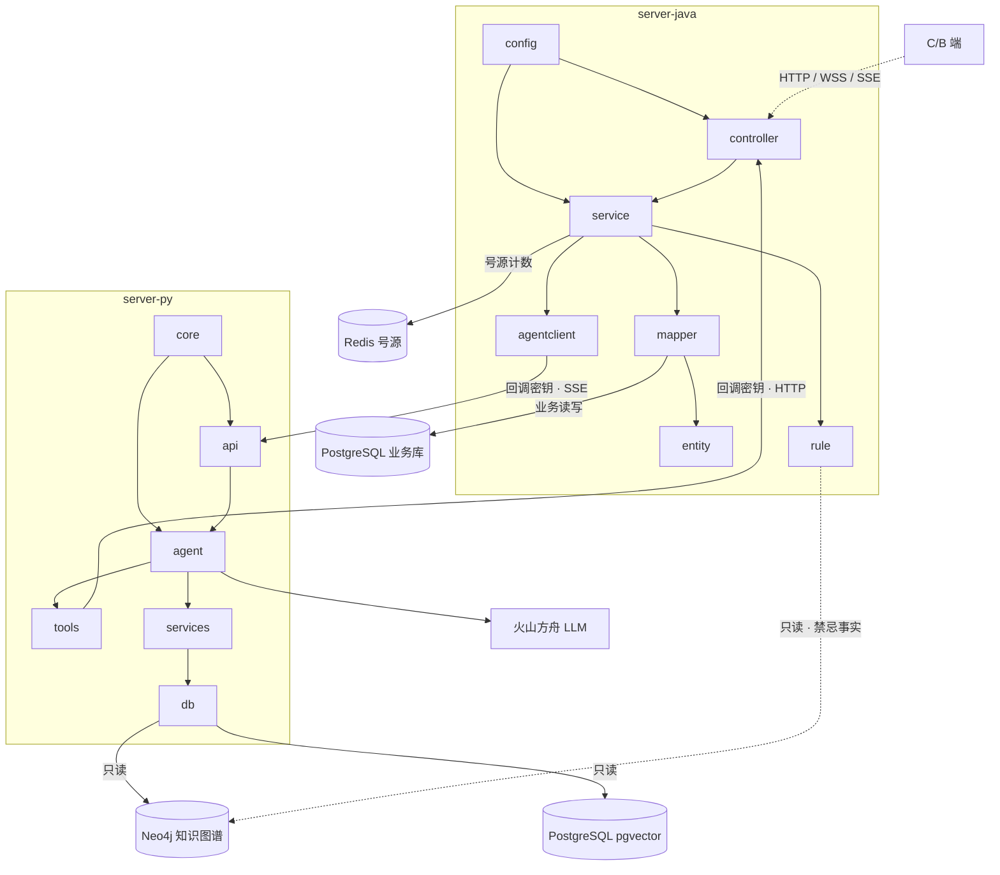
```mermaid
flowchart TD
    CLIENT["C/B 端"]
    subgraph SJ["server-java"]
      CFG["config"] --> CON["controller"]
      CFG --> SVC["service"]
      CON --> SVC
      SVC --> MAP["mapper"]
      MAP --> ENT["entity"]
      SVC --> RUL["rule"]
      SVC --> AGC["agentclient"]
    end
    subgraph SP["server-py"]
      CORE["core"] --> API["api"]
      CORE --> AGT["agent"]
      API --> AGT
      AGT --> TOOL["tools"]
      AGT --> SRV["services"]
      SRV --> DB["db"]
    end

    CLIENT -.->|"HTTP / WSS / SSE"| CON
    AGC -->|"回调密钥 · SSE"| API
    TOOL -->|"回调密钥 · HTTP"| CON
    MAP -->|"业务读写"| PG[("PostgreSQL 业务库")]
    SVC -->|"号源计数"| REDIS[("Redis 号源")]
    DB -->|"只读"| VEC[("PostgreSQL pgvector")]
    DB -->|"只读"| NEO[("Neo4j 知识图谱")]
    RUL -.->|"只读 · 禁忌事实"| NEO
    AGT --> LLM["火山方舟 LLM"]
```

server-py 的 `models`（数据模型）与 `schemas`（Pydantic 校验模型）为各层引用的数据定义，无主动调用关系，未画入图中。

图中可读出三条关键边界：一是 server-py 的 `tools` 必须经回调密钥调 server-java 的 `controller`，不得直连业务库；二是 PostgreSQL 业务库和 Redis 号源只有 server-java 的 `mapper`/`service` 能写，server-py 的 `db` 对 pgvector 与 Neo4j 均为只读；三是 server-java 的 `rule` 对 Neo4j 也只读，仅查询开方禁忌事实。这三条边界的可视化即对应上述双栈写入硬约束。

### 7.3 核心领域模型

本图突出状态对象与聚合边界；完整字段与外键关系见下方 ER 图。

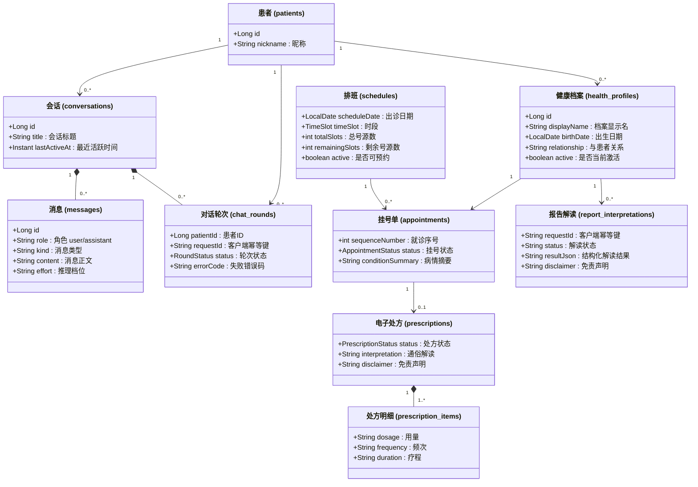
```mermaid
classDiagram
    class Patient["患者 (patients)"] {
      +Long id
      +String nickname : 昵称
    }
    class HealthProfile["健康档案 (health_profiles)"] {
      +Long id
      +String displayName : 档案显示名
      +LocalDate birthDate : 出生日期
      +String relationship : 与患者关系
      +boolean active : 是否当前激活
    }
    class Conversation["会话 (conversations)"] {
      +Long id
      +String title : 会话标题
      +Instant lastActiveAt : 最近活跃时间
    }
    class Message["消息 (messages)"] {
      +Long id
      +String role : 角色 user/assistant
      +String kind : 消息类型
      +String content : 消息正文
      +String effort : 推理档位
    }
    class ChatRound["对话轮次 (chat_rounds)"] {
      +Long patientId : 患者ID
      +String requestId : 客户端幂等键
      +RoundStatus status : 轮次状态
      +String errorCode : 失败错误码
    }
    class Schedule["排班 (schedules)"] {
      +LocalDate scheduleDate : 出诊日期
      +TimeSlot timeSlot : 时段
      +int totalSlots : 总号源数
      +int remainingSlots : 剩余号源数
      +boolean active : 是否可预约
    }
    class Appointment["挂号单 (appointments)"] {
      +int sequenceNumber : 就诊序号
      +AppointmentStatus status : 挂号状态
      +String conditionSummary : 病情摘要
    }
    class Prescription["电子处方 (prescriptions)"] {
      +PrescriptionStatus status : 处方状态
      +String interpretation : 通俗解读
      +String disclaimer : 免责声明
    }
    class PrescriptionItem["处方明细 (prescription_items)"] {
      +String dosage : 用量
      +String frequency : 频次
      +String duration : 疗程
    }
    class ReportInterpretation["报告解读 (report_interpretations)"] {
      +String requestId : 客户端幂等键
      +String status : 解读状态
      +String resultJson : 结构化解读结果
      +String disclaimer : 免责声明
    }

    Patient "1" --> "0..*" HealthProfile
    Patient "1" --> "0..*" Conversation
    Patient "1" --> "0..*" ChatRound
    Conversation "1" *-- "0..*" Message
    Conversation "1" *-- "0..*" ChatRound
    HealthProfile "1" --> "0..*" Appointment
    Schedule "1" --> "0..*" Appointment
    Appointment "1" --> "0..1" Prescription
    Prescription "1" *-- "1..*" PrescriptionItem
    HealthProfile "1" --> "0..*" ReportInterpretation
```

上图突出状态对象；完整业务实体还包括 Hospital、Department、Doctor、StaffUser、Medication、ConsultationRecord、HealthProfileAllergy、KnowledgeChunk 与 InAppMessage，其关系由下方 ER 图给出。状态值一律来自 `schema.sql` CHECK 或 `contracts/`，不得在调用端自行新增。

### 7.4 业务实体 ER 图

实体仅列主键与核心字段（完整定义见「字段字典」）；`FK` 标注外键来源，`o|--` 表示左端可为零（即外键可空）。

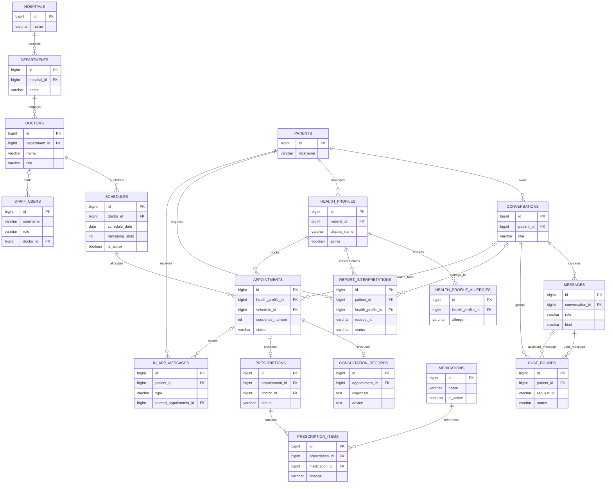
```mermaid
erDiagram
    HOSPITALS ||--o{ DEPARTMENTS : contains
    DEPARTMENTS ||--o{ DOCTORS : employs
    DOCTORS ||--o{ SCHEDULES : publishes
    DOCTORS o|--o{ STAFF_USERS : binds
    PATIENTS ||--o{ CONVERSATIONS : owns
    PATIENTS ||--o{ HEALTH_PROFILES : manages
    HEALTH_PROFILES ||--o{ HEALTH_PROFILE_ALLERGIES : records
    CONVERSATIONS ||--o{ MESSAGES : contains
    CONVERSATIONS ||--o{ CHAT_ROUNDS : groups
    MESSAGES ||--o{ CHAT_ROUNDS : user_message
    MESSAGES o|--o{ CHAT_ROUNDS : assistant_message
    PATIENTS ||--o{ REPORT_INTERPRETATIONS : requests
    HEALTH_PROFILES ||--o{ REPORT_INTERPRETATIONS : contextualizes
    CONVERSATIONS o|--o{ REPORT_INTERPRETATIONS : belongs_to
    HEALTH_PROFILES ||--o{ APPOINTMENTS : books
    SCHEDULES ||--o{ APPOINTMENTS : allocates
    CONVERSATIONS o|--o{ APPOINTMENTS : originates_from
    APPOINTMENTS ||--o| CONSULTATION_RECORDS : produces
    APPOINTMENTS ||--o| PRESCRIPTIONS : produces
    PRESCRIPTIONS ||--|{ PRESCRIPTION_ITEMS : contains
    MEDICATIONS ||--o{ PRESCRIPTION_ITEMS : references
    PATIENTS ||--o{ IN_APP_MESSAGES : receives
    APPOINTMENTS o|--o{ IN_APP_MESSAGES : relates

    HOSPITALS {
        bigint id PK
        varchar name
    }
    DEPARTMENTS {
        bigint id PK
        bigint hospital_id FK
        varchar name
    }
    DOCTORS {
        bigint id PK
        bigint department_id FK
        varchar name
        varchar title
    }
    SCHEDULES {
        bigint id PK
        bigint doctor_id FK
        date schedule_date
        int remaining_slots
        boolean is_active
    }
    STAFF_USERS {
        bigint id PK
        varchar username
        varchar role
        bigint doctor_id FK
    }
    PATIENTS {
        bigint id PK
        varchar nickname
    }
    CONVERSATIONS {
        bigint id PK
        bigint patient_id FK
        varchar title
    }
    HEALTH_PROFILES {
        bigint id PK
        bigint patient_id FK
        varchar display_name
        boolean active
    }
    HEALTH_PROFILE_ALLERGIES {
        bigint id PK
        bigint health_profile_id FK
        varchar allergen
    }
    MESSAGES {
        bigint id PK
        bigint conversation_id FK
        varchar role
        varchar kind
    }
    CHAT_ROUNDS {
        bigint id PK
        bigint patient_id FK
        varchar request_id
        varchar status
    }
    REPORT_INTERPRETATIONS {
        bigint id PK
        bigint patient_id FK
        bigint health_profile_id FK
        varchar request_id
        varchar status
    }
    APPOINTMENTS {
        bigint id PK
        bigint health_profile_id FK
        bigint schedule_id FK
        int sequence_number
        varchar status
    }
    CONSULTATION_RECORDS {
        bigint id PK
        bigint appointment_id FK
        text diagnosis
        text advice
    }
    PRESCRIPTIONS {
        bigint id PK
        bigint appointment_id FK
        bigint doctor_id FK
        varchar status
    }
    PRESCRIPTION_ITEMS {
        bigint id PK
        bigint prescription_id FK
        bigint medication_id FK
        varchar dosage
    }
    MEDICATIONS {
        bigint id PK
        varchar name
        boolean is_active
    }
    IN_APP_MESSAGES {
        bigint id PK
        bigint patient_id FK
        varchar type
        bigint related_appointment_id FK
    }
```

---

## 8 业务流程

### 8.1 实时对话与断连恢复流程

每轮对话由客户端携带 `request_id` 作为幂等键；红线症状判断先于 LLM 执行；轮次一旦受理便独立于连接运行，断连不取消。

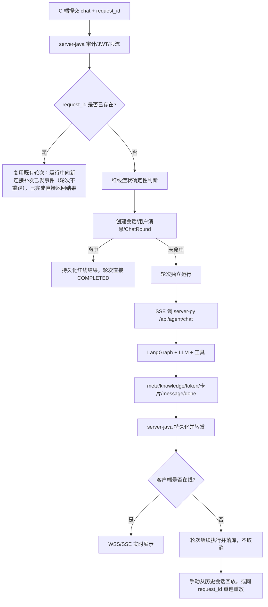
```mermaid
flowchart TD
    A["C 端提交 chat + request_id"] --> B["server-java 审计/JWT/限流"]
    B --> C{"request_id 是否已存在?"}
    C -- 是 --> D["复用既有轮次：运行中向新连接补发已发事件（轮次不重跑），已完成直接返回结果"]
    C -- 否 --> E["红线症状确定性判断"]
    E --> F["创建会话/用户消息/ChatRound"]
    F -- 命中 --> G["持久化红线结果，轮次直接 COMPLETED"]
    F -- 未命中 --> H["轮次独立运行"]
    H --> I["SSE 调 server-py /api/agent/chat"]
    I --> J["LangGraph + LLM + 工具"]
    J --> K["meta/knowledge/token/卡片/message/done"]
    K --> L["server-java 持久化并转发"]
    L --> M{"客户端是否在线?"}
    M -- 是 --> N["WSS/SSE 实时展示"]
    M -- 否 --> O["轮次继续执行并落库，不取消"]
    O --> P["手动从历史会话回放，或同 request_id 重连重放"]
```

- 无论是否命中红线都会创建会话与 ChatRound，红线消息同样挂在会话和轮次上。
- 断连重连的"补发"只针对事件流：运行中的轮次通过 replay sink 把已发出的事件重新推给新连接，轮次本身只执行一次。
- 进程重启后运行中的轮次不可恢复：幂等命中时标记 `FAILED(PROCESS_RESTARTED)` 并提示从对话记录恢复，绝不重新执行轮次（不产生二次业务副作用）。
- 端侧 WebSocket 断连后用同一 `request_id` 降级走 HTTP SSE，由幂等机制收敛；重进历史会话的回放由用户手动选择，非自动恢复。

### 8.2 导诊、挂号与摘要降级流程

导诊由 Agent 通过三个业务工具回调 server-java 完成（`recommend_doctors` / `get_doctor_slots` / `create_appointment`）。号源防超卖的核心顺序：行锁 + 幂等 → Redis 原子预扣 → PG 事务对账，任何一步失败都反向补偿 Redis；挂号成立后的病情摘要独立保存、失败降级，绝不影响已成立的挂号。

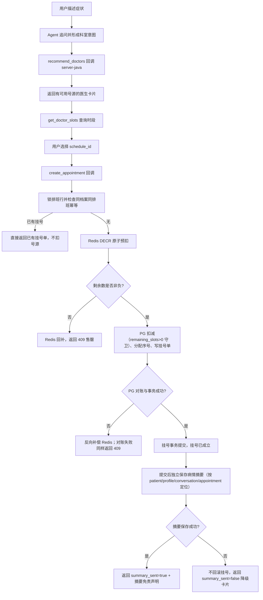
```mermaid
flowchart TD
    A["用户描述症状"] --> B["Agent 追问并形成科室意图"]
    B --> C["recommend_doctors 回调 server-java"]
    C --> D["返回有可用号源的医生卡片"]
    D --> E["get_doctor_slots 查询时段"]
    E --> F["用户选择 schedule_id"]
    F --> G["create_appointment 回调"]
    G --> H["锁排班行并检查同档案同排班幂等"]
    H -- 已有挂号 --> H1["直接返回已有挂号单，不扣号源"]
    H -- 无 --> I["Redis DECR 原子预扣"]
    I --> J{"剩余数是否非负?"}
    J -- 否 --> K["Redis 回补，返回 409 售罄"]
    J -- 是 --> L["PG 扣减（remaining_slots>0 守卫）、分配序号、写挂号单"]
    L --> M{"PG 对账与事务成功?"}
    M -- 否 --> N["反向补偿 Redis；对账失败同样返回 409"]
    M -- 是 --> O["挂号事务提交，挂号已成立"]
    O --> P["提交后独立保存病情摘要（按 patient/profile/conversation/appointment 定位）"]
    P --> Q{"摘要保存成功?"}
    Q -- 是 --> R["返回 summary_sent=true + 摘要免责声明"]
    Q -- 否 --> S["不回滚挂号，返回 summary_sent=false 降级卡片"]
```

- 409 售罄有两个出口：Redis 预扣后为负，以及预扣成功后 PG 对账守卫未命中；两者都会回补 Redis。
- Redis 号源计数由 `SlotAccounting` 在排班创建/调整时初始化，是 DECR 预扣成立的前置不变量。
- server-py 侧两层降级：模型臆造的非法参数（如 `schedule_id<=0`）在回调前拦截；回调失败被规整为模型可向用户解释的错误文本，不掐断 SSE 流。

### 8.3 医生开方与审核流程

禁忌检查为确定性规则，判定所需事实（过敏史、在用药、禁忌与相互作用）由 server-java 读取，不依赖 LLM；前端禁用按钮只是体验层，提交时强制复跑同一规则。

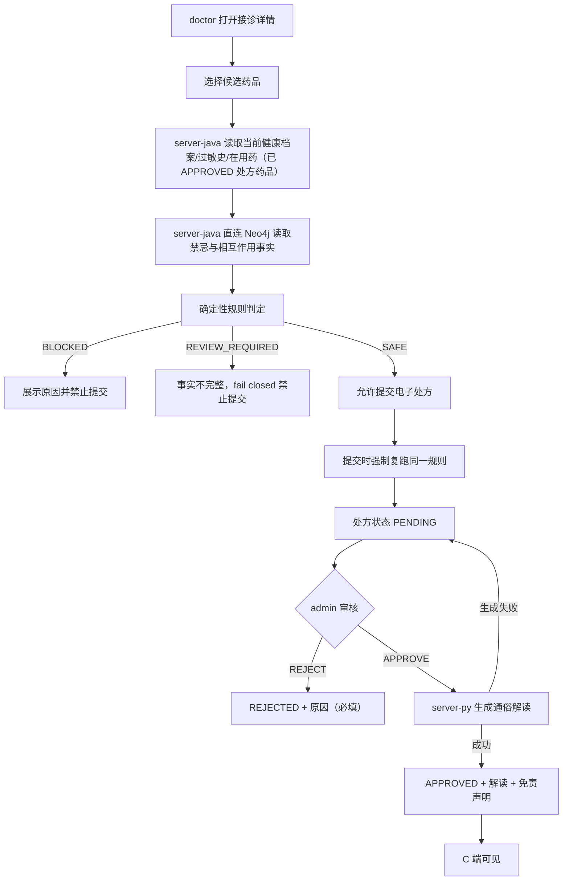
```mermaid
flowchart TD
    A["doctor 打开接诊详情"] --> B["选择候选药品"]
    B --> C["server-java 读取当前健康档案/过敏史/在用药（已 APPROVED 处方药品）"]
    C --> D["server-java 直连 Neo4j 读取禁忌与相互作用事实"]
    D --> E["确定性规则判定"]
    E -- BLOCKED --> F["展示原因并禁止提交"]
    E -- REVIEW_REQUIRED --> G["事实不完整，fail closed 禁止提交"]
    E -- SAFE --> H["允许提交电子处方"]
    H --> I["提交时强制复跑同一规则"]
    I --> J["处方状态 PENDING"]
    J --> K{"admin 审核"}
    K -- REJECT --> L["REJECTED + 原因（必填）"]
    K -- APPROVE --> M["server-py 生成通俗解读"]
    M -- 生成失败 --> J
    M -- 成功 --> N["APPROVED + 解读 + 免责声明"]
    N --> O["C 端可见"]
```

- 相互作用检查的范围包含患者当前在用的药品（来自已 APPROVED 处方），不限于候选药品两两之间。
- fail closed 边界：无激活健康档案返回 409；药品不存在/已停用返回 400；Neo4j 不可用按事实不完整判 `REVIEW_REQUIRED`。
- 处方审核为 admin 专属操作（`/api/b/prescriptions/{id}/review`），驳回必须填原因。

### 8.4 报告解读流程

上传链路支持直接 multipart 与逐页暂存 + finalize 两种，均以 `request_id` 幂等；解读记录先落 `PROCESSING` 占位再调模型，模型调用刻意放在短事务之外。

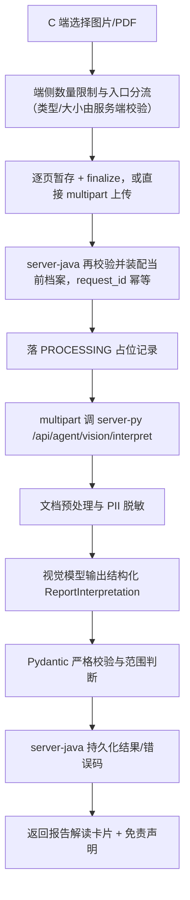
```mermaid
flowchart TD
    A["C 端选择图片/PDF"] --> B["端侧数量限制与入口分流（类型/大小由服务端校验）"]
    B --> C["逐页暂存 + finalize，或直接 multipart 上传"]
    C --> D["server-java 再校验并装配当前档案，request_id 幂等"]
    D --> E["落 PROCESSING 占位记录"]
    E --> F["multipart 调 server-py /api/agent/vision/interpret"]
    F --> G["文档预处理与 PII 脱敏"]
    G --> H["视觉模型输出结构化 ReportInterpretation"]
    H --> I["Pydantic 严格校验与范围判断"]
    I --> J["server-java 持久化结果/错误码"]
    J --> K["返回报告解读卡片 + 免责声明"]
```

- 错误码体系由 `contracts/vision-errors.json` 钉死：输入非法 422、模型超时 504、输出非法 502；结构校验失败自动重试一次。
- 解读成功同时写三条会话消息（report_upload 用户卡、report_interpretation 卡片、report_context 文本摘要），免责声明由 server-java 出口固定兜底。

### 8.5 认证与授权流程

server-java 是唯一鉴权入口，按路径分三类凭证；过滤器顺序为审计 → 认证 → 限流（401/429 也落审计）。

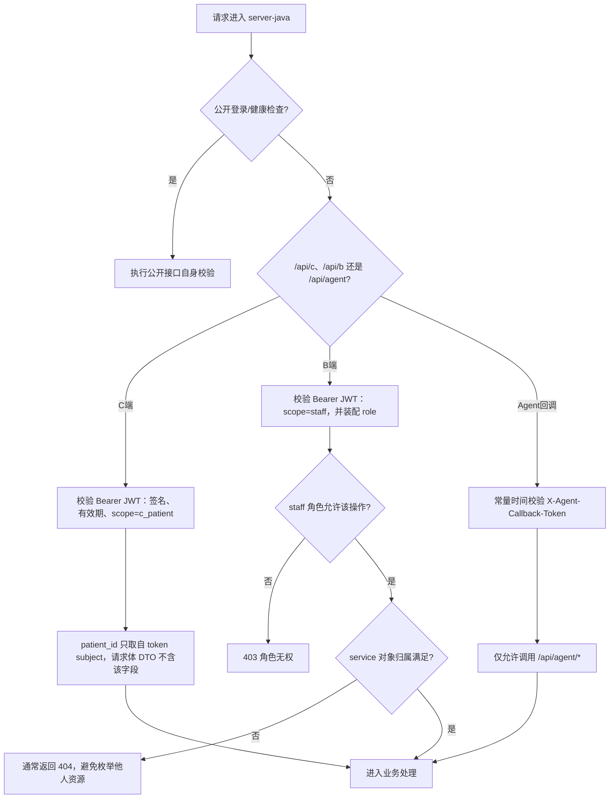
```mermaid
flowchart TD
    A["请求进入 server-java"] --> B{"公开登录/健康检查?"}
    B -- 是 --> C["执行公开接口自身校验"]
    B -- 否 --> D{"/api/c、/api/b 还是 /api/agent?"}
    D -- C端 --> E["校验 Bearer JWT：签名、有效期、scope=c_patient"]
    D -- B端 --> F["校验 Bearer JWT：scope=staff，并装配 role"]
    D -- Agent回调 --> G["常量时间校验 X-Agent-Callback-Token"]
    E --> H["patient_id 只取自 token subject，请求体 DTO 不含该字段"]
    F --> I{"staff 角色允许该操作?"}
    G --> J["仅允许调用 /api/agent/*"]
    I -- 否 --> K["403 角色无权"]
    I -- 是 --> M{"service 对象归属满足?"}
    M -- 否 --> N["通常返回 404，避免枚举他人资源"]
    M -- 是 --> L["进入业务处理"]
    H --> L
    J --> L
```

- JWT 无 `doctor_id` claim：B 端医生的 `doctor_id` 由 service 按 `staff_id` 查 `staff_users` 得到。
- 授权分两层：过滤器/拦截器管角色（403），service 管对象归属（404），后者避免枚举他人资源。

### 8.6 健康档案切换流程

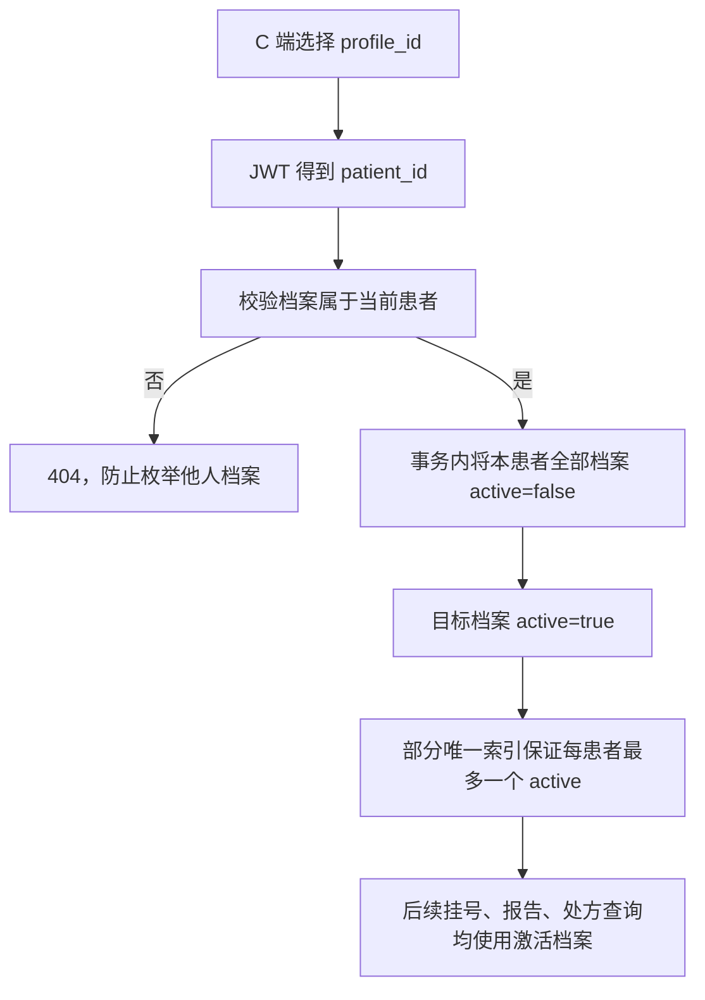
```mermaid
flowchart TD
    A["C 端选择 profile_id"] --> B["JWT 得到 patient_id"]
    B --> C["校验档案属于当前患者"]
    C -- 否 --> D["404，防止枚举他人档案"]
    C -- 是 --> E["事务内将本患者全部档案 active=false"]
    E --> F["目标档案 active=true"]
    F --> G["部分唯一索引保证每患者最多一个 active"]
    G --> H["后续挂号、报告、处方查询均使用激活档案"]
```

- 新建档案走同一模式：一个事务内"全部置 false + 插入新档案并激活"。
- 激活时目标档案更新行数不为 1 返回 409，部分唯一索引（`WHERE active = TRUE`）在 DB 层兜底唯一性。

### 8.7 取消挂号流程

取消与创建对称：先锁行定状态，PG 与 Redis 在同一事务窗口内退还，PG 失败则撤销 Redis 退还；重复取消幂等，不重复回补。

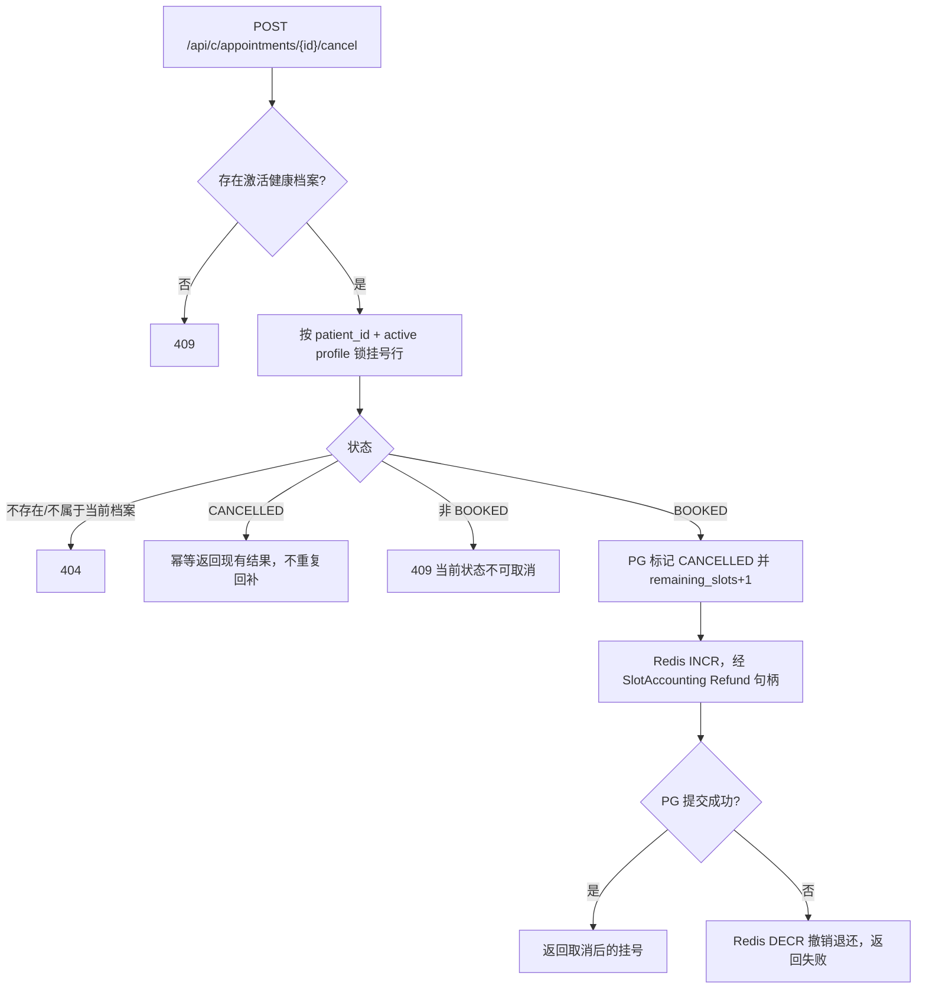
```mermaid
flowchart TD
    A["POST /api/c/appointments/{id}/cancel"] --> B{"存在激活健康档案?"}
    B -- 否 --> B1["409"]
    B -- 是 --> C["按 patient_id + active profile 锁挂号行"]
    C --> D{"状态"}
    D -- 不存在/不属于当前档案 --> E["404"]
    D -- CANCELLED --> F["幂等返回现有结果，不重复回补"]
    D -- 非 BOOKED --> G["409 当前状态不可取消"]
    D -- BOOKED --> H["PG 标记 CANCELLED 并 remaining_slots+1"]
    H --> I["Redis INCR，经 SlotAccounting Refund 句柄"]
    I --> J{"PG 提交成功?"}
    J -- 是 --> K["返回取消后的挂号"]
    J -- 否 --> L["Redis DECR 撤销退还，返回失败"]
```

### 8.8 挂号、处方与接诊副作用状态

挂号状态机（`Appointment`）：

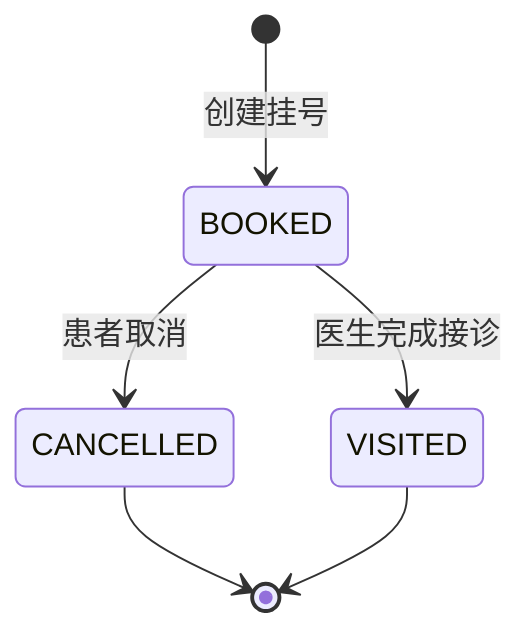
```mermaid
stateDiagram-v2
    [*] --> BOOKED: 创建挂号
    BOOKED --> CANCELLED: 患者取消
    BOOKED --> VISITED: 医生完成接诊
    CANCELLED --> [*]
    VISITED --> [*]
```

处方状态机（`Prescription`）：

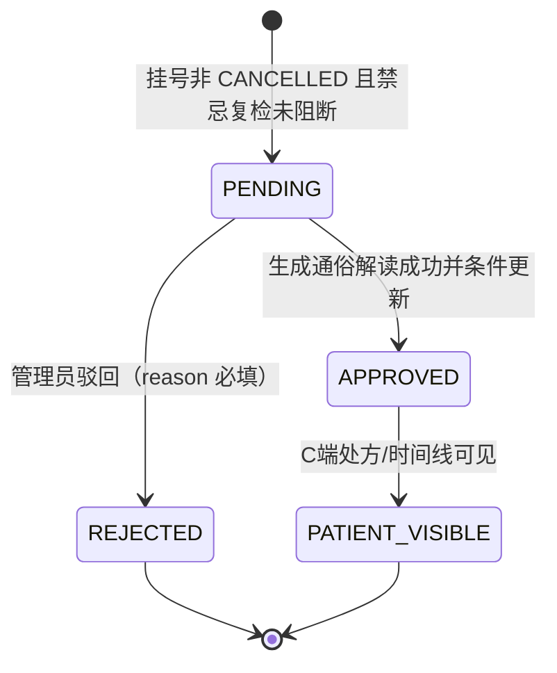
```mermaid
stateDiagram-v2
    [*] --> PENDING: 挂号非 CANCELLED 且禁忌复检未阻断
    PENDING --> REJECTED: 管理员驳回（reason 必填）
    PENDING --> APPROVED: 生成通俗解读成功并条件更新
    APPROVED --> PATIENT_VISIBLE: C端处方/时间线可见
    REJECTED --> [*]
    PATIENT_VISIBLE --> [*]
```

完成接诊的副作用（同一 PG 事务，小结生成在事务外）：

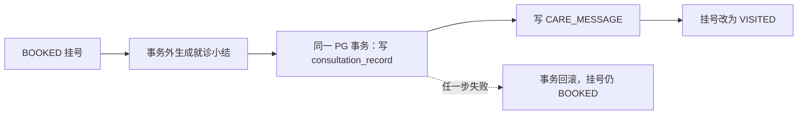
```mermaid
flowchart LR
    A["BOOKED 挂号"] --> B["事务外生成就诊小结"]
    B --> C["同一 PG 事务：写 consultation_record"]
    C --> D["写 CARE_MESSAGE"]
    D --> E["挂号改为 VISITED"]
    C -. 任一步失败 .-> F["事务回滚，挂号仍 BOOKED"]
```

聚合边界与不变量：

- `Appointment` 与 `Prescription` 是两个独立状态机：挂号仍为 `BOOKED` 时可先创建 `PENDING` 处方，系统只拒绝 `CANCELLED` 挂号；完成接诊不是开方的前置条件。
- 挂号取消与完成接诊互斥；一张挂号单最多一条接诊记录和一张处方，由 DB 唯一约束兜底。
- 并发审核通过 `WHERE status='PENDING'` 条件更新保证只有一个决定成功。
- 处方通过前须先得到 server-py 通俗解读：解读生成发生在条件更新之前，失败则保持 `PENDING`，不会产生缺少解读或免责声明的患者可见处方（DB CHECK 约束兜底）。

---

## 9 时序图

### 9.1 WebSocket 对话时序

下图覆盖三条分支：已存在轮次的幂等重放、命中红线的自闭环、正常 Agent 流（含 RAG 降级与最终 `message`）。FAILED 路径在末尾给出。

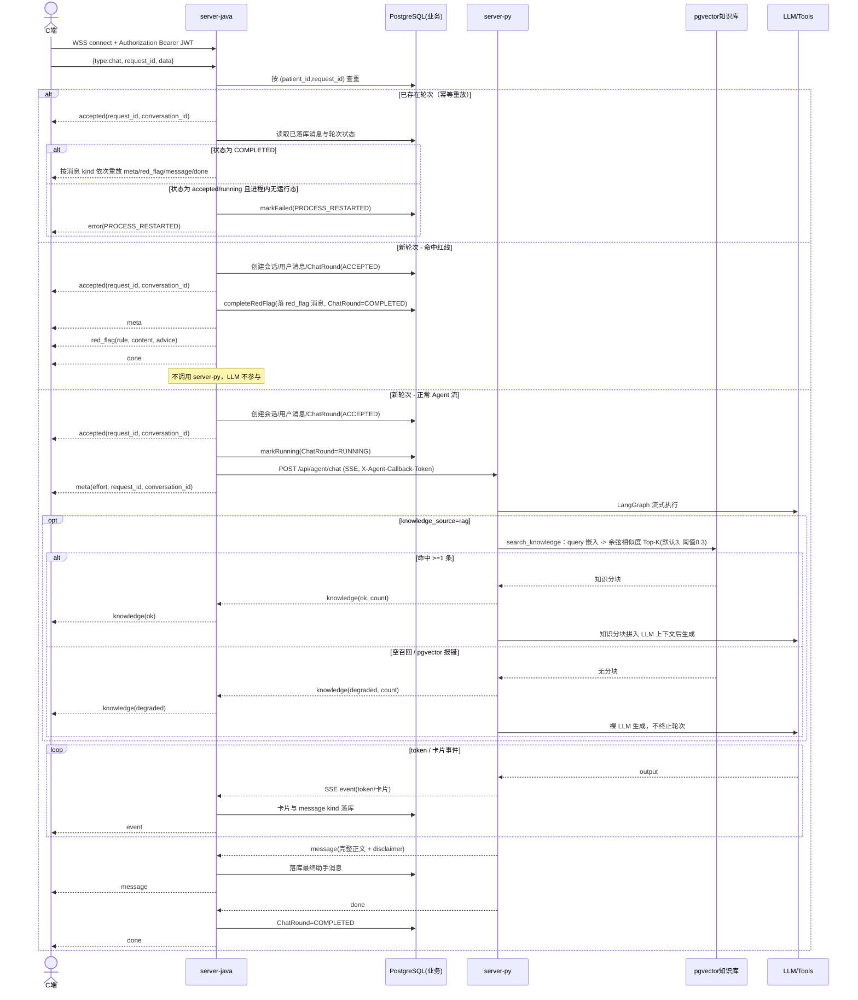
```mermaid
sequenceDiagram
    actor C as C端
    participant J as server-java
    participant P as PostgreSQL(业务)
    participant A as server-py
    participant V as pgvector知识库
    participant L as LLM/Tools

    C->>J: WSS connect + Authorization Bearer JWT
    C->>J: {type:chat, request_id, data}
    J->>P: 按 (patient_id,request_id) 查重

    alt 已存在轮次（幂等重放）
      J-->>C: accepted(request_id, conversation_id)
      J->>P: 读取已落库消息与轮次状态
      alt 状态为 COMPLETED
        J-->>C: 按消息 kind 依次重放 meta/red_flag/message/done
      else 状态为 accepted/running 且进程内无运行态
        J->>P: markFailed(PROCESS_RESTARTED)
        J-->>C: error(PROCESS_RESTARTED)
      end
    else 新轮次 - 命中红线
      J->>P: 创建会话/用户消息/ChatRound(ACCEPTED)
      J-->>C: accepted(request_id, conversation_id)
      J->>P: completeRedFlag(落 red_flag 消息, ChatRound=COMPLETED)
      J-->>C: meta
      J-->>C: red_flag(rule, content, advice)
      J-->>C: done
      Note over J: 不调用 server-py，LLM 不参与
    else 新轮次 - 正常 Agent 流
      J->>P: 创建会话/用户消息/ChatRound(ACCEPTED)
      J-->>C: accepted(request_id, conversation_id)
      J->>P: markRunning(ChatRound=RUNNING)
      J->>A: POST /api/agent/chat (SSE, X-Agent-Callback-Token)
      J-->>C: meta(effort, request_id, conversation_id)
      A->>L: LangGraph 流式执行
      opt knowledge_source=rag
        A->>V: search_knowledge：query 嵌入 -> 余弦相似度 Top-K(默认3, 阈值0.3)
        alt 命中 >=1 条
          V-->>A: 知识分块
          A-->>J: knowledge(ok, count)
          J-->>C: knowledge(ok)
          A->>L: 知识分块拼入 LLM 上下文后生成
        else 空召回 / pgvector 报错
          V-->>A: 无分块
          A-->>J: knowledge(degraded, count)
          J-->>C: knowledge(degraded)
          A->>L: 裸 LLM 生成，不终止轮次
        end
      end
      loop token / 卡片事件
        L-->>A: output
        A-->>J: SSE event(token/卡片)
        J->>P: 卡片与 message kind 落库
        J-->>C: event
      end
      A-->>J: message(完整正文 + disclaimer)
      J->>P: 落库最终助手消息
      J-->>C: message
      A-->>J: done
      J->>P: ChatRound=COMPLETED
      J-->>C: done
    end
```

上游异常时的 FAILED 路径：

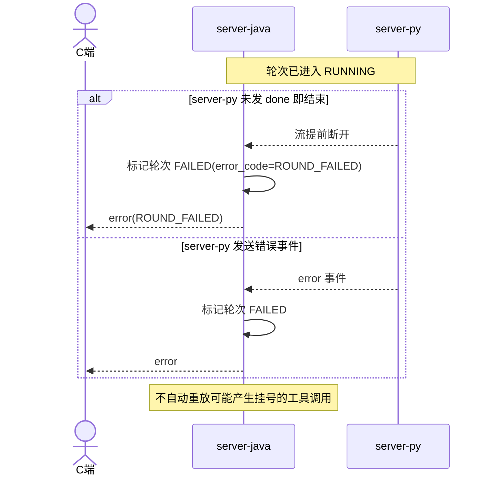
```mermaid
sequenceDiagram
    actor C as C端
    participant J as server-java
    participant A as server-py

    Note over J,A: 轮次已进入 RUNNING
    alt server-py 未发 done 即结束
      A-->>J: 流提前断开
      J->>J: 标记轮次 FAILED(error_code=ROUND_FAILED)
      J-->>C: error(ROUND_FAILED)
    else server-py 发送错误事件
      A-->>J: error 事件
      J->>J: 标记轮次 FAILED
      J-->>C: error
    end
    Note over J: 不自动重放可能产生挂号的工具调用
```

### 9.2 WebSocket 断连时序

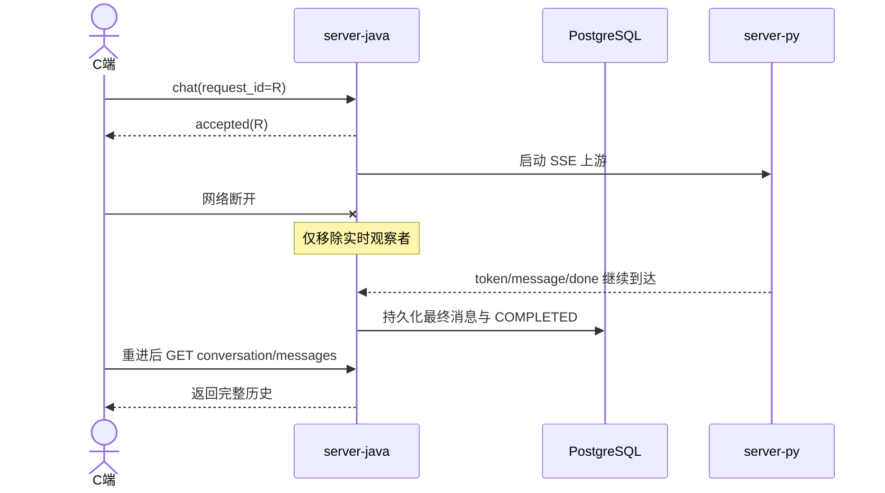
```mermaid
sequenceDiagram
    actor C as C端
    participant J as server-java
    participant P as PostgreSQL
    participant A as server-py

    C->>J: chat(request_id=R)
    J-->>C: accepted(R)
    J->>A: 启动 SSE 上游
    C-xJ: 网络断开
    Note over J: 仅移除实时观察者
    A-->>J: token/message/done 继续到达
    J->>P: 持久化最终消息与 COMPLETED
    C->>J: 重进后 GET conversation/messages
    J-->>C: 返回完整历史
```

### 9.3 挂号与摘要 best-effort 时序

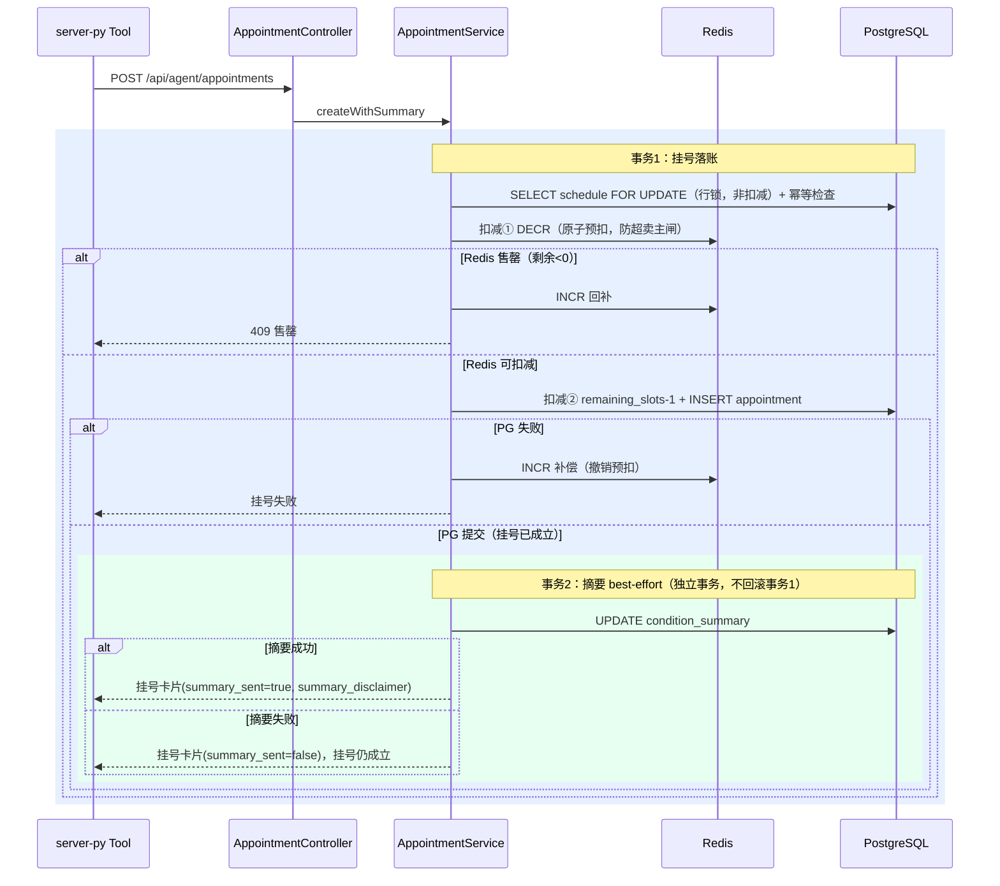
```mermaid
sequenceDiagram
    participant A as server-py Tool
    participant C as AppointmentController
    participant S as AppointmentService
    participant R as Redis
    participant P as PostgreSQL

    A->>C: POST /api/agent/appointments
    C->>S: createWithSummary

    rect rgb(230, 240, 255)
      Note over S,P: 事务1：挂号落账
      S->>P: SELECT schedule FOR UPDATE（行锁，非扣减）+ 幂等检查
      S->>R: 扣减① DECR（原子预扣，防超卖主闸）
      alt Redis 售罄（剩余<0）
        S->>R: INCR 回补
        S-->>A: 409 售罄
      else Redis 可扣减
        S->>P: 扣减② remaining_slots-1 + INSERT appointment
        alt PG 失败
          S->>R: INCR 补偿（撤销预扣）
          S-->>A: 挂号失败
        else PG 提交（挂号已成立）
          rect rgb(230, 255, 240)
            Note over S,P: 事务2：摘要 best-effort（独立事务，不回滚事务1）
            S->>P: UPDATE condition_summary
            alt 摘要成功
              S-->>A: 挂号卡片(summary_sent=true, summary_disclaimer)
            else 摘要失败
              S-->>A: 挂号卡片(summary_sent=false)，挂号仍成立
            end
          end
        end
      end
    end
```

### 9.4 报告解读时序

报告解读分“直传”和“分片暂存 + finalize”两种入口，二者最终汇入同一条模型调用与持久化路径。关键约束：跨栈模型调用故意置于短事务之间，失败只落稳定错误码，绝不持久化模型原始输出或报告原文。

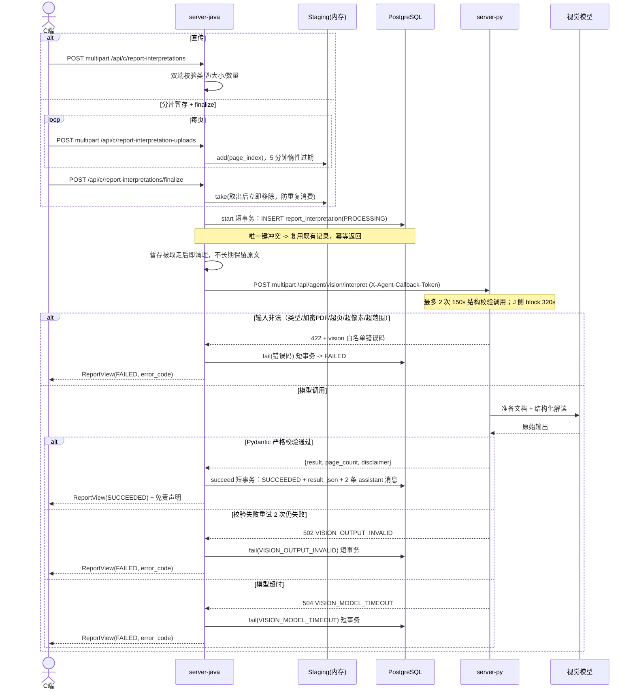
```mermaid
sequenceDiagram
    actor C as C端
    participant J as server-java
    participant ST as Staging(内存)
    participant P as PostgreSQL
    participant A as server-py
    participant V as 视觉模型

    alt 直传
      C->>J: POST multipart /api/c/report-interpretations
      J->>J: 双端校验类型/大小/数量
    else 分片暂存 + finalize
      loop 每页
        C->>J: POST multipart /api/c/report-interpretation-uploads
        J->>ST: add(page_index)，5 分钟惰性过期
      end
      C->>J: POST /api/c/report-interpretations/finalize
      J->>ST: take(取出后立即移除，防重复消费)
    end

    J->>P: start 短事务：INSERT report_interpretation(PROCESSING)
    Note over J,P: 唯一键冲突 -> 复用既有记录，幂等返回
    J->>J: 暂存被取走后即清理，不长期保留原文

    J->>A: POST multipart /api/agent/vision/interpret (X-Agent-Callback-Token)
    Note over A: 最多 2 次 150s 结构校验调用；J 侧 block 320s

    alt 输入非法（类型/加密PDF/超页/超像素/超范围）
      A-->>J: 422 + vision 白名单错误码
      J->>P: fail(错误码) 短事务 -> FAILED
      J-->>C: ReportView(FAILED, error_code)
    else 模型调用
      A->>V: 准备文档 + 结构化解读
      V-->>A: 原始输出
      alt Pydantic 严格校验通过
        A-->>J: {result, page_count, disclaimer}
        J->>P: succeed 短事务：SUCCEEDED + result_json + 2 条 assistant 消息
        J-->>C: ReportView(SUCCEEDED) + 免责声明
      else 校验失败重试 2 次仍失败
        A-->>J: 502 VISION_OUTPUT_INVALID
        J->>P: fail(VISION_OUTPUT_INVALID) 短事务
        J-->>C: ReportView(FAILED, error_code)
      else 模型超时
        A-->>J: 504 VISION_MODEL_TIMEOUT
        J->>P: fail(VISION_MODEL_TIMEOUT) 短事务
        J-->>C: ReportView(FAILED, error_code)
      end
    end
```

说明：直传与分片两入口共享 `interpret` 主干；finalize 路径的幂等由 `persistence.findByRequest` 先行命中即返回旧记录保证；非白名单 server-py 错误码在 server-java 侧统一收敛为 `VISION_AGENT_UNAVAILABLE`。

### 9.5 处方开方与审核时序

本流程跨 server-java、Neo4j、server-py 三方，并存在两处设计要点：医生开方提交时强制复跑禁忌规则；管理员 APPROVE 时**先**调用 server-py 生成通俗解读**再**做并发条件更新，故模型已调用但条件更新失败（被并发抢审）的窗口存在，interpretation 结果会被丢弃，审核不落库为 APPROVED。

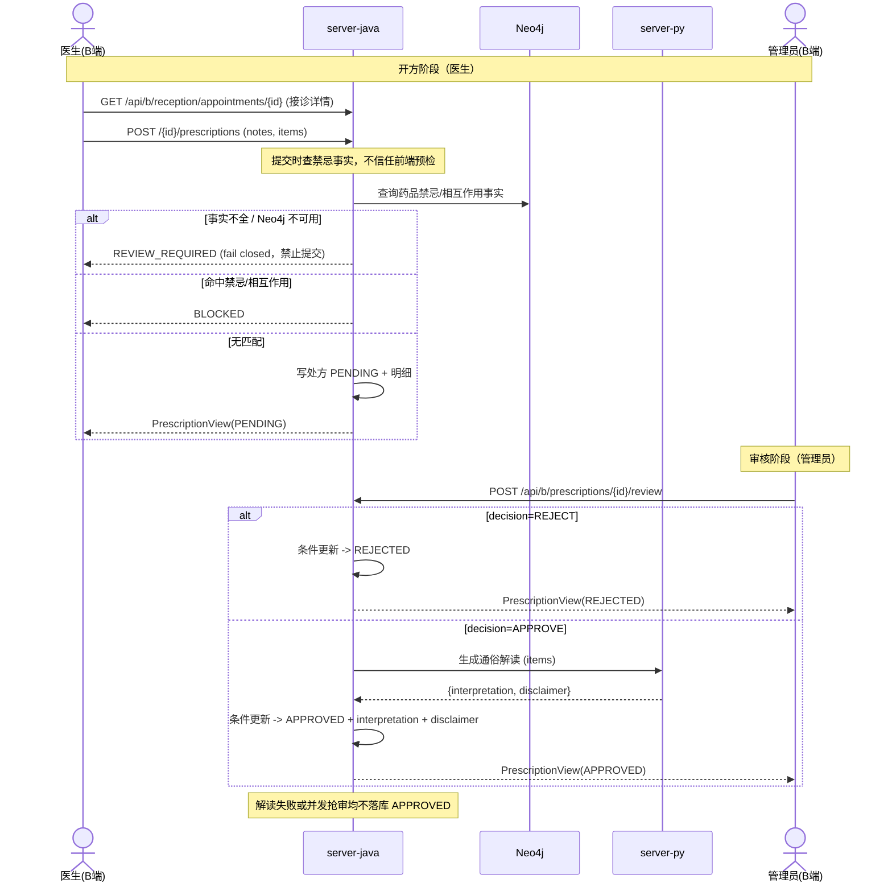
```mermaid
sequenceDiagram
    actor D as 医生(B端)
    participant J as server-java
    participant N as Neo4j
    participant A as server-py
    actor Ad as 管理员(B端)

    Note over D,Ad: 开方阶段（医生）
    D->>J: GET /api/b/reception/appointments/{id} (接诊详情)
    D->>J: POST /{id}/prescriptions (notes, items)
    Note over J: 提交时查禁忌事实，不信任前端预检
    J->>N: 查询药品禁忌/相互作用事实
    alt 事实不全 / Neo4j 不可用
      J-->>D: REVIEW_REQUIRED (fail closed，禁止提交)
    else 命中禁忌/相互作用
      J-->>D: BLOCKED
    else 无匹配
      J->>J: 写处方 PENDING + 明细
      J-->>D: PrescriptionView(PENDING)
    end

    Note over Ad: 审核阶段（管理员）
    Ad->>J: POST /api/b/prescriptions/{id}/review

    alt decision=REJECT
      J->>J: 条件更新 -> REJECTED
      J-->>Ad: PrescriptionView(REJECTED)
    else decision=APPROVE
      J->>A: 生成通俗解读 (items)
      A-->>J: {interpretation, disclaimer}
      J->>J: 条件更新 -> APPROVED + interpretation + disclaimer
      J-->>Ad: PrescriptionView(APPROVED)
    end

    Note over J: 解读失败或并发抢审均不落库 APPROVED
```

说明：上图把开方阶段的选药预检折叠进提交复检--实际医生选药时可先调 `POST /{id}/contraindication-check` 预览判定结果，但提交时 server-java 必须用最新事实强制复跑同一规则，前端禁用按钮不是安全边界。Neo4j 查询沿 `CONTRAINDICATED_FOR`（药品禁用于某过敏/状态）与 `INTERACTS_WITH`（两药相互作用）两种关系捞事实，交纯内存规则引擎做确定性判定，LLM 不参与。审核的条件更新使用 `WHERE id=#{id} AND status='PENDING'`，返回行数≠1 即抛 409，保证并发只有一个决定生效；APPROVE 分支先调 server-py 生成解读、再条件更新，故解读失败（server-py 5xx 抛 502）或并发抢审时结果被丢弃，审核保持 PENDING，不产生缺少解读或免责声明的患者可见处方。

---

## 10 数据库设计

数据库唯一建模来源为 `server-java/src/main/resources/schema.sql`。开发期不使用迁移工具，结构变更统一 drop + recreate + 幂等 seed。业务实体只存 PostgreSQL；Redis 只承担号源计数；Neo4j 只存医学知识节点和关系。

### 10.1 业务表总览

| 域 | 表 | 责任 |
| --- | --- | --- |
| 组织主数据 | `hospitals` `departments` `doctors` | 医院 / 科室 / 医生 |
| 号源与排班 | `schedules` | 排班与 PG 侧号源账 |
| C 端身份 | `patients` | C 端患者身份 |
| B 端身份 | `staff_users` | B 端员工身份（admin/doctor） |
| 会话 | `conversations` `messages` `chat_rounds` | 会话、消息卡片、对话轮次生命周期 |
| 健康档案 | `health_profiles` `health_profile_allergies` | 本人/家人档案与可信过敏史 |
| 挂号与接诊 | `appointments` `consultation_records` | 挂号单与医生接诊记录 |
| 处方 | `prescriptions` `prescription_items` | 电子处方头与明细 |
| 药品 | `medications` | 药品业务主数据 |
| 报告解读 | `report_interpretations` | 报告解读记录 |
| 知识库 | `knowledge_chunks` | pgvector 知识分块（server-py 只读） |
| 站内消息 | `in_app_messages` | 关怀/小结站内消息 |

### 10.2 字段字典

以下为 `schema.sql` 的编码基线。所有 `id` 均为 `BIGINT GENERATED BY DEFAULT AS IDENTITY PRIMARY KEY`；`N` 表示 NOT NULL，`Y` 表示可空；未写默认值即无默认值。

#### 组织与号源

##### `hospitals` 医院主数据

| 字段 | 类型 | 可空 | 说明 |
| --- | --- | --- | --- |
| name | varchar(100) | N | 医院名称 |
| level | varchar(30) | Y | 医院等级 |
| address | varchar(255) | Y | 地址 |
| longitude | double precision | Y | 经度（须与 latitude 成对） |
| latitude | double precision | Y | 纬度（须与 longitude 成对） |

**约束与索引**：`name UNIQUE`

##### `departments` 科室主数据

| 字段 | 类型 | 可空 | 说明 |
| --- | --- | --- | --- |
| hospital_id | bigint | N | 外键 -> hospitals.id |
| name | varchar(100) | Y | 科室名称 |
| floor | varchar(30) | Y | 楼层 |
| location | varchar(255) | Y | 位置说明 |

**约束与索引**：`hospital_id -> hospitals.id`

##### `doctors` 医生主数据

| 字段 | 类型 | 可空 | 说明 |
| --- | --- | --- | --- |
| department_id | bigint | N | 外键 -> departments.id |
| name | varchar(50) | Y | 医生姓名 |
| title | varchar(50) | Y | 职称 |
| specialty | text | Y | 专长 |
| photo_url | varchar(500) | Y | 头像地址 |

**约束与索引**：`department_id -> departments.id`

##### `schedules` 排班与号源账

| 字段 | 类型 | 可空 | 默认 | 说明 |
| --- | --- | --- | --- | --- |
| doctor_id | bigint | N | - | 外键 -> doctors.id |
| schedule_date | date | N | - | 出诊日期 |
| time_slot | varchar(30) | N | - | 契约枚举时段 |
| total_slots | int | N | - | 总号源 |
| remaining_slots | int | N | - | 剩余号源 |
| is_active | boolean | N | true | 是否可约 |

**约束与索引**：`doctor_id -> doctors.id`；`total_slots > 0`；`0 <= remaining_slots <= total_slots`

#### 身份

##### `patients` C 端患者身份

| 字段 | 类型 | 可空 | 默认 | 说明 |
| --- | --- | --- | --- | --- |
| nickname | varchar(50) | N | - | 昵称 |
| created_at | timestamptz | N | now() | 创建时间 |

**约束与索引**：`nickname UNIQUE`

##### `staff_users` B 端员工身份

| 字段 | 类型 | 可空 | 说明 |
| --- | --- | --- | --- |
| username | varchar(50) | N | 登录账号 |
| password_hash | varchar(255) | Y | 密码哈希 |
| role | varchar(20) | Y | 角色：admin/doctor |
| doctor_id | bigint | Y | 绑定医生（外键） |

**约束与索引**：`username UNIQUE`；`doctor_id -> doctors.id ON DELETE SET NULL`

#### 会话

##### `conversations` 会话

| 字段 | 类型 | 可空 | 默认 | 说明 |
| --- | --- | --- | --- | --- |
| patient_id | bigint | N | - | 外键 -> patients.id |
| title | varchar(50) | N | - | 会话标题 |
| created_at | timestamptz | N | now() | 创建时间 |
| last_active_at | timestamptz | N | now() | 最近活跃时间 |

**约束与索引**：`patient_id -> patients.id`；`idx_conversations_patient`

##### `messages` 会话消息与卡片

| 字段 | 类型 | 可空 | 默认 | 说明 |
| --- | --- | --- | --- | --- |
| conversation_id | bigint | N | - | 外键 -> conversations.id |
| role | varchar(20) | N | - | user/assistant |
| kind | varchar(32) | N | text | 消息类型（须容纳 contracts 最长值） |
| content | text | N | - | 消息正文 |
| effort | varchar(10) | Y | - | 推理档位 |
| report_interpretation_id | bigint | Y | - | 关联报告解读 |
| created_at | timestamptz | N | now() | 创建时间 |

**约束与索引**：conversation 删除级联；`report_interpretation_id -> report_interpretations.id`；`idx_messages_conversation`

##### `chat_rounds` 对话轮次

| 字段 | 类型 | 可空 | 默认 | 说明 |
| --- | --- | --- | --- | --- |
| patient_id | bigint | N | - | 外键 -> patients.id |
| request_id | varchar(64) | N | - | 客户端幂等键 |
| conversation_id | bigint | N | - | 外键 -> conversations.id |
| user_message_id | bigint | N | - | 用户消息外键 |
| assistant_message_id | bigint | Y | - | 助手消息外键 |
| status | varchar(20) | N | - | ACCEPTED/RUNNING/COMPLETED/FAILED |
| error_code | varchar(50) | Y | - | 失败错误码 |
| accepted_at | timestamptz | N | now() | 接受时间 |
| started_at | timestamptz | Y | - | 开始执行时间 |
| completed_at | timestamptz | Y | - | 完成时间 |

**约束与索引**：`UNIQUE(patient_id, request_id)`；状态 CHECK 见下方 DDL；conversation/user_message 删除级联，assistant_message 删除置空；`idx_chat_rounds_conversation`

#### 健康档案

##### `health_profiles` 本人/家人档案

| 字段 | 类型 | 可空 | 默认 | 说明 |
| --- | --- | --- | --- | --- |
| patient_id | bigint | N | - | 外键 -> patients.id |
| display_name | varchar(50) | N | - | 档案显示名 |
| gender | varchar(10) | N | - | 性别 |
| birth_date | date | N | - | 出生日期 |
| relationship | varchar(20) | N | - | 与患者关系 |
| active | boolean | N | false | 是否当前激活 |
| created_at | timestamptz | N | now() | 创建时间 |
| updated_at | timestamptz | N | now() | 更新时间 |

**约束与索引**：`patient_id -> patients.id`；部分唯一索引 `uq_health_profiles_active_patient ON (patient_id) WHERE active=true`（每患者最多一个激活）；`idx_health_profiles_patient(patient_id, id)`

##### `health_profile_allergies` 可信过敏史

| 字段 | 类型 | 可空 | 说明 |
| --- | --- | --- | --- |
| health_profile_id | bigint | N | 外键 -> health_profiles.id |
| allergen | varchar(100) | N | 过敏原 |

**约束与索引**：`health_profile_id -> health_profiles.id ON DELETE CASCADE`；`UNIQUE(health_profile_id, allergen)`

#### 挂号与接诊

##### `appointments` 挂号单

| 字段 | 类型 | 可空 | 默认 | 说明 |
| --- | --- | --- | --- | --- |
| patient_id | bigint | N | - | 外键 -> patients.id |
| health_profile_id | bigint | N | - | 外键 -> health_profiles.id |
| conversation_id | bigint | Y | - | 外键 -> conversations.id（删除置空） |
| schedule_id | bigint | N | - | 外键 -> schedules.id |
| sequence_number | int | N | - | 就诊序号 |
| status | varchar(20) | N | BOOKED | BOOKED/CANCELLED/VISITED |
| condition_summary | text | Y | - | 病情摘要 |
| created_at | timestamptz | N | now() | 创建时间 |
| cancelled_at | timestamptz | Y | - | 取消时间 |

**约束与索引**：FK 到 patient/health_profile/schedule，conversation 删除置空；`UNIQUE(health_profile_id, schedule_id)`；`UNIQUE(schedule_id, sequence_number)`；状态 CHECK 见下方 DDL；`idx_appointments_patient`

##### `consultation_records` 医生接诊记录

| 字段 | 类型 | 可空 | 默认 | 说明 |
| --- | --- | --- | --- | --- |
| appointment_id | bigint | N | - | 外键 -> appointments.id（唯一） |
| doctor_id | bigint | N | - | 外键 -> doctors.id |
| diagnosis | text | N | - | 诊断 |
| advice | text | N | - | 医嘱 |
| created_at | timestamptz | N | now() | 创建时间 |

**约束与索引**：`appointment_id UNIQUE -> appointments.id`；`doctor_id -> doctors.id`；`idx_consultation_records_doctor`

#### 处方

##### `prescriptions` 电子处方头

| 字段 | 类型 | 可空 | 默认 | 说明 |
| --- | --- | --- | --- | --- |
| appointment_id | bigint | N | - | 外键 -> appointments.id（唯一） |
| doctor_id | bigint | N | - | 外键 -> doctors.id |
| status | varchar(20) | N | PENDING | PENDING/APPROVED/REJECTED |
| notes | text | Y | - | 医生备注 |
| review_reason | text | Y | - | 审核原因 |
| reviewed_by | bigint | Y | - | 审核人外键 -> staff_users.id |
| interpretation | text | Y | - | server-py 通俗解读 |
| disclaimer | varchar(100) | Y | - | 免责声明 |
| created_at | timestamptz | N | now() | 创建时间 |
| reviewed_at | timestamptz | Y | - | 审核时间 |

**约束与索引**：`appointment_id UNIQUE -> appointments.id`；`doctor_id -> doctors.id`；`reviewed_by -> staff_users.id`；状态 CHECK 与患者可见性 CHECK 见下方 DDL；`idx_prescriptions_status`

##### `prescription_items` 电子处方明细

| 字段 | 类型 | 可空 | 说明 |
| --- | --- | --- | --- |
| prescription_id | bigint | N | 外键 -> prescriptions.id |
| medication_id | bigint | N | 外键 -> medications.id |
| dosage | varchar(100) | N | 用量 |
| frequency | varchar(100) | N | 频次 |
| duration | varchar(100) | N | 疗程 |
| notes | varchar(500) | Y | 明细备注 |

**约束与索引**：`prescription_id -> prescriptions.id ON DELETE CASCADE`；`medication_id -> medications.id`

##### `medications` 药品主数据

| 字段 | 类型 | 可空 | 默认 | 说明 |
| --- | --- | --- | --- | --- |
| name | varchar(100) | N | - | 药品名称 |
| generic_name | varchar(100) | N | - | 通用名 |
| specification | varchar(100) | N | - | 规格 |
| instructions | text | N | - | 用药说明 |
| is_active | boolean | N | true | 是否在用 |

**约束与索引**：`name UNIQUE`

#### 报告解读

##### `report_interpretations` 报告解读记录

| 字段 | 类型 | 可空 | 默认 | 说明 |
| --- | --- | --- | --- | --- |
| patient_id | bigint | N | - | 外键 -> patients.id |
| health_profile_id | bigint | N | - | 外键 -> health_profiles.id |
| conversation_id | bigint | Y | - | 外键 -> conversations.id（删除置空） |
| request_id | varchar(64) | N | - | 客户端幂等键 |
| file_type | varchar(20) | N | - | 文件类型 |
| file_name | varchar(255) | N | - | 文件名 |
| page_count | int | Y | - | 页数 |
| status | varchar(20) | N | - | PROCESSING/SUCCEEDED/FAILED |
| result_json | text | Y | - | 结构化解读结果 |
| context_summary | text | Y | - | 上下文摘要 |
| error_code | varchar(50) | Y | - | vision 白名单错误码 |
| disclaimer | varchar(100) | N | - | 免责声明 |
| created_at | timestamptz | N | now() | 创建时间 |
| updated_at | timestamptz | N | now() | 更新时间 |

**约束与索引**：FK 分别到 patient/health_profile/conversation（conversation 删除置空）；`UNIQUE(patient_id, request_id)`；状态 CHECK `PROCESSING/SUCCEEDED/FAILED`；`idx_report_interpretations_patient(patient_id, health_profile_id, created_at DESC)`

#### 知识库与消息

##### `knowledge_chunks` pgvector 知识库

| 字段 | 类型 | 可空 | 默认 | 说明 |
| --- | --- | --- | --- | --- |
| department | varchar(100) | N | - | 所属科室 |
| title | varchar(200) | N | - | 标题 |
| content | text | N | - | 分块正文 |
| vector | vector(1024) | Y | - | 嵌入向量 |
| created_at | timestamptz | N | now() | 创建时间 |

**约束与索引**：HNSW cosine 向量索引 `idx_knowledge_chunks_vector`；`idx_knowledge_chunks_department`；运行时仅 server-py 读取

##### `in_app_messages` 站内消息

| 字段 | 类型 | 可空 | 默认 | 说明 |
| --- | --- | --- | --- | --- |
| patient_id | bigint | N | - | 外键 -> patients.id |
| type | varchar(40) | N | - | 消息类型 |
| title | varchar(100) | N | - | 标题 |
| content | text | N | - | 正文 |
| disclaimer | varchar(100) | N | - | 免责声明 |
| related_appointment_id | bigint | Y | - | 关联挂号外键 |
| created_at | timestamptz | N | now() | 创建时间 |

**约束与索引**：`patient_id -> patients.id`；`related_appointment_id -> appointments.id`；`UNIQUE(related_appointment_id, type)`；`idx_in_app_messages_patient(patient_id, created_at DESC)`

建模不变量：业务身份从认证上下文派生；同一患者最多一个激活档案；同档案同排班最多一个挂号；同排班序号不重复；同挂号最多一个接诊记录和一个处方；只有具备解读及免责声明的 `APPROVED` 处方才可由 C 端查询。

### 10.3 对话轮次关键约束

```sql
CONSTRAINT uq_chat_rounds_patient_request UNIQUE (patient_id, request_id),
CONSTRAINT ck_chat_rounds_status CHECK (status IN ('ACCEPTED', 'RUNNING', 'COMPLETED', 'FAILED'))
```

`UNIQUE(patient_id, request_id)` 保证同一患者同一请求只存在一条轮次记录，是幂等性的数据库层兜底——即使进程内同步锁失效或并发重试，也不会重复创建轮次、重复调用 Agent。`CHECK(status ...)` 限定轮次状态只能取 ACCEPTED/RUNNING/COMPLETED/FAILED 四个合法值，防止程序写入脏状态导致断连恢复时误判。

### 10.4 挂号关键约束

```sql
CONSTRAINT uq_appointments_profile_schedule UNIQUE (health_profile_id, schedule_id),
CONSTRAINT uq_appointments_schedule_sequence UNIQUE (schedule_id, sequence_number),
CONSTRAINT ck_appointments_status CHECK (status IN ('BOOKED', 'CANCELLED', 'VISITED'))
```

`UNIQUE(health_profile_id, schedule_id)` 保证同一档案同一排班最多一个挂号，即使 Redis 预扣与 PG 事务之间出现并发，数据库也兜住重复挂号。`UNIQUE(schedule_id, sequence_number)` 保证同一排班的就诊序号不重复，防止并发分配出两个相同序号引发就诊纠纷。`CHECK(status ...)` 限定挂号状态只能取 BOOKED/CANCELLED/VISITED 三个值。

### 10.5 处方患者可见性约束

```sql
CONSTRAINT ck_prescriptions_patient_visibility CHECK (
    (status = 'APPROVED' AND interpretation IS NOT NULL AND disclaimer IS NOT NULL)
    OR status <> 'APPROVED'
)
```

这条约束的语义是：处方若要变成 APPROVED（已审核通过），必须同时具备通俗解读（interpretation）和免责声明（disclaimer）；否则状态不能是 APPROVED，患者也就看不到这张处方。这样即使代码逻辑出错漏挂免责声明，数据库也会拒绝该处方变为患者可见状态，把"所有 AI 产出必须带免责声明"这条硬约束下沉到数据层保障。

### 10.6 Redis 号源计数

| Key | 类型 | 写入方 | 语义 |
| --- | --- | --- | --- |
| `schedule:{scheduleId}:remaining_slots` | integer string | 仅 server-java `SlotAccounting` | 排班剩余号源原子计数 |

对话轮次不进入 Redis。运行任务与实时观察者只保存在 server-java 单进程内，PostgreSQL 是轮次状态事实源。

### 10.7 Neo4j 数据边界

Neo4j 只保存症状、疾病、科室、药品、禁忌等医学知识及其关系。患者、医生、排班、挂号、处方等业务实体不得写入 Neo4j，也不得与 PostgreSQL 双写。server-java 从 Neo4j 只读查询开方禁忌/相互作用事实；server-py 只读检索医学知识。

---

## 11 API 设计

### 11.1 全局协议

**路由与认证**

- 端侧统一前缀 `/api/c/*`（C 端）和 `/api/b/*`（B 端），端侧不得访问 `/api/agent/*` 或 server-py。
- C 端 JWT scope 为 `c_patient`；B 端为 `staff`，角色 `admin/doctor`。
- `Authorization: Bearer <JWT>` 仅用于 C/B API；`/api/agent/*` 使用 `X-Agent-Callback-Token` 做常量时间比较认证（防时序侧信道），仅允许 server-py 调用。
- 请求体中的 patient/staff 身份不被端侧 API 信任，一律从 JWT subject 注入。

**响应与错误**

- 成功响应直接返回业务 JSON，不额外包 `code/message/data` 外层；列表接口直接返回数组。
- 普通错误统一为 `{"detail":"错误说明"}`；带业务码错误为 `{"detail":{"code":"...","message":"..."}}`。
- 所有 AI 内容的 `disclaimer` 由 server-py 生成时注入、server-java 出口兜底。

**数据格式**

- 所有 HTTP、SSE、WebSocket JSON 字段统一 `snake_case`；新增 DTO 禁止输出 camelCase。
- 日期 `YYYY-MM-DD`，时间带时区 ISO-8601；ID 为正整数；经纬度必须成对且 longitude ∈ [-180,180]、latitude ∈ [-90,90]。

**状态码**

| 码 | 语义 |
| --- | --- |
| 200 | 查询/更新成功 |
| 201 | 创建成功（有显式标注者） |
| 204 | 删除成功 |
| 400 | 一般参数或状态值非法 |
| 401 | 未认证 |
| 403 | 角色无权 |
| 404 | 资源不存在或对象归属不符 |
| 409 | 批次/售罄/状态冲突 |
| 422 | 报告上传参数、类型、大小或内容非法 |
| 429 | 限流 |
| 502/504 | Agent/模型失败或超时 |

### 11.2 资源接口契约

下表是联调契约；响应字段除表中资源字段外，不做统一外层包装。列表接口直接返回数组，除非响应明确命名为对象。`*` 表示必填。

### 11.3 C 端 API

| 方法/协议 | 路径 | 请求要点 | 响应/事件 | 认证 |
| --- | --- | --- | --- | --- |
| POST | `/api/c/auth/mock-login` | `nickname` ≤50 | token + patient | 公开 |
| WebSocket | `/api/c/chat/ws` | `chat` 信封、request_id、data | accepted/event/error | C JWT |
| POST SSE | `/api/c/chat` | ChatRequest | meta/knowledge/token/card/message/done/red_flag | C JWT |
| GET | `/api/c/conversations` | 无 | 最近会话列表 | C JWT |
| GET | `/api/c/conversations/{id}/messages` | 会话 ID | 消息列表 | C JWT |
| DELETE | `/api/c/conversations/{id}` | 会话 ID | 204 | C JWT |
| GET/POST | `/api/c/health-profiles` | 创建时基础信息+过敏史 | 档案列表/新档案 | C JWT |
| GET | `/api/c/health-profiles/current` | 无 | `{profile}` | C JWT |
| POST | `/api/c/health-profiles/{id}/activate` | 档案 ID | 激活档案 | C JWT |
| PUT | `/api/c/health-profiles/{id}/allergies` | allergies ≤30 | 更新后档案 | C JWT |
| GET | `/api/c/health-profiles/{id}/timeline` | 档案 ID | 健康时间线 | C JWT |
| GET | `/api/c/appointments` | 当前激活档案 | 挂号单列表 | C JWT |
| POST | `/api/c/appointments/{id}/cancel` | 挂号单 ID | 取消后挂号单 | C JWT |
| POST multipart | `/api/c/report-interpretations` | request_id、conversation_id、files | ReportView | C JWT |
| POST multipart | `/api/c/report-interpretation-uploads` | request/page/total/media/file | 上传进度 | C JWT |
| POST | `/api/c/report-interpretations/finalize` | request_id、conversation_id | ReportView | C JWT |
| GET | `/api/c/prescriptions` | 当前激活档案 | 已审核处方 | C JWT |
| GET | `/api/c/messages` | 无 | 站内消息 | C JWT |

#### C 端资源契约

`*` 表示必填。响应字段除表中资源字段外，不做统一外层包装；列表接口直接返回数组，除非响应明确命名为对象。

##### C 端登录 `POST /api/c/auth/mock-login`（公开）

| 请求字段 | 类型 | 必填 | 说明 |
| --- | --- | --- | --- |
| nickname | string(1..50) | N | 空值使用默认昵称 |

**响应 `200`**：

| 字段 | 类型 | 说明 |
| --- | --- | --- |
| token | string | C 端 JWT，scope=`c_patient` |
| patient | object | 患者身份对象 |
| patient.id | integer | 患者标识 |
| patient.nickname | string | 患者昵称 |

```json
{
  "token": "eyJhbGciOi...",
  "patient": { "id": 1, "nickname": "张三" }
}
```

**幂等与错误**：同 nickname 复用患者；超长 400 `{"detail":"昵称长度需在1到50之间"}`

##### 对话 `POST /api/c/chat`（SSE）/ `WS /api/c/chat/ws`

| 请求字段 | 类型 | 必填 | 说明 |
| --- | --- | --- | --- |
| request_id | string(1..64) | Y | 客户端幂等键 |
| content | string | Y | 用户输入 |
| conversation_id | id | N | 不传则惰性创建会话 |
| effort | auto/quick/deep | Y | 推理档位 |
| scenario | triage/interpretation | Y | 场景 |
| knowledge_source | rag/none | N | 知识源选择器 |
| longitude / latitude | number | N | 授权定位，须成对传入 |

**响应**：SSE 事件流，见“实时事件契约”
**幂等与错误**：`(patient_id,request_id)` 幂等；409 当前会话有运行轮次 `{"detail":"当前会话已有运行中的对话轮次"}`；命中红线规则不调用 Agent

##### 会话 `GET/DELETE /api/c/conversations[/{id}]`

| 请求字段 | 位置 | 必填 | 说明 |
| --- | --- | --- | --- |
| id | path | N | 操作指定会话 |

**会话列表响应 `200`**（数组，最近活跃倒序，硬上限 50 条）：

| 字段 | 类型 | 说明 |
| --- | --- | --- |
| id | integer | 会话标识 |
| title | string | 会话标题 |
| last_active_at | string | 最近活跃时间，ISO-8601 带时区 |

**消息列表响应 `200`**（数组，按时间正序；`effort`/`disclaimer` 为 null 时不输出该字段）：

| 字段 | 类型 | 说明 |
| --- | --- | --- |
| id | integer | 消息标识 |
| role | string | `user`/`assistant` |
| kind | string | 消息类型，取自 `contracts/sse-events.json` 的 `message_kinds` |
| content | string | 消息正文（卡片为 JSON 字符串） |
| effort | string | 推理档位，仅 assistant 消息携带 |
| disclaimer | string | 免责声明，仅 assistant 的 text/卡片 kind 携带 |
| created_at | string | 创建时间，ISO-8601 带时区 |

**幂等与错误**：404 不存在/不属于患者 `{"detail":"会话不存在"}`；DELETE 成功返回 `204` 无响应体

##### 健康档案 `GET/POST /api/c/health-profiles`、`/current`、`/{id}/activate`、`PUT /{id}/allergies`

| 请求字段 | 类型 | 必填 | 说明 |
| --- | --- | --- | --- |
| display_name | ≤50 | Y | 档案显示名 |
| gender | ≤10 | Y | 性别 |
| birth_date | date | Y | 出生日期 |
| relationship | ≤20 | Y | 与患者关系 |
| allergies | string[]≤30 | N | 过敏史（PUT 同约束） |

**响应**（`ProfileView`，列表/创建/激活/替换过敏史均返回此结构或其数组）：

| 字段 | 类型 | 说明 |
| --- | --- | --- |
| id | integer | 档案标识 |
| display_name | string | 档案显示名 |
| gender | string | 性别 |
| birth_date | string | 出生日期，`YYYY-MM-DD` |
| relationship | string | 与患者关系 |
| active | boolean | 是否当前激活 |
| allergies | string[] | 过敏原列表 |
| created_at | string | 创建时间，ISO-8601 带时区 |

`GET /api/c/health-profiles/current` 响应 `200` 为 `{"profile": ProfileView|null}`，无激活档案时 `profile` 为 `null`。

```json
{
  "profile": {
    "id": 1, "display_name": "张三", "gender": "男",
    "birth_date": "1990-01-01", "relationship": "self",
    "active": true, "allergies": ["青霉素"], "created_at": "2026-07-31T10:00:00+08:00"
  }
}
```

**幂等与错误**：POST 返回 `201`；激活与替换过敏史按患者归属，404 防枚举 `{"detail":"档案不存在"}`；激活冲突 409 `{"detail":"档案激活冲突"}`

##### 健康时间线 `GET /api/c/health-profiles/{id}/timeline`

**响应 `200`**（数组，按时间倒序聚合挂号/处方/报告/接诊记录）：

| 字段 | 类型 | 说明 |
| --- | --- | --- |
| type | string | 记录类型（如 `appointment`/`prescription`/`report`/`consultation`） |
| record_id | integer | 关联业务记录标识 |
| title | string | 标题 |
| summary | string | 摘要 |
| occurred_at | string | 发生时间，ISO-8601 带时区 |
| disclaimer | string | 免责声明 |

**幂等与错误**：404 不属于患者 `{"detail":"档案不存在"}`

##### 挂号 `GET /api/c/appointments`、`POST /api/c/appointments/{id}/cancel`

**响应 `200`**（列表或单个 `AppointmentOut`；`condition_summary`/`summary_disclaimer` 为 null 时不输出）：

| 字段 | 类型 | 说明 |
| --- | --- | --- |
| appointment_id | integer | 挂号单标识 |
| schedule_id | integer | 排班标识 |
| doctor_id | integer | 医生标识 |
| doctor_name | string | 医生姓名 |
| department_name | string | 科室名称 |
| schedule_date | string | 排班日期，`YYYY-MM-DD` |
| time_slot | string | 时段，`上午`/`下午`/`晚上` |
| sequence_number | integer | 就诊序号 |
| status | string | `BOOKED`/`CANCELLED`/`VISITED` |
| condition_summary | string | AI 病情摘要，无摘要时不输出 |
| summary_disclaimer | string | 摘要免责声明，有摘要时必带 |
| created_at | string | 创建时间，ISO-8601 带时区 |

**幂等与错误**：取消重复调用幂等返回当前状态；非 BOOKED 409 `{"detail":"当前状态不可取消"}`；不存在/不归属 404 `{"detail":"挂号单不存在"}`

##### 报告直传 `POST multipart /api/c/report-interpretations`

| 请求字段 | 类型 | 必填 | 说明 |
| --- | --- | --- | --- |
| request_id | ≤64 | Y | 客户端幂等键 |
| conversation_id | id | N | 关联会话 |
| files | 1..5 | Y | JPEG/PNG/PDF |

**响应 `200`**（`ReportView`，三个报告端点共用；`result`/`page_count` 为 null 时不输出）：

| 字段 | 类型 | 说明 |
| --- | --- | --- |
| report_interpretation_id | integer | 解读记录标识 |
| conversation_id | integer | 关联会话，未传时不输出 |
| status | string | `PROCESSING`/`SUCCEEDED`/`FAILED` |
| page_count | integer | 报告页数，PROCESSING/FAILED 时不输出 |
| result | object | 结构化解读结果，仅 SUCCEEDED 携带 |
| result.summary | string | 报告整体摘要 |
| result.items | object[] | 重点指标列表 |
| result.items[].name | string | 指标名称 |
| result.items[].value | string | 指标值 |
| result.items[].reference_range | string | 参考范围 |
| result.items[].priority | string | 优先级 `red`/`yellow`/`blue`/`green` |
| result.actions | string[] | 建议行动列表 |
| result.unreadable | boolean | 是否存在不可读内容 |
| disclaimer | string | 免责声明，所有状态必带 |

**幂等与错误**：`(patient_id,request_id)` 幂等返回既有结果；类型/大小/数量按 `contracts/upload-limits.json`，非法返回 422；模型错误使用 `contracts/vision-errors.json` 白名单码，错误体为 `{"detail":{"code":"VISION_*","message":"..."}}`

##### 报告分片 `POST multipart /api/c/report-interpretation-uploads` + `POST /api/c/report-interpretations/finalize`

| 请求字段 | 位置 | 类型 | 必填 | 说明 |
| --- | --- | --- | --- | --- |
| request_id | upload/finalize | ≤64 | Y | 客户端幂等键 |
| page_index | upload | int | Y | 页序号 |
| total_files | upload | 1..5 | Y | 批次总页数 |
| media_type | upload | - | Y | 文件媒体类型 |
| file | upload | - | Y | 单页文件 |
| conversation_id | finalize | id | N | 关联会话 |

**上传进度响应 `200`**（`UploadProgress`）：

| 字段 | 类型 | 说明 |
| --- | --- | --- |
| uploaded | integer | 已上传页数 |
| total | integer | 批次总页数 |
| ready | boolean | 是否已集齐全部页，`uploaded==total` 时为 true |

finalize 响应同报告直传的 `ReportView`。

**幂等与错误**：`(patient_id,request_id)` 隔离；非法页/类型/大小返回 422，批次数量不一致或 finalize 缺页返回 409 `{"detail":"上传页数与声明不一致"}`；take/finalize 后清理暂存

##### 患者处方 `GET /api/c/prescriptions`

**响应 `200`**（数组，仅当前激活档案的 `APPROVED` 处方；`PatientPrescriptionView`，不暴露 `status`/`appointment_id`）：

| 字段 | 类型 | 说明 |
| --- | --- | --- |
| id | integer | 处方标识 |
| doctor_name | string | 开方医生姓名 |
| department_name | string | 科室名称 |
| date | string | 开方日期，`YYYY-MM-DD` |
| interpretation | string | server-py 生成的通俗解读 |
| disclaimer | string | 免责声明 |
| items | object[] | 处方明细列表 |
| items[].name | string | 药品名称 |
| items[].specification | string | 规格 |
| items[].dosage | string | 用量 |
| items[].frequency | string | 频次 |
| items[].duration | string | 疗程 |
| items[].notes | string | 明细备注 |

**幂等与错误**：无激活档案 409 `{"detail":"未激活健康档案"}`；不返回 PENDING/REJECTED 处方

##### 站内消息 `GET /api/c/messages`

**响应 `200`**（数组，当前患者范围，按时间倒序）：

| 字段 | 类型 | 说明 |
| --- | --- | --- |
| id | integer | 消息标识 |
| type | string | 消息类型（如 `consultation_summary`/`care_reminder`） |
| title | string | 标题 |
| content | string | 正文 |
| disclaimer | string | 免责声明 |
| created_at | string | 创建时间，ISO-8601 带时区 |

**幂等与错误**：仅 JWT patient 自身数据

### 11.4 B 端 API

| 方法 | 路径 | 请求要点 | 响应 | 角色 |
| --- | --- | --- | --- | --- |
| POST | `/api/b/auth/login` | username/password | Bearer token | 公开 |
| GET | `/api/b/auth/me` | 无 | username/role/doctor_id | staff |
| GET/POST | `/api/b/hospitals` | 医院字段 | 列表/实体 | admin |
| PUT/DELETE | `/api/b/hospitals/{id}` | 医院字段/ID | 实体/204 | admin |
| GET/POST | `/api/b/departments` | 科室字段 | 列表/实体 | admin |
| PUT/DELETE | `/api/b/departments/{id}` | 科室字段/ID | 实体/204 | admin |
| GET/POST | `/api/b/doctors` | 医生字段 | 列表/实体 | admin |
| PUT/DELETE | `/api/b/doctors/{id}` | 医生字段/ID | 实体/204 | admin |
| GET/POST | `/api/b/schedules` | `doctor_id/schedule_date/time_slot/total_slots` | 列表/实体 | admin |
| GET/PUT/DELETE | `/api/b/schedules/{id}` | 排班 ID/字段 | 实体/204 | admin |
| PATCH | `/api/b/schedules/{id}/disable` | 排班 ID | 停用实体 | admin |
| GET | `/api/b/reception` | 当前员工 | 今日排班与挂号 | doctor |
| GET | `/api/b/reception/appointments/{id}` | 挂号单 ID | 接诊详情 | doctor |
| POST | `/api/b/reception/appointments/{id}/complete` | diagnosis/advice | 接诊详情 | doctor |
| GET | `/api/b/reception/medications` | 无 | 在用药品 | doctor |
| POST | `/api/b/reception/appointments/{id}/contraindication-check` | medication_ids | 确定性判定 | doctor |
| POST | `/api/b/reception/appointments/{id}/prescriptions` | notes/items | PENDING 处方 | doctor |
| GET | `/api/b/prescriptions?status=` | 可选状态 | 处方列表 | admin |
| POST | `/api/b/prescriptions/{id}/review` | APPROVE/REJECT + reason | 审核后处方 | admin |

#### B 端资源契约

`*` 表示必填。响应字段除表中资源字段外，不做统一外层包装。

##### B 登录 `POST /api/b/auth/login`（公开）、`GET /api/b/auth/me`（staff）

| 请求字段 | 类型 | 必填 | 说明 |
| --- | --- | --- | --- |
| username | ≤50 | Y | 登录账号 |
| password | 1..128 | Y | 密码 |

**登录响应 `200`**：

| 字段 | 类型 | 说明 |
| --- | --- | --- |
| access_token | string | B 端 JWT，scope=`staff` |
| token_type | string | 固定 `bearer` |

**`/me` 响应 `200`**：

| 字段 | 类型 | 说明 |
| --- | --- | --- |
| username | string | 登录账号 |
| role | string | `admin`/`doctor` |
| doctor_id | integer | 绑定医生标识，admin 时为 null |

**状态码与错误**：凭据错误 401 `{"detail":"账号或密码错误"}`；不得区分账号不存在/密码错误

##### 医院 `GET/POST/PUT/DELETE /api/b/hospitals[/{id}]`（admin）

| 请求字段 | 类型 | 必填 | 说明 |
| --- | --- | --- | --- |
| name | ≤100 | Y | 医院名称 |
| level | ≤30 | Y | 医院等级 |
| address | ≤255 | Y | 地址 |
| longitude | number | Y | 经度 |
| latitude | number | Y | 纬度 |

**响应**（列表或单个实体）：

| 字段 | 类型 | 说明 |
| --- | --- | --- |
| id | integer | 医院标识 |
| name | string | 医院名称 |
| level | string | 医院等级 |
| address | string | 地址 |
| longitude | number | 经度 |
| latitude | number | 纬度 |

**状态码与错误**：POST 返回 `201`；DELETE 返回 `204` 无响应体；重名 409 `{"detail":"医院名称已存在"}`；被科室引用时删除 409 `{"detail":"存在下游引用，无法删除"}`；仅 admin，非 admin 403 `{"detail":"仅管理员可操作"}`

##### 科室 `GET/POST/PUT/DELETE /api/b/departments[/{id}]`（admin）

| 请求字段 | 类型 | 必填 | 说明 |
| --- | --- | --- | --- |
| hospital_id | positive | Y | 所属医院 |
| name | - | N | 科室名称 |
| floor | - | N | 楼层 |
| location | - | N | 位置说明 |

**响应**（列表或单个实体）：

| 字段 | 类型 | 说明 |
| --- | --- | --- |
| id | integer | 科室标识 |
| hospital_id | integer | 所属医院标识 |
| name | string | 科室名称 |
| floor | string | 楼层 |
| location | string | 位置说明 |

**状态码与错误**：POST 返回 `201`；DELETE 返回 `204`；hospital 不存在 400/404；被医生引用时删除 409 `{"detail":"存在下游引用，无法删除"}`；仅 admin

##### 医生 `GET/POST/PUT/DELETE /api/b/doctors[/{id}]`（admin）

| 请求字段 | 类型 | 必填 | 说明 |
| --- | --- | --- | --- |
| department_id | positive | Y | 所属科室 |
| name | - | N | 医生姓名 |
| title | - | N | 职称 |
| specialty | - | N | 专长 |
| photo_url | - | N | 头像地址 |

**响应**（列表或单个实体）：

| 字段 | 类型 | 说明 |
| --- | --- | --- |
| id | integer | 医生标识 |
| department_id | integer | 所属科室标识 |
| name | string | 医生姓名 |
| title | string | 职称 |
| specialty | string | 专长 |
| photo_url | string | 头像地址 |

**状态码与错误**：POST 返回 `201`；DELETE 返回 `204`；department 不存在 400/404；被排班/员工引用时删除 409 `{"detail":"存在下游引用，无法删除"}`；仅 admin

##### 排班 `GET/POST/PUT/DELETE /api/b/schedules[/{id}]`、`PATCH /{id}/disable`（admin）

| 请求字段 | 类型 | 必填 | 说明 |
| --- | --- | --- | --- |
| doctor_id | positive | Y | 所属医生 |
| schedule_date | date | Y | 出诊日期 |
| time_slot | contract enum | Y | 契约枚举时段 |
| total_slots | positive | Y | 总号源 |

**响应**（列表或单个实体；创建/更新 DTO 不接收 `remaining_slots`/`is_active`）：

| 字段 | 类型 | 说明 |
| --- | --- | --- |
| id | integer | 排班标识 |
| doctor_id | integer | 所属医生标识 |
| schedule_date | string | 出诊日期，`YYYY-MM-DD` |
| time_slot | string | 时段，`上午`/`下午`/`晚上` |
| total_slots | integer | 总号源 |
| remaining_slots | integer | 剩余号源 |
| is_active | boolean | 是否可预约 |

**状态码与错误**：POST 返回 `201`；DELETE 返回 `204`；更新容量按 delta 原子调整；停用幂等；有挂号时删除/非法缩容 409 `{"detail":"存在挂号记录，无法缩容或删除"}`；仅 admin

##### 接诊 `GET /api/b/reception`、`/{id}`、`POST /{id}/complete`（doctor）

| 请求字段 | 位置 | 类型 | 必填 | 说明 |
| --- | --- | --- | --- | --- |
| diagnosis | complete | nonblank | Y | 诊断 |
| advice | complete | nonblank | Y | 医嘱 |

**接诊台看板响应 `200`**（`ReceptionDashboard`，今日排班与挂号）：

| 字段 | 类型 | 说明 |
| --- | --- | --- |
| date | string | 当日日期，`YYYY-MM-DD` |
| schedules | object[] | 今日排班列表 |
| schedules[].id | integer | 排班标识 |
| schedules[].time_slot | string | 时段 |
| schedules[].total_slots | integer | 总号源 |
| schedules[].remaining_slots | integer | 剩余号源 |
| schedules[].active | boolean | 是否启用 |
| appointments | object[] | 今日挂号列表（结构见接诊详情 `appointment`） |

**接诊详情响应 `200`**（`AppointmentDetail`，完成接诊返回同一结构）：

| 字段 | 类型 | 说明 |
| --- | --- | --- |
| appointment | object | 挂号单视图 |
| appointment.id | integer | 挂号单标识 |
| appointment.schedule_id | integer | 排班标识 |
| appointment.patient_nickname | string | 患者昵称 |
| appointment.sequence_number | integer | 就诊序号 |
| appointment.status | string | 挂号状态 |
| appointment.schedule_date | string | 排班日期 |
| appointment.time_slot | string | 时段 |
| appointment.condition_summary | string | AI 病情摘要 |
| appointment.summary_disclaimer | string | 摘要免责声明（接诊台恒挂载） |
| diagnosis | string | 诊断结论，未接诊时为 null |
| advice | string | 医嘱，未接诊时为 null |
| completed_at | string | 完成时间，未接诊时为 null |

**状态码与错误**：仅绑定 doctor；非本人排班/挂号 404 `{"detail":"挂号单不存在"}`；取消/重复完成 409 `{"detail":"当前状态不可完成接诊"}`

##### 药品与安全检查 `GET /api/b/reception/medications`、`POST /{id}/contraindication-check`（doctor）

| 请求字段 | 类型 | 必填 | 说明 |
| --- | --- | --- | --- |
| medication_ids | positive[1..20] | Y | 候选药品 ID |

**药品列表响应 `200`**（数组，仅 `is_active=true` 药品）：

| 字段 | 类型 | 说明 |
| --- | --- | --- |
| id | integer | 药品标识 |
| name | string | 药品名称 |
| generic_name | string | 通用名 |
| specification | string | 规格 |
| instructions | string | 用药说明 |

**禁忌检查响应 `200`**（`SafetyCheckResponse`，固定值来自 `contracts/contraindication.json`）：

| 字段 | 类型 | 说明 |
| --- | --- | --- |
| decision | string | `SAFE`/`BLOCKED`/`REVIEW_REQUIRED` |
| message_type | string | 消息类型标签 |
| blocked | boolean | 是否阻断开方，前端据此控制提交 |
| reasons | string[] | 阻断原因列表 |
| message | string | 用户可见提示文案 |
| advice | string | 建议文案 |

**状态码与错误**：仅 doctor；Neo4j 不可用/事实不全返回 `REVIEW_REQUIRED` 且 `blocked=true`；候选药品不存在/已停用 400 `{"detail":"药品不存在或已停用"}`

##### 开方 `POST /api/b/reception/appointments/{id}/prescriptions`（doctor）

| 请求字段 | 类型 | 必填 | 说明 |
| --- | --- | --- | --- |
| notes | ≤1000 | N | 医生备注 |
| items | 1..20 | Y | 处方明细 |
| items[].medication_id | positive | Y | 药品 ID |
| items[].dosage | ≤100 | Y | 用量 |
| items[].frequency | ≤100 | Y | 频次 |
| items[].duration | ≤100 | Y | 疗程 |
| items[].notes | ≤500 | N | 明细备注 |

**响应 `201`**（`PrescriptionView`，B 端开方/审核/审核列表共用）：

| 字段 | 类型 | 说明 |
| --- | --- | --- |
| id | integer | 处方标识 |
| appointment_id | integer | 关联挂号单标识 |
| status | string | `PENDING`/`APPROVED`/`REJECTED` |
| notes | string | 医生备注，无则不输出 |
| interpretation | string | 通俗解读，APPROVED 时非空 |
| disclaimer | string | 免责声明，APPROVED 时非空 |
| patient_nickname | string | 患者昵称 |
| doctor_name | string | 开方医生姓名 |
| date | string | 开方日期，`YYYY-MM-DD` |
| items | object[] | 处方明细列表 |
| items[].medication_id | integer | 药品标识 |
| items[].name | string | 药品名称 |
| items[].specification | string | 规格 |
| items[].dosage | string | 用量 |
| items[].frequency | string | 频次 |
| items[].duration | string | 疗程 |
| items[].notes | string | 明细备注，无则不输出 |

**状态码与错误**：提交时强制复检；已开方/非 SAFE 409 `{"detail":"用药禁忌或已存在处方"}`；同 appointment 唯一约束兜底

##### 审核 `GET /api/b/prescriptions`、`POST /{id}/review`（admin）

| 请求字段 | 位置 | 类型 | 必填 | 说明 |
| --- | --- | --- | --- | --- |
| status | query | PENDING/APPROVED/REJECTED | N | 状态过滤 |
| decision | review | APPROVE/REJECT | Y | 审核决定 |
| reason | review | ≤1000 | N | 审核原因（REJECT 必填） |

**响应 `200`**：审核列表为数组，审核操作返回单个 `PrescriptionView`（结构同开方响应）。`GET /api/b/prescriptions` 仅 admin，支持 `status` 过滤。

**状态码与错误**：REJECT 无 reason 400 `{"detail":"驳回必须填写原因"}`；条件更新保证并发仅一次成功，后到请求 409 `{"detail":"处方状态已变更"}`；解读生成失败保持 PENDING 并返回 502 `{"detail":"处方解读暂不可用"}`

### 11.5 Agent 工具回调 API（server-py → server-java）

| 方法 | 路径 | 工具 | 说明 |
| --- | --- | --- | --- |
| GET | `/api/agent/doctors/recommend?department_name=` | `recommend_doctors` | 只返回仍有可用号源的医生 |
| GET | `/api/agent/doctors/{doctorId}/slots` | `get_doctor_slots` | 查询可预约时段 |
| GET | `/api/agent/hospitals/nearby?longitude=&latitude=` | `find_hospitals` | 可信坐标由运行时上下文注入 |
| POST | `/api/agent/appointments` | `create_appointment` | 创建挂号并尝试保存病情摘要 |
| GET | `/api/agent/appointments?patient_id=` | `get_appointment` | 查询当前患者挂号 |
| POST | `/api/agent/appointments/{id}/summary` | 非直接模型入口 | 补写病情摘要 |

工具执行异常被 server-py 规整为模型可解释文本，不投影成成功卡片；售罄、参数臆造和 server-java 暂不可用不应直接掐断整条 Agent 流。

| 工具契约 | 参数 | 返回 |
| --- | --- | --- |
| recommend_doctors | query `department_name*:string` | `{doctors:[DoctorRecommendation]}` |
| get_doctor_slots | path `doctor_id*:positive` | `{doctor_id,slots:[DoctorSlot]}` |
| find_hospitals | query `longitude*,latitude*`，坐标来自可信 AgentContext | `{hospitals:[HospitalRecommendation]}` |
| create_appointment | JSON `patient_id*,conversation_id*,schedule_id*,condition_summary*` | `AppointmentCard` |
| get_appointment | query `patient_id*:positive` | `{appointments:[AppointmentCard]}` |
| save summary | path appointment id；JSON `patient_id*,conversation_id*,condition_summary*` | `AppointmentCard` |

`DoctorRecommendation`：

| 字段 | 类型 | 说明 |
| --- | --- | --- |
| doctor_id | integer | 医生标识 |
| name | string | 医生姓名 |
| title | string | 职称 |
| specialty | string | 专长 |
| photo_url | string | 头像地址 |
| remaining_slots | integer | 剩余号源（聚合该医生所有启用排班） |

`DoctorSlot`：

| 字段 | 类型 | 说明 |
| --- | --- | --- |
| schedule_id | integer | 排班标识 |
| schedule_date | string | 出诊日期，`YYYY-MM-DD` |
| time_slot | string | 时段，`上午`/`下午`/`晚上` |
| remaining_slots | integer | 剩余号源 |

`HospitalRecommendation`：

| 字段 | 类型 | 说明 |
| --- | --- | --- |
| hospital_id | integer | 医院标识 |
| name | string | 医院名称 |
| level | string | 医院等级 |
| address | string | 地址 |
| distance_km | number | 距离公里数（按经纬度计算） |

`AppointmentCard`（创建/查询/保存摘要共用，比 C 端 `AppointmentOut` 多 `summary_sent`/`notice`）：

| 字段 | 类型 | 说明 |
| --- | --- | --- |
| appointment_id | integer | 挂号单标识 |
| schedule_id | integer | 排班标识 |
| doctor_id | integer | 医生标识 |
| doctor_name | string | 医生姓名 |
| department_name | string | 科室名称 |
| schedule_date | string | 排班日期，`YYYY-MM-DD` |
| time_slot | string | 时段，`上午`/`下午`/`晚上` |
| sequence_number | integer | 就诊序号 |
| status | string | `BOOKED`/`CANCELLED`/`VISITED` |
| condition_summary | string | AI 病情摘要 |
| summary_disclaimer | string | 摘要免责声明，有摘要时必带 |
| summary_sent | boolean | 摘要是否已成功保存给医生 |
| notice | string | 面向用户的提示语（`summary_sent` 为 true 时为"病情摘要已发送给医生"，否则为"挂号成功，病情摘要暂未发送"） |

这些接口必须携带 `X-Agent-Callback-Token`；模型不得自行提供 patient_id、conversation_id 或定位，它们由 server-py 运行时上下文注入。

### 11.6 server-py 内部 API（server-java → server-py）

| 方法 | 路径 | 请求 | 响应 | 认证 |
| --- | --- | --- | --- | --- |
| GET | `/api/health` | 无 | `HealthResponse` | 健康检查策略 |
| POST SSE | `/api/agent/chat` | `AgentChatRequest` | SSE 事件流 | Agent callback secret |
| POST multipart | `/api/agent/vision/interpret` | scenario/files/health_profile | `VisionResponse` | Agent callback secret |
| POST | `/api/agent/clinical/prescription-explanation` | `PrescriptionExplanationRequest` | `ClinicalTextResponse` | Agent callback secret |
| POST | `/api/agent/clinical/consultation-summary` | `ConsultationSummaryRequest` | `ClinicalTextResponse` | Agent callback secret |

`AgentChatRequest` 字段见下文；vision multipart 为 `scenario*:report`、`files*:UploadFile[]`、`health_profile?:JSON string`，响应 `{result,page_count,disclaimer}`；clinical prescription 请求为药品事实数组，consultation 请求为诊断和医嘱，响应均为 `{content,disclaimer}`。认证失败 401，校验失败 422，模型/处理错误由 server-java 映射为 502/504 或 vision 白名单业务码。

#### `GET /api/health` 响应 `HealthResponse`

| 字段 | 类型 | 说明 |
| --- | --- | --- |
| status | string | `ok`/`degraded`，任一依赖异常即降级 |
| services | object | 知识依赖健康状态 |
| services.neo4j.status | string | `ok`/`error` |
| services.pgvector.status | string | `ok`/`error` |

#### `POST /api/agent/vision/interpret` 响应 `VisionResponse`

| 字段 | 类型 | 说明 |
| --- | --- | --- |
| result | object | 结构化解读结果（`ReportInterpretation`） |
| result.summary | string | 报告整体摘要 |
| result.items | object[] | 重点指标列表 |
| result.items[].name | string | 指标名称 |
| result.items[].value | string | 指标值 |
| result.items[].reference_range | string | 参考范围 |
| result.items[].unit | string | 单位 |
| result.items[].priority | string | 优先级 `red`/`yellow`/`blue`/`green` |
| result.items[].explanation | string | 通俗解释 |
| result.items[].action | string | 行动建议 |
| result.items[].page | integer | 所属页码 |
| result.actions | string[] | 建议行动列表 |
| result.unreadable | string[] | 不可读内容说明列表 |
| page_count | integer | 报告页数 |
| disclaimer | string | 免责声明，由契约注入 |

#### clinical 响应 `ClinicalTextResponse`

| 字段 | 类型 | 说明 |
| --- | --- | --- |
| content | string | 生成的通俗文本 |
| disclaimer | string | 免责声明，由契约注入 |

### 11.7 核心契约示例

#### WebSocket 客户端请求

```json
{
  "type": "chat",
  "request_id": "1722331200000-a1b2c3d4",
  "data": {
    "content": "我头疼两天了，该挂什么科",
    "conversation_id": null,
    "effort": "auto",
    "scenario": "triage",
    "knowledge_source": "rag"
  }
}
```

#### WebSocket 服务端事件

```json
{
  "type": "event",
  "request_id": "1722331200000-a1b2c3d4",
  "event": "token",
  "data": {
    "text": "我先了解一下疼痛部位。"
  }
}
```

信封类型固定为 `chat/accepted/event/error`；每条信封必须携带 `request_id`。事件语义与 SSE 相同，流事件为 `meta/knowledge/token/message/done`，另有 `red_flag` 和结构化卡片事件。

#### server-java 发给 server-py 的 AgentChatRequest

| 字段 | 类型 | 必填 | 说明 |
| --- | --- | --- | --- |
| messages | ChatMessage[] | Y | server-java 组装的近期会话上下文 |
| patient_id | positive int | Y | 可信患者身份 |
| conversation_id | positive int | Y | 当前会话 |
| health_profile | object/null | N | 当前激活档案；没有档案时不传 |
| effort | auto/quick/deep | Y | 推理档位选择 |
| scenario | triage/interpretation | Y | 场景 |
| knowledge_source | rag/none | N | 知识源选择器 |
| longitude/latitude | number | N | 授权定位；必须成对传入 |

#### 创建挂号请求

```json
{
  "patient_id": 1,
  "conversation_id": 42,
  "schedule_id": 108,
  "condition_summary": "近两日反复头痛，无意识障碍。"
}
```

#### 禁忌检查响应

```json
{
  "decision": "BLOCKED",
  "message_type": "contraindication_warning",
  "blocked": true,
  "reasons": ["过敏史与候选药品成分匹配"],
  "message": "检测到用药禁忌，已阻止本次药品推荐。请咨询医生或药师后再用药。",
  "advice": "请咨询医生或药师，并主动告知完整过敏史和正在使用的药品。"
}
```

实际固定值由 `contracts/contraindication.json` 提供。前端只按 `blocked` 控制提交，不得把文案或绿色 UI 当作安全判定来源。

### 11.8 实时事件契约

WebSocket 服务端统一信封为 `{"type":"accepted|event|error","request_id":"...","event":"...|null","data":{...}}`；HTTP SSE 使用 `event: <name>\ndata: <JSON>\n\n`。两种传输的 `event/data` 完全同构，共用同一轮次，不得各自产生业务副作用。

| event/type | data schema | 持久化/终止语义 |
| --- | --- | --- |
| `accepted` 信封 | `{conversation_id,status}` | 请求已校验并创建或命中幂等轮次；红线路径也会先发送 accepted，因此不是“已通过红线检查”或最终成功 |
| `meta` | 首次正常流为 `{effort,request_id,conversation_id}`；完成轮次重放可能只有 `{request_id,conversation_id}` | 元数据，不落消息 |
| `knowledge` | `{source,status,count,request_id}`，status 为 `ok/degraded` | 检索失败或空召回时降级走裸 LLM，不因降级终止轮次 |
| `token` | `{text:string,request_id}` | 仅展示增量，不逐 token 落库，不含免责声明 |
| `doctor_recommendations` | 工具 payload + `{disclaimer,request_id,message_id}` | 作为同名 message kind 落库 |
| `doctor_slots` | 工具 payload + `{disclaimer,request_id,message_id}` | 同名 kind 落库 |
| `hospital_recommendations` | 工具 payload + `{disclaimer,request_id,message_id}` | 同名 kind 落库 |
| `appointment` | AppointmentCard + `{disclaimer,request_id,message_id}` | 只在工具真实成功后发送和落库 |
| `appointments` | `{appointments:[AppointmentCard],disclaimer,request_id,message_id}` | 查询结果卡片落库 |
| `message` | `{role,content,effort,disclaimer,request_id,message_id}` | 最终助手正文，完整落库；这是 token 聚合后的事实消息 |
| `done` | 正常首次流至少为 `{request_id}`；重放/红线路径还含 `conversation_id` | server-java 在下发前将轮次置 COMPLETED |
| `red_flag` | 首次为 `{request_id,conversation_id,message_id,rule,content,advice}`；历史重放可能只有 ID 与 content | server-java 规则产物，落库并直接完成；不是 AI，不加免责声明 |
| `error` 信封 | `{code,message}` | `INVALID_ENVELOPE/ROUND_IN_PROGRESS/CHAT_REJECTED/ROUND_FAILED`；不把堆栈或敏感原文返回客户端 |

事件顺序：WSS 正常路径为 `accepted → meta → knowledge? → (token|card)* → message → done`；HTTP SSE 没有 accepted 信封，从 `meta` 开始。WSS 红线路径为 `accepted → meta → red_flag → done`，HTTP SSE 红线路径为 `meta → red_flag → done`。上游在 `done` 前异常结束时 server-java 将轮次标为 FAILED；客户端断连不改变此状态机。

---

## 12 关键技术设计

### 12.1 对话轮次幂等与实时通道

1. `request_id` 在患者维度唯一；首次接受在 server-java 单进程同步区内执行，数据库唯一约束兜底。
2. 接受时惰性创建会话，写用户消息和 `chat_rounds`；状态流转为 `ACCEPTED → RUNNING → COMPLETED/FAILED`。
3. 红线判断先于 Agent 调用。命中后直接持久化规则结果并结束，不调用 server-py。
4. WSS 和 SSE 都是薄传输适配器，共用 `ChatRoundService`。
5. 实时订阅者断开只移除观察者；上游 Agent 订阅继续，最终消息和状态继续落库。
6. 服务进程重启后若发现数据库仍是 ACCEPTED/RUNNING 但内存无运行实例，标记 `PROCESS_RESTARTED` 失败，绝不自动重放可能产生挂号等副作用的工具调用。
7. 完成轮次的幂等重试直接返回持久化结果；失败轮次返回明确错误，由用户显式新建请求重试。

### 12.2 推理档位与 TTFT

| 用户选择 | 普通对话/导诊 | 复杂解读 |
| --- | --- | --- |
| quick | `thinking.type=disabled` | `thinking.type=disabled` |
| auto | `thinking.type=disabled` | high |
| deep | high | high |

模型为火山方舟 OpenAI 兼容协议的 `doubao-seed-2.1-turbo`。quick/auto 普通对话连续 5 次首 token 中位数 ≤3 秒、单次最大值 ≤5 秒；deep 档不设硬性阈值。转发延迟方面，server-py 发出首 token 后，server-java 转发到 WebSocket 的额外延迟 ≤100ms（以测试桩验证转发链路，以真实模型采样端到端 TTFT）。

### 12.3 号源一致性与补偿

所有 Redis 号源操作必须经 `SlotAccounting`：

- 创建排班：初始化 `schedule:{id}:remaining_slots`；PG 提交失败则删除 Redis key。
- 挂号：排班行锁内完成幂等检查；Redis `DECR` 预扣，判负立即 `INCR` 回补；PG 条件扣减与写挂号单失败时反向补偿。
- 取消：PG 挂号单行锁保证重复取消只首次生效；PG 回补与 Redis `INCR` 同步，事务失败则 Redis `DECR` 撤销。
- 调整排班容量：使用 Redis `INCRBY delta`，不以旧快照覆盖并发扣减；事务失败按相反 delta 补偿。
- PostgreSQL 的档案+排班、排班+序号唯一约束提供最终防重复保障。

严禁“先查剩余号源再更新”。并发测试必须覆盖 N 个请求抢最后 1 个号源时恰好 1 个成功，且 Redis/PG 计数一致。

### 12.4 确定性安全规则

#### 红线症状

server-java 在 C 端对话入口用关键词组合确定性判断，规则包括胸痛伴冷汗、意识障碍、呼吸窘迫、中风征兆、大出血/呕血咯血、持续抽搐和急性中毒。命中后立即建议就近就医或拨打 120，并中断导诊；LLM 不参与、不覆盖。

#### 用药禁忌

禁忌只在 B 端医生开方流程执行。可信业务上下文来自 PostgreSQL 当前健康档案、过敏史、候选药品和既往已审核药品；医学事实来自 Neo4j。规则输出：

- `SAFE`：事实完整且无已知匹配，允许提交。
- `BLOCKED`：过敏成分或药品相互作用命中，阻止提交。
- `REVIEW_REQUIRED`：事实源不可用、事实不完整或候选药品缺数据，fail closed 阻止提交。

前端选药时可预检，但提交电子处方时 server-java 必须强制复跑同一规则，防止绕过 UI。

#### 免责声明

固定文案来自 `contracts/disclaimer.json`。server-py 的文本/视觉/临床生成响应注入；server-java 在端侧出口兜底。对话流只在最终 `message` 展示，token 生成阶段不提前展示；病情摘要、报告解读、处方解读、就诊小结等无例外携带。红线规则不是 AI 产出，不附免责声明。

### 12.5 知识检索与 Agent 工具

- `search_knowledge`：server-py 对 PostgreSQL `knowledge_chunks.vector(1024)` 只读 Top-K 余弦检索，默认 Top 3、阈值 0.3。
- RAG 检索成功发 `knowledge(status=ok)`；空召回/失败发 degraded 并走裸 LLM。
- 业务工具为 `recommend_doctors/get_doctor_slots/find_hospitals/create_appointment/get_appointment`，均经带回调密钥的 HTTP 访问 server-java。
- 定位坐标从可信 AgentContext 直接传工具，不作为 LLM 工具参数，避免模型誊抄或臆造。
- C 端 Agent 不装配禁忌检查工具，不根据健康档案做个性化药品、剂量、替代药决策。

### 12.6 报告解读

- 上传限制由 `contracts/upload-limits.json` 统一：JPEG/PNG/PDF，单文件 10 MiB，图片批次总量 20 MiB，1–5 个文件，PDF 单文件。
- server-java 暂存按 patient + request_id 隔离，finalize 后交给 server-py；双端都校验文件类型和数量。
- server-py 把 PDF/图片转成模型可用文档，拒绝加密 PDF、超页、超像素、不可读文件和原始医学影像诊断范围。
- 输出必须通过严格 Pydantic schema：summary、items、actions、unreadable；指标优先级为 red/yellow/blue/green。
- 错误码白名单由 `contracts/vision-errors.json` 统一，server-java 决定最终用户可见文案；不透传模型堆栈。
- 原文件只用于本次处理，不作为业务原件长期保存；审计和 trace 不记录患者报告原文。

### 12.7 认证、权限与隐私

- C 端与 B 端账号体系分离。JWT scope 必须匹配 `/api/c/*` 或 `/api/b/*`，不能跨端复用。
- B 端组织、排班、审核由 admin 权限控制；接诊与开方绑定 doctor 身份和 doctor_id，service 再校验业务归属。
- Agent 回调只允许持有共享回调密钥的 server-py 访问；比较使用 `MessageDigest.isEqual`。
- 支付宝开发者工具可能给 Authorization 值包字面双引号，server-java 只剥离成对外层引号，对标准客户端无副作用。
- JWT、`.env`、数据库连接串、患者原文不得输出到日志、文档示例或测试快照。
- AuditFilter 在 server-java 统一入口记录脱敏摘要；server-py 日志只记录轮次、工具名、参数类型、事件数与耗时。

---

## 13 质量保障

本节聚合跨切面的质量属性:用例覆盖、安全设计、非功能指标、可观测性与测试策略,对应评审维度的"设计用例覆盖"与"幂等/事务一致性/通信存储安全"。

### 13.1 用例与异常矩阵

| 用例 | 前置条件与主成功路径 | 边界/异常与期望后置状态 |
| --- | --- | --- |
| C/B 登录 | 合法虚构账号 → 颁发对应 scope JWT | 空字段 400；错误凭据 401；C token 调 B 或反向调用均 401/403 |
| 提交对话 | C JWT、合法 request_id → accepted → Agent → message/done | 重复 request_id 返回既有轮次；同会话运行中 409；红线直接 red_flag；断连继续；进程重启遗留 RUNNING → FAILED/PROCESS_RESTARTED |
| 推荐与挂号 | 有激活档案、有效排班 → Redis 预扣 → PG 挂号提交 → 摘要另存 | 无档案/排班停用/售罄/并发最后一号；PG 失败回补 Redis；摘要失败保留挂号并 `summary_sent=false`；同档案同排班重试不重复扣减 |
| 取消挂号 | BOOKED 且属于当前档案 → PG+Redis 回补 | 重复取消幂等；VISITED 409；PG 提交失败撤销 Redis INCR；越权 404 |
| 创建/激活档案 | 患者创建本人/家人档案并激活 | 过敏史 >30 或字段超长 400；越权 404；并发激活由部分唯一索引兜底且事务回滚 |
| 报告直传/分片 | 合法 JPEG/PNG/PDF → PROCESSING → SUCCEEDED | 类型/数量/大小、加密 PDF、超页/像素、缺页、重复 finalize；模型超时 → FAILED+白名单码；同 request_id 返回既有结果 |
| 完成接诊 | doctor 仅操作自己排班挂号 → VISITED + consultation record | 取消、非本人、重复完成、临床小结失败；业务记录一致且不泄露他人数据 |
| 安全检查与开方 | 医生选择有效药品 → SAFE → 提交时复检 → PENDING | 过敏/相互作用 BLOCKED；图谱失败/事实缺失 REVIEW_REQUIRED；停用药品/已开方/取消挂号 400/409；均不写处方 |
| 审核处方 | admin 对 PENDING 作 APPROVE/REJECT | REJECT 无 reason 400；并发审核仅一个成功；解读生成失败保持 PENDING；APPROVED 必有 interpretation+disclaimer |
| 知识/Agent 降级 | RAG 命中或工具成功 → 事件/卡片 | RAG 空/失败降级裸 LLM；工具 4xx/5xx 转解释文本且不产成功卡片 |

### 13.2 安全设计

#### 权限矩阵

| 能力 | C patient | doctor | admin | server-py |
| --- | :---: | :---: | :---: | :---: |
| 自身档案/会话/挂号/报告/已审核处方 | 读写自身 | — | — | 仅可信上下文，不直写 |
| 接诊、禁忌检查、开方 | — | 仅本人排班患者 | — | 仅生成文本 |
| 医院/科室/医生/排班 CRUD、处方审核 | — | — | 允许 | — |
| `/api/agent/*` 业务回调 | 禁止 | 禁止 | 禁止 | 回调密钥允许 |
| PostgreSQL 业务写/Redis 号源写 | — | — | — | 禁止；仅 server-java 服务账号执行 |

#### 威胁与控制

| 威胁 | 控制与验证 |
| --- | --- |
| 身份伪造/越权枚举 | JWT 签名、exp、scope；subject 注入；doctor_id 与资源归属 service 二次校验；无权资源统一 404；负向 MockMvc |
| 双栈接口伪造/重放 | 独立强随机回调密钥、常量时间比较、仅内部监听/防火墙；生产必须 HTTPS；密钥经环境变量注入、定期轮换，日志不记录 header |
| 传输窃听 | 端侧生产强制 HTTPS/WSS，禁明文 HTTP；server-java↔server-py 即使同机也使用 loopback 或受控内网，跨主机必须 TLS；证书校验不得关闭 |
| 注入/恶意文件 | Bean Validation/Pydantic；MyBatis 参数绑定和固定 Cypher；MIME、大小、页数、像素、加密 PDF 双端校验；文件名不参与路径拼接 |
| 敏感信息泄露 | 审计/trace 仅脱敏摘要、参数类型和错误类别；不记录患者原文、报告内容、token、密钥、连接串；用户响应不透传堆栈 |
| 重复副作用/竞态 | request_id/唯一约束/行锁/条件更新；SlotAccounting 原子计数和补偿；客户端断连不自动重放 |
| 存储越权 | PostgreSQL 业务账号仅授予所需 schema 权限；server-py pgvector 账号只读；Neo4j 会话 READ；Redis 仅 server-java 凭据可用；业务数据禁止写 Neo4j |
| 临时文件残留 | 报告分片按 patient+request_id 内存隔离；take/finalize 后移除，`add/take` 时惰性清理超过 5 分钟的批次 |
| 凭据生命周期 | B 端 staff JWT 默认 480 分钟（`JWT_EXPIRE_MINUTES`），C 端 patient JWT 默认 720 分钟（`zhiyu.patient-token-expire-minutes`）；系统无撤销列表，凭据泄露时轮换 JWT secret 使旧 token 全部失效；回调密钥与 JWT secret 分离 |
| 数据丢失 | PostgreSQL 业务数据 RPO≤24h、RTO≤4h；Redis 号源为派生计数，可由 PG 对账重建；Neo4j 只存可重建的医学知识 |

### 13.3 非功能需求与容量基线

| 指标 | SLO | 验证方式 |
| --- | --- | --- |
| 可用性 | server-java、server-py 健康检查均成功；外部依赖失败有明确降级或错误 | `/api/health`、故障注入 |
| 普通 API | 本地网络、不含模型调用，p95 ≤300ms，错误率 <1% | 100 并发、5 分钟压测 |
| 对话 TTFT | quick/auto 连续 5 次中位数 ≤3s、最大 ≤5s；Java 额外转发 ≤100ms | 测试桩验证转发链路 + 真实模型采样 |
| 挂号一致性 | 100 并发抢最后 1 个号源恰好 1 成功，Redis/PG 最终一致 | 并发集成测试与对账 |
| 数据规模 | 患者 1万、会话 10万、消息 100万、排班 10万、知识 chunk 10万；单实例峰值 100 HTTP RPS、20 个并发 Agent 轮次 | explain analyze + 压测 |
| 上传容量 | 单文件 10MiB、图片批次 20MiB、1–5 文件；PDF 单文件；临时批次 5 分钟惰性过期 | contracts 一致性与边界测试 |
| Agent 超时 | 单轮总超时 300s；模型/工具子调用采用更短超时且不无限重试副作用工具 | 超时测试桩 |
| 日志与隐私 | 0 条患者敏感原文、0 个凭据；审计有 request/round/tool 类型和耗时 | 日志扫描与人工抽查 |
| 恢复 | PostgreSQL RPO≤24h/RTO≤4h；Redis 从 PG 对账重建；进程重启不重放 Agent 工具 | 恢复演练、遗留轮次测试 |

### 13.4 可观测性与故障处理

| 场景 | 处理 | 观测 |
| --- | --- | --- |
| server-py SSE 未发 done 就结束 | 轮次 FAILED | roundId、事件数、错误类别 |
| WSS 客户端断开 | 轮次继续，移除观察者 | 不记患者正文 |
| 工具回调 4xx/5xx | 转为模型可解释文本，不产成功卡片 | 工具名、HTTP 类别 |
| 知识检索空/失败 | 降级裸 LLM | knowledge source/status/count |
| Neo4j 禁忌事实不可用 | REVIEW_REQUIRED，阻断处方 | 只记结果枚举 |
| PG 事务失败 | Redis 反向补偿 | scheduleId、动作、结果，不记凭据 |
| 模型/视觉超时 | 502/504 或契约错误码 | 模型场景、耗时、错误码 |

server-java 对话日志记录 accepted、first-event、first-token、complete/fail 耗时；严禁记录患者敏感原文。健康检查只验证连接状态，不返回连接凭据。

### 13.5 测试设计

#### server-java

- MockMvc 覆盖 C/B/Agent 回调 HTTP 外部行为、认证、权限、错误形状和负向场景。
- 规则单测必须同时覆盖危险输入命中和正常输入不误触；禁忌规则覆盖 SAFE/BLOCKED/REVIEW_REQUIRED。
- `SlotAccounting` 和 API 并发测试覆盖预扣、售罄、PG 回滚补偿、取消回补和容量调整。
- WebSocket 黑盒测试覆盖握手 JWT、结构化信封、实时首 token、单会话单轮和断连后继续持久化。
- 架构测试强制号源只经 `SlotAccounting`、契约值从 `contracts/` 加载、新 CRUD service 继承 `ServiceImpl`、DTO 映射使用 MapStruct。

#### server-py

- TestClient 覆盖 `/api/agent/chat`、视觉与临床接口。
- 以测试桩替换 LLM 和业务回调客户端，断言工具调用顺序、可信上下文和回调参数。
- 覆盖推理档位映射、SSE 事件顺序、RAG 降级、工具 HTTP 错误规整、视觉输入与输出校验。
- 运行 `pytest`、`ruff`、`mypy` 和 `lint-imports`；测试配置不得导入 `.env`。

#### 跨栈与人工验收

- 契约一致性测试校验 Java/Python/TypeScript 对事件、状态、免责声明、上传限制和错误码的消费。
- 本地同时启动双栈，用测试桩验证首 token 额外转发 ≤100ms，用真实模型完成 quick/auto TTFT 采样。
- 支付宝开发者工具走通登录 → 对话逐字展示 → 断网 → 重进恢复；浏览器走通 admin 与 doctor 主流程，均无控制台错误。
- 所有测试在本地执行；连接失败只检查本地配置和安全组白名单，不触发 SSH 或云端维护。

---

## 14 实现追踪矩阵

本矩阵将每个业务能力映射到“流程图 -> API -> server-java 实现 -> server-py 实现 -> 数据/契约”，证明文档所述流程均有代码落地，可据此逐行追踪。

**C/B 认证**
- 流程/API：8.5；`/api/c/auth`、`/api/b/auth`
- server-java：AuthController、AuthService、PatientTokenService、AuthFilter、AdminInterceptor
- server-py：无
- 数据/契约：`patients`、`staff_users`；JWT 配置

**实时对话**
- 流程/API：8.1、9.1/9.2；`/api/c/chat`（WSS/SSE）
- server-java：ChatWebSocketHandler、ChatController -> ChatRoundService、ChatRoundPersistence -> AgentClient
- server-py：`api.agent` -> `agent.runner` -> `services.chat`
- 数据/契约：`conversations`、`messages`、`chat_rounds`；`chat-realtime`、`sse-events`、`chat-defaults`

**红线规则**
- 流程/API：对话入口（8.1）
- server-java：ChatRoundService -> RedFlagRuleEngine
- server-py：不参与
- 数据/契约：`messages`、`chat_rounds`；免责声明例外语义

**医生推荐/挂号**
- 流程/API：8.2、9.3；Agent 回调 API（`/api/agent/doctors/*`、`/api/agent/appointments`）
- server-java：RecommendationService、AppointmentService、SlotAccounting、AppointmentMapper
- server-py：`tools.business` 回调
- 数据/契约：`schedules`、`appointments`、Redis 号源；`sse-events`

**健康档案**
- 流程/API：8.6；`/api/c/health-profiles`
- server-java：HealthProfileController、HealthProfileService、HealthProfileMapper（MapStruct）
- server-py：仅接收可信只读上下文
- 数据/契约：`health_profiles`、`health_profile_allergies`

**报告解读**
- 流程/API：8.4；`/api/c/report-interpretations`
- server-java：ReportUploadStagingService、ReportInterpretationService、ReportInterpretationPersistence、AgentClient
- server-py：`api.vision` -> `agent.vision`
- 数据/契约：`report_interpretations`、`messages`；`upload-limits`、`vision-errors`

**接诊/处方**
- 流程/API：8.3、8.8；`/api/b/reception`、`/api/b/prescriptions`
- server-java：ReceptionService、PrescriptionService、ContraindicationService、ContraindicationRuleEngine
- server-py：`clinical` 生成处方通俗解读与就诊小结
- 数据/契约：`consultation_records`、`prescriptions`、`prescription_items`、`in_app_messages`；`contraindication`、`prescription-flow`

**RAG 知识检索**
- 流程/API：对话 `knowledge_source=rag`
- server-java：透传 knowledge 事件
- server-py：`services.knowledge` -> `db`（pgvector 只读）
- 数据/契约：`knowledge_chunks`；`knowledge` 契约

## 15 排期

下表为本系统各模块的工程实施参考估算。

| 阶段 | 内容 | 预估工期 |
| --- | --- | ---: |
| 需求与系分对齐 | 对齐 PRD、领域语言、双栈边界与契约 | 1 天 |
| 数据与契约 | schema/seed、contracts、DTO 与错误形状 | 1 天 |
| server-java 基础能力 | 认证、组织、排班、号源、统一错误/审计 | 2 天 |
| 双栈对话主干 | ChatRound、WSS/SSE、Agent 编排、业务工具 | 3 天 |
| 患者业务闭环 | 健康档案、推荐、挂号、会话记录 | 2 天 |
| 报告解读 | 上传暂存、视觉接口、结构化结果 | 1 天 |
| 接诊与电子处方 | 接诊、禁忌规则、审核、临床生成 | 2 天 |
| 测试与联调 | 双栈自动化、并发、TTFT、前端人工验收 | 1 天 |
| 发布收口 | seed 校准、发布检查 | 1 天 |

> 总参考工期：约 14 天，可由三条工作线并行压缩日历周期。
