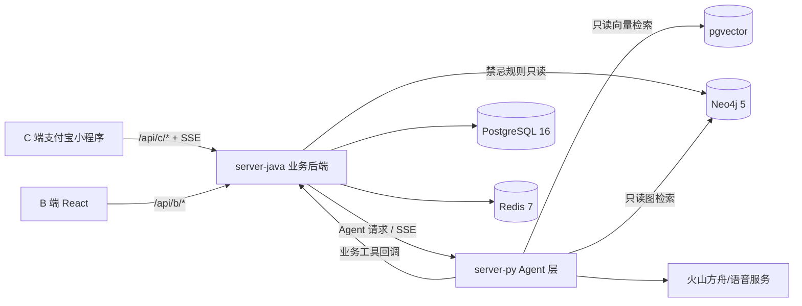
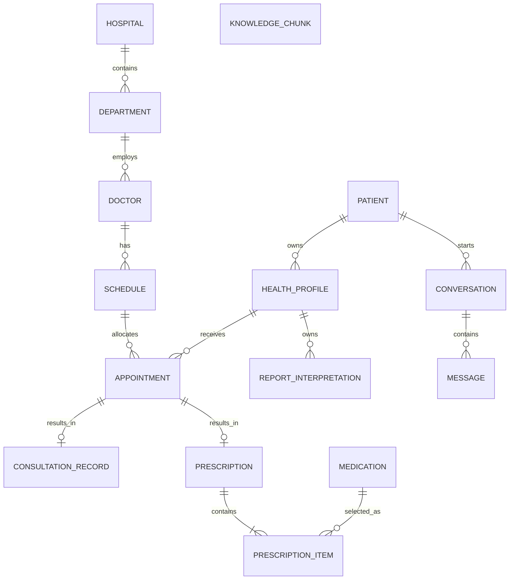
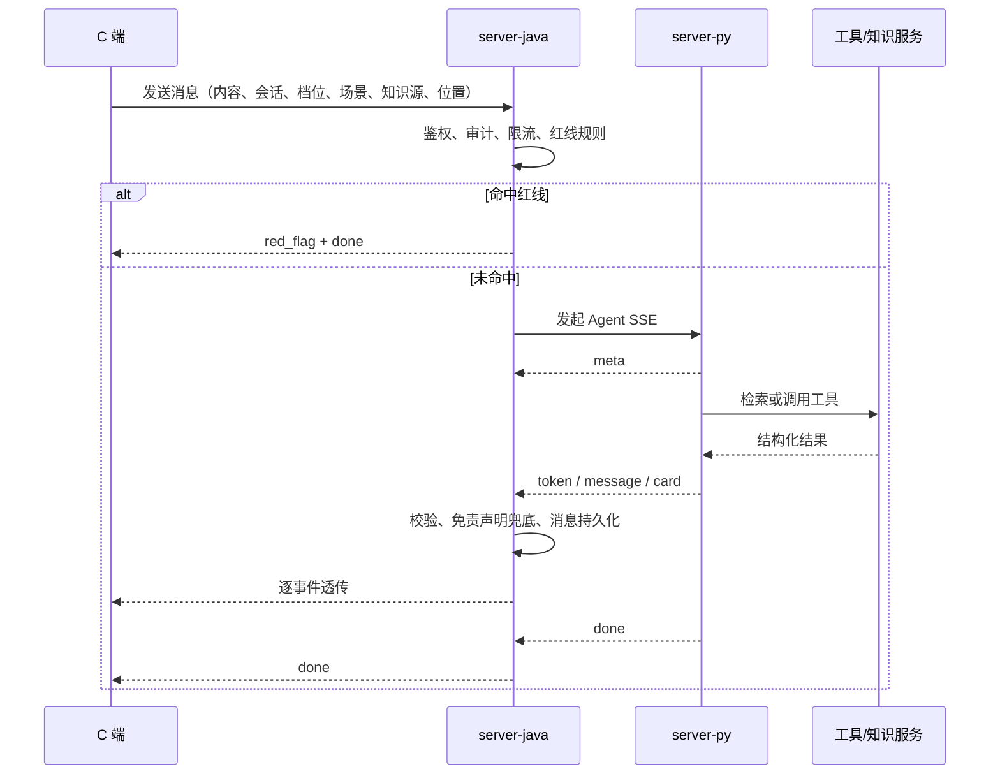

# 智愈 server-java 与 server-py 系统分析与设计

## 1. 文档目的

本文用于指导“智愈”服务端编码、联调、测试与运行，描述 server-java（业务后端）和 server-py（Agent 层）的职责边界、领域模型、接口、数据、安全规则及非功能设计。本文以编码前方案为视角，不记录实现状态、开发进度或完成清单。

## 2. 建设目标与约束

服务端应支撑患者智能导诊与挂号闭环、医生接诊与电子处方、医院运营管理、医学知识增强和 AI 多模态解读，并满足以下核心约束：

1. server-java 是端侧唯一入口与业务数据唯一写入方，负责鉴权、审计、限流、确定性规则与事务。
2. server-py 只负责编排 Agent、调用模型和只读检索医学知识，不直接写业务库。
3. 红线症状和用药禁忌由 server-java 的确定性规则判断，LLM 只负责表达与解释。
4. 所有 AI 产出均携带“仅供参考，不替代医生诊断”；server-py 生成时注入，server-java 出口兜底。
5. PostgreSQL 保存业务实体，pgvector 保存知识块向量，Neo4j 仅保存医学知识关系，Redis 仅由 server-java 操作号源计数与缓存。
6. 号源扣减使用 Redis 原子 DECR 与 PostgreSQL 事务对账，禁止先查后改。
7. 不引入 Spring Cloud、Dubbo、注册中心或网关中间件，两服务通过受控 HTTP 直连。

## 3. 系统上下文与运行拓扑



应用进程与全部测试在本地运行；云服务器只承载 PostgreSQL、Redis、Neo4j 数据服务。开发机通过 `.env` 中的地址直连数据服务，凭据不得进入代码、测试、日志或版本库。

## 4. 服务边界与分层

### 4.1 server-java（业务后端）

| 分层 | 职责 | 禁止事项 |
|---|---|---|
| `controller/` | 参数校验、身份装配、响应转换 | SQL、业务流程、局部 try-catch |
| `service/` | 用例编排、事务、状态流转、幂等与一致性 | 绕过统一规则和号源会计入口 |
| `rule/` | 红线症状、过敏与用药禁忌等确定性判断 | 交由 LLM 决定是否拦截 |
| `mapper/` | PostgreSQL 数据访问 | 混入业务决策 |
| `agentclient/` | 调用 server-py、SSE 透传与错误映射 | 暴露给端侧直连 |
| `config/` | 鉴权、审计、限流、异常、契约加载 | 记录患者敏感原文 |

新建 B 端 CRUD service 应继承 MyBatis-Plus `ServiceImpl`；DTO、Entity、View 映射使用 MapStruct；异常统一抛出 `ApiException` 并由全局 advice 转换。

### 4.2 server-py（Agent 层）

| 分层 | 职责 | 禁止事项 |
|---|---|---|
| `api/` | FastAPI 路由、请求校验、流响应 | 业务写入和复杂编排 |
| `agent/` | LangGraph 状态图、提示词、工具循环、事件输出 | 保存业务实体 |
| `tools/` | 工具参数模型与业务回调薄壳 | 承载业务逻辑 |
| `services/` | RAG、图谱、视觉、语音等知识/模型能力 | 写 PostgreSQL 业务表 |
| `db/` | pgvector 与 Neo4j 只读客户端 | 获取写权限 |
| `schemas/` | 跨端共享的 pydantic 请求/响应模型 | 与 Java 侧 DTO 产生第二份事实 |
| `core/` | 配置、模型客户端、共享契约、通用基础设施 | 硬编码跨栈常量 |

`app/scripts/` 提供离线向量回填脚本（embedding 产出知识库 seed），只在数据准备期运行，不进入在线请求链路。

LangChain 与 LangGraph 的用法必须对照 `uv.lock` 锁定版本的官方文档。模型调用通过 OpenAI 兼容协议接入火山方舟。

## 5. 核心业务域

### 5.1 组织与资源域

- 医院：名称、等级、地址、经纬度。
- 科室：隶属医院，包含楼层与位置。
- 医生：隶属科室，包含职称、擅长和照片。
- 排班：医生、日期、时段、总号源、剩余号源、启用状态。

医院—科室—医生—排班形成严格父子关系。删除或停用操作需校验下游业务引用，不以级联删除破坏挂号历史。

### 5.2 患者与健康档案域

- 患者账号是 C 端登录身份，可拥有多份本人/家人健康档案。
- 同一患者账号同一时刻最多一份激活档案；激活切换需原子完成。
- 健康档案保存基础信息与过敏史，并作为挂号、处方、报告解读和健康时间线的服务对象。
- 会话归属患者账号而非健康档案；每轮个性化能力读取当时的激活档案。

### 5.3 会话与 Agent 域

- 会话在首条消息时惰性创建，包含标题、创建时间和最近活跃时间。
- 消息保存角色、消息种类、内容、推理档位和可选报告解读关联。
- 一轮对话先经 server-java 红线规则，再进入 server-py；命中红线时不得继续普通导诊工具链。
- server-py 可执行知识检索、图谱扩展和业务工具；所有业务工具通过 HTTP 回调 server-java。

### 5.4 挂号与接诊域

- 排班采用号源池计数，不创建逐号实体。
- 挂号单关联患者、健康档案、来源会话与排班，保存分配序号、病情摘要及状态。
- 状态流转为 `BOOKED → CANCELLED` 或 `BOOKED → VISITED`，终态不可逆。
- 接诊记录与挂号单一一对应，保存医生诊断结论与医嘱；Agent 产出的病情摘要不等同于医生诊断。

### 5.5 处方与健康内容域

- 药品业务信息以 PostgreSQL `medications` 为唯一权威来源。
- 电子处方关联接诊完成的挂号单与医生，包含多个药品明细。
- 审核状态为 `PENDING`、`APPROVED`、`REJECTED`；通过或驳回均为显式决定，驳回需原因。
- 患者仅能查看已通过且带通俗解读与免责声明的处方。
- 报告解读保存处理状态、结构化结果、上下文摘要、错误码和免责声明，可关联会话。
- 站内消息用于就诊提醒、处方通知和接诊小结等主动关怀，需保证同一业务事件幂等。

## 6. 数据存储设计

| 存储 | 数据范围 | 访问方 | 一致性定位 |
|---|---|---|---|
| PostgreSQL 16 | 全部业务实体、知识文本块与向量 | server-java 读写；server-py 仅 pgvector 知识只读 | 业务事实源 |
| Redis 7 | 排班号源原子计数、短期缓存 | 仅 server-java | 高并发前置计数，需与 PG 对账 |
| Neo4j 5 | 症状、疾病、科室、药品、禁忌及关系 | server-py 图谱检索只读；server-java 禁忌规则亦直连只读 | 医学关系事实源 |

### 6.1 PostgreSQL 关系模型



主键使用 bigint identity；时间使用带时区时间戳；重要状态由检查约束限定。常用归属、状态与时间排序字段建立索引。schema 由 `schema.sql` 与幂等 seed 管理，开发期结构变化采用 drop、recreate、seed，不引入迁移工具。

#### 核心表 schema

下表是编码阶段的数据字典基线。`id` 均为 `BIGINT IDENTITY`；未特别说明的业务外键均为 `NOT NULL`；所有时间字段使用 `TIMESTAMPTZ`。

| 表 | 核心字段 | 外键/约束 | 说明 |
|---|---|---|---|
| `hospitals` | `name VARCHAR(100)`、`level VARCHAR(30)`、`address VARCHAR(255)`、`longitude/latitude DOUBLE` | `name` 唯一 | 经纬度用于就近医院排序 |
| `departments` | `hospital_id`、`name`、`floor`、`location` | `hospital_id → hospitals.id` | 科室必须归属医院 |
| `doctors` | `department_id`、`name`、`title`、`specialty TEXT`、`photo_url` | `department_id → departments.id` | 医生不进入 Neo4j |
| `schedules` | `doctor_id`、`schedule_date DATE`、`time_slot`、`total_slots INT`、`remaining_slots INT`、`is_active` | `0 ≤ remaining_slots ≤ total_slots`，`total_slots > 0` | 号源池事实记录；并发前置计数位于 Redis |
| `patients` | `nickname`、`created_at` | `nickname` 唯一 | C 端账号身份 |
| `staff_users` | `username`、`password_hash`、`role`、`doctor_id` | `username` 唯一；医生角色需关联医生 | B 端独立账号体系 |
| `health_profiles` | `patient_id`、`display_name`、`gender`、`birth_date`、`relationship`、`active` | 同一 `patient_id` 仅一条 `active=true` | 患者本人或家人档案 |
| `health_profile_allergies` | `health_profile_id`、`allergen` | 二者联合唯一；档案删除时级联删除 | 供确定性用药规则读取 |
| `conversations` | `patient_id`、`title`、`created_at`、`last_active_at` | 按 `patient_id,last_active_at` 查询 | 归属患者账号，不绑定档案 |
| `messages` | `conversation_id`、`role VARCHAR(20)`、`kind VARCHAR(32)`、`content TEXT`、`effort VARCHAR(10)`、`report_interpretation_id` | 会话删除时级联；`kind` 来自共享契约 | 结构化卡片以 JSON 字符串保存；免责声明不落列，由出口服务在响应与持久化前派生补齐 |
| `appointments` | `patient_id`、`health_profile_id`、`conversation_id`、`schedule_id`、`sequence_number`、`status`、`condition_summary` | 档案+排班唯一；排班+序号唯一；状态限 `BOOKED/CANCELLED/VISITED` | 挂号单业务事实；档案+排班唯一约束同时承担创建幂等；病情摘要的免责声明由出口派生 |
| `consultation_records` | `appointment_id`、`doctor_id`、`diagnosis`、`advice` | `appointment_id` 唯一 | 医生诊疗结论，不属于 AI 产出 |
| `medications` | `name`、`generic_name`、`specification`、`instructions`、`is_active` | `name` 唯一 | 药品业务信息唯一权威源 |
| `prescriptions` | `appointment_id`、`doctor_id`、`status`、`notes`、`review_reason`、`reviewed_by`、`interpretation`、`disclaimer` | `appointment_id` 唯一；状态限 `PENDING/APPROVED/REJECTED` | `APPROVED` 时解读和免责声明非空 |
| `prescription_items` | `prescription_id`、`medication_id`、`dosage`、`frequency`、`duration`、`notes` | 处方删除时级联 | 一个处方包含一至多条明细 |
| `report_interpretations` | `patient_id`、`health_profile_id`、`conversation_id`、`request_id`、`file_type`、`file_name`、`page_count`、`status`、`result_json`、`context_summary`、`error_code`、`disclaimer` | 患者+`request_id` 唯一；状态限 `PROCESSING/SUCCEEDED/FAILED` | `request_id` 作为幂等键；`context_summary` 供后续对话引用解读上下文 |
| `knowledge_chunks` | `department`、`title`、`content TEXT`、`vector vector(1024)` | 向量列建 HNSW 余弦索引；按 `department` 建查询索引 | pgvector 知识块；向量由离线 embedding 脚本回填，运行时仅 server-py 只读检索 |
| `in_app_messages` | `patient_id`、`type`、`title`、`content`、`disclaimer`、`related_appointment_id` | 挂号单+消息类型唯一 | 防止同一业务事件重复通知 |

状态相关字段需满足以下组合约束。其中仅状态枚举检查与处方 `APPROVED` 可见性约束由数据库检查约束落实，其余组合为应用层不变量，由 service 在状态流转中原子维护：

| 实体状态 | 必须为空 | 必须非空 |
|---|---|---|
| 挂号单 `BOOKED` | `cancelled_at` | 排班、序号、健康档案 |
| 挂号单 `CANCELLED` | — | `cancelled_at` |
| 挂号单 `VISITED` | `cancelled_at` | 对应接诊记录 |
| 处方 `PENDING` | `reviewed_at/reviewed_by` | 至少一条明细 |
| 处方 `APPROVED` | `review_reason` | `reviewed_at/reviewed_by/interpretation/disclaimer` |
| 处方 `REJECTED` | `interpretation` | `reviewed_at/reviewed_by/review_reason` |
| 报告解读 `PROCESSING` | `result_json/error_code` | `request_id/disclaimer` |
| 报告解读 `SUCCEEDED` | `error_code` | `result_json/disclaimer` |
| 报告解读 `FAILED` | `result_json` | `error_code/disclaimer` |

#### 跨存储标识与 Redis key

- Neo4j 药品节点通过 `medication_id` 对齐 PostgreSQL，名称仅为快照；不存在由 Neo4j 回写药品表的路径。
- pgvector 知识块包含 `id`、`department`、`title`、`content`、`vector` 与 `created_at`；检索只返回知识内容和来源元数据，不返回业务实体。
- Redis 排班号源 key 统一采用 `schedule:{scheduleId}:remaining_slots`，值为非负整数；初始化值取 PostgreSQL `remaining_slots`。
- Redis key 不作为永久事实源。服务启动、排班变更及故障恢复必须走 `SlotAccounting` 的初始化/调整语义，禁止任意覆盖并发中的计数。

### 6.2 医学知识图谱

- 节点类型：症状、疾病、科室、药品、禁忌。
- 关系表达症状关联疾病、疾病推荐科室、药品禁忌与药品相互作用等医学知识。
- 图中药品只保存 `medication_id` 与名称快照作为关联键，不作为业务读取源。
- 图中禁止存放患者、医生、排班、号源或挂号单，也不建立业务实体影子节点。
- GraphRAG 采用 pgvector 召回知识块，再由 Neo4j 一跳扩展相关医学关系。

## 7. 接口体系设计

### 7.1 通用接口规则

- 资源路径使用复数名词；列表查询使用 query 参数；创建返回 `201`，普通成功返回 `200`，无响应体删除返回 `204`。
- 标识符在 JSON 中使用十进制整数；日期为 `YYYY-MM-DD`，时刻为 ISO 8601 带时区字符串；经纬度使用十进制度。
- 成功响应直接返回业务数据本身：详情端点返回对象，列表端点返回数组，不包统一信封；列表数据量受患者范围与业务规模约束，不引入分页参数。
- 报告解读上传等可重试写操作携带 `request_id`，同一患者、同一 `request_id` 必须返回同一业务结果；挂号创建的幂等由“健康档案+排班”唯一约束承担。
- `Authorization: Bearer <token>` 用于端侧身份。服务间回调使用独立的 `X-Agent-Callback-Token` 静态凭证，不得复用患者令牌；禁忌校验回调另要求 `X-Agent-Patient-Id` 与 `X-Agent-Patient-Signature`（以回调凭证为密钥对患者标识做 HMAC-SHA256 签名），由 server-java 验签后注入患者上下文，不信任模型自报身份。

### 7.2 C 端接口

| 方法与路径 | 请求要点 | 成功响应要点 | 主要约束 |
|---|---|---|---|
| `POST /api/c/auth/mock-login` | `nickname` | `token`、`patient` | 仅演示身份，不接收真实支付宝凭证 |
| `GET /api/c/conversations` | 无 | 对话记录数组 | 当前患者范围，最近活跃倒序，硬上限 50 条 |
| `GET /api/c/conversations/{id}/messages` | 无 | 消息数组 | 校验会话归属 |
| `DELETE /api/c/conversations/{id}` | 无 | `204` | 只删会话与消息，不删业务实体 |
| `POST /api/c/chat` | `content`、可选 `conversation_id/effort/scenario/knowledge_source/longitude/latitude` | `text/event-stream` | 红线规则先于 Agent；首条消息惰性建会话；个性化读取服务端激活档案 |
| `GET /api/c/health-profiles` | 无 | 档案数组 | 仅当前患者 |
| `GET /api/c/health-profiles/current` | 无 | 当前激活档案 | 仅当前患者 |
| `POST /api/c/health-profiles` | 基础信息、`allergies[]` | `201` 档案详情 | 创建第一份档案时默认激活 |
| `PUT /api/c/health-profiles/{profileId}/allergies` | `allergies[]` | 档案详情 | 校验归属；过敏史整体替换需事务化 |
| `POST /api/c/health-profiles/{profileId}/activate` | 无 | 激活后的档案 | 单患者仅一个激活档案 |
| `GET /api/c/health-profiles/{profileId}/timeline` | 无 | 健康时间线数组 | 聚合挂号、处方、报告和接诊小结 |
| `GET /api/c/appointments` | 无 | 挂号单数组 | 仅当前患者及其档案 |
| `POST /api/c/appointments/{appointmentId}/cancel` | 无 | 取消后的挂号单 | 只允许 `BOOKED → CANCELLED`，成功后返还号源 |
| `POST /api/c/report-interpretations` | multipart `files[]`、`request_id`、可选 `conversation_id` | 解读结果 | 类型、数量、大小按共享契约校验；`request_id` 幂等 |
| `POST /api/c/report-interpretation-uploads` | multipart 单文件、`request_id`、`page_index`、`total_files`、`media_type` | 分片上传进度 | 逐文件暂存，供多页报告分批上传 |
| `POST /api/c/report-interpretations/finalize` | `request_id`、可选 `conversation_id` | 解读结果 | 合并已暂存分片并触发解读 |
| `GET /api/c/prescriptions` | 无 | 已审核处方数组 | 只返回 `APPROVED` 且带免责声明的处方 |
| `GET /api/c/messages` | 无 | 站内消息数组 | 当前患者范围 |

挂号创建不设 C 端直连端点：患者在对话中经 Agent 工具回调 `POST /api/agent/appointments` 完成（见 7.4），防超卖与幂等由 server-java 在回调入口统一保障。

### 7.3 B 端接口

| 方法与路径 | 请求要点 | 成功响应要点 | 权限/约束 |
|---|---|---|---|
| `POST /api/b/auth/login` | `username/password` | `accessToken`、`tokenType` | B 端独立账号 |
| `GET /api/b/auth/me` | 无 | 员工资料 | 返回 `username/role/doctorId`，不含口令散列 |
| `GET/POST /api/b/hospitals` | 无或医院表单 | 医院数组/医院详情 | 管理员 |
| `PUT/DELETE /api/b/hospitals/{id}` | 医院表单或无 | 详情/`204` | 有下游引用时拒绝删除 |
| `GET/POST /api/b/departments` | 无或科室表单 | 科室数组/科室详情 | 管理员 |
| `PUT/DELETE /api/b/departments/{id}` | 科室表单或无 | 详情/`204` | 校验医院与医生引用 |
| `GET/POST /api/b/doctors` | 无或医生表单 | 医生数组/医生详情 | 管理员 |
| `PUT/DELETE /api/b/doctors/{id}` | 医生表单或无 | 详情/`204` | 校验排班、员工关联 |
| `GET/POST /api/b/schedules` | 无或排班表单 | 排班数组/排班详情 | 管理员；不允许直接提交 `remainingSlots` |
| `GET /api/b/schedules/{id}` | 无 | 排班详情 | 管理员 |
| `PUT /api/b/schedules/{id}` | 日期、时段、总号源 | 排班详情 | 容量变化通过号源会计增量调整 |
| `PATCH /api/b/schedules/{id}/disable` | 无 | 停用后的排班 | 管理员；停用即停止预约 |
| `DELETE /api/b/schedules/{id}` | 无 | `204` | 管理员；按停用语义处理，不物理删除 |
| `GET /api/b/reception` | 无 | 医生今日排班和接诊队列 | 医生仅能查看本人 |
| `GET /api/b/reception/appointments/{id}` | 无 | 挂号单接诊详情 | 医生本人 |
| `POST /api/b/reception/appointments/{id}/complete` | `diagnosis/advice` | 接诊记录与挂号状态 | 医生本人；只允许 `BOOKED → VISITED` |
| `GET /api/b/reception/medications` | 无 | 药品数组 | 医生；供开方选药 |
| `POST /api/b/reception/appointments/{appointmentId}/prescriptions` | `items[]/notes` | 待审核处方 | 医生本人；先执行用药安全规则 |
| `POST /api/b/reception/appointments/{appointmentId}/contraindication-check` | `medication_ids[]` | 禁忌决定与原因 | 医生本人；开方过程实时校验，与提交侧复用同一确定性规则 |
| `GET /api/b/prescriptions` | 可选 `status` | 处方数组 | 管理员 |
| `POST /api/b/prescriptions/{id}/review` | `decision`、可选 `reason` | 审核后处方 | 管理员；驳回必须填写原因；终态不可重复审核 |
| `GET /api/b/dashboard/summary` | `date` | 指标及统计口径 | 管理员 |
| `GET /api/b/knowledge-graph` | `nodeTypes/keyword/limit` | 节点与边 | 管理员；server-java 转调 server-py |
| `GET /api/b/agent-logs` | 时间范围、工具名、结果过滤 | 脱敏 trace | 管理员；不返回患者原文 |
| `POST /api/b/demo/reset` | `confirmation` | 重置摘要 | 管理员；串行、审计、二次确认 |

### 7.4 服务间接口

- server-java → server-py：对话编排、报告及约定视觉场景解读、处方通俗解读与接诊小结生成、知识图谱投影与语音能力。
- server-py → server-java：推荐医生、查询号源、查找医院、创建挂号、补写病情摘要、查询挂号、禁忌校验等工具回调。
- 工具回调使用独立服务身份认证（`X-Agent-Callback-Token`），不接受端侧令牌代替；接口按最小权限暴露。禁忌校验回调另强制患者上下文 HMAC 签名（`X-Agent-Patient-Id`/`X-Agent-Patient-Signature`），由 server-java 验签注入患者标识。
- 所有写操作由 server-java 再次校验患者归属、对象状态与业务约束，不能信任模型参数。

| 调用方向 | 方法与路径 | 用途 | 幂等/安全要求 |
|---|---|---|---|
| server-java → server-py | `POST /api/agent/chat` | LangGraph 对话流（SSE） | 仅 server-java 可调用 |
| server-java → server-py | `POST /api/agent/vision/interpret` | 报告及约定视觉场景解读 | multipart 提交文件与档案上下文；错误码限契约白名单 |
| server-java → server-py | `POST /api/agent/clinical/prescription-explanation` | 处方通俗解读生成 | 仅传药品明细，输出强制带免责声明 |
| server-java → server-py | `POST /api/agent/clinical/consultation-summary` | 接诊小结生成 | 仅传诊断与医嘱，输出强制带免责声明 |
| server-java → server-py | `GET /api/agent/knowledge/graph` | 获取只读图谱投影 | 限制节点数与遍历深度 |
| server-py → server-java | `GET /api/agent/doctors/recommend` | 按科室推荐医生 | 只读；参数白名单 |
| server-py → server-java | `GET /api/agent/doctors/{doctorId}/slots` | 查询医生号源 | 只读；只返回可预约排班 |
| server-py → server-java | `GET /api/agent/hospitals/nearby` | 按经纬度找就近医院 | 只读；经纬度范围校验 |
| server-py → server-java | `POST /api/agent/appointments` | 创建挂号 | 以“健康档案+排班”唯一约束幂等；重新鉴权与规则校验 |
| server-py → server-java | `POST /api/agent/appointments/{appointmentId}/summary` | 补写病情摘要 | 校验患者上下文与挂号状态 |
| server-py → server-java | `GET /api/agent/appointments` | 按 `patient_id` 查询挂号列表 | 校验患者上下文 |
| server-py → server-java | `POST /api/agent/contraindications/check` | 获取确定性安全决定 | 强制患者上下文 HMAC 签名；server-java 作最终判断 |

### 7.5 统一响应与错误

- 非流式接口的成功响应直接返回业务数据：详情端点返回对象，列表端点返回数组，不使用 `{data, ...}` 信封。
- 错误响应统一为 `{"detail": ...}`：`detail` 为用户可见消息字符串；需要稳定错误码时 `detail` 为 `{code, message}` 对象。
- 参数错误、鉴权失败、权限不足、对象不存在、状态冲突、限流和服务依赖失败使用可区分的 HTTP 状态；用户可见文案不作为程序分支依据。
- server-py 错误由 server-java 白名单映射，禁止把模型、数据库或调用栈细节暴露给端侧。带程序语义的错误码仅用于报告视觉链路，码值与用户可见文案以 `contracts/vision-errors.json` 为唯一事实源（`VISION_*` 系列），server-java 侧补充 Agent 不可达与模型超时两个兜底码；上传边界从 `contracts/upload-limits.json` 获取。

普通成功响应（详情端点直接返回业务对象）：

```json
{
  "id": 1,
  "status": "APPROVED"
}
```

列表成功响应（裸数组）：

```json
[
  { "id": 1, "title": "最近对话" }
]
```

统一错误响应：

```json
{
  "detail": "该时段号源已约满，请选择其他时段"
}
```

带稳定错误码的错误响应（限契约错误码链路）：

```json
{
  "detail": {
    "code": "VISION_MODEL_TIMEOUT",
    "message": "报告解读服务响应超时，请稍后重试"
  }
}
```

### 7.6 关键 DTO schema

字段命名分两个语域：C 端接口、服务间接口与 SSE 事件负载统一使用 snake_case（Java 侧以 `@JsonProperty` 标注，server-py 的 pydantic 模型同名）；B 端管理接口沿用 Jackson 默认的 lower camel case。请求 DTO 不接受服务端生成字段，响应 DTO 不直接暴露 Entity。

#### 发起对话 `ChatRequest`

| 字段 | 类型 | 必填 | 校验/语义 |
|---|---|---|---|
| `content` | string | 是 | 去除首尾空白后非空；长度上限由入口配置 |
| `conversation_id` | integer | 否 | 为空时在首条有效消息上创建会话 |
| `effort` | enum | 否 | `auto/quick/deep`，默认来自共享契约 |
| `scenario` | enum | 否 | `triage/interpretation`，默认来自共享契约 |
| `knowledge_source` | enum | 否 | 知识增强源 `rag/graph/none`；缺省时 server-py 按场景取契约默认 |
| `longitude` | number | 否 | 用户授权定位的经度，范围来自共享契约；与 `latitude` 成对出现 |
| `latitude` | number | 否 | 用户授权定位的纬度，范围来自共享契约 |

健康档案不随请求传入：个性化能力统一由服务端读取当时的激活档案。

#### 创建挂号（Agent 回调）`CreateAppointmentRequest`

| 字段 | 类型 | 必填 | 校验/语义 |
|---|---|---|---|
| `patient_id` | integer | 是 | 来自可信运行时上下文，非模型自报 |
| `conversation_id` | integer | 是 | 来源会话，必须属于该患者 |
| `schedule_id` | integer | 是 | 排班存在、启用且未过期 |
| `condition_summary` | string | 是 | AI 病情摘要；持久化前补免责声明 |

幂等由“健康档案+排班”唯一约束承担：同一档案对同一排班重复创建直接冲突，不引入请求标识。

#### 挂号单 `AppointmentView`

响应为平铺 snake_case 字段，不嵌套医院、科室、医生、排班子对象：

| 字段 | 类型 | 说明 |
|---|---|---|
| `appointment_id` | integer | 挂号单标识 |
| `schedule_id/doctor_id` | integer | 排班与医生标识 |
| `doctor_name` | string | 医生姓名 |
| `department_name` | string | 科室名称 |
| `schedule_date` | date | 排班日期 |
| `time_slot` | enum | 时段 |
| `sequence_number` | integer | 排班内就诊序号 |
| `status` | enum | `BOOKED/CANCELLED/VISITED` |
| `condition_summary` | string/null | 病情摘要，不得称为诊断 |
| `summary_disclaimer` | string/null | 存在 AI 病情摘要时必填 |
| `created_at` | datetime | ISO 8601 带时区 |

#### 提交与审核处方

`CreatePrescriptionRequest` 包含可选 `notes` 与非空 `items` 数组，每项包含 `medication_id`、`dosage`、`frequency`、`duration` 和可选 `notes`；同一处方内同一药品不得重复。`ReviewPrescriptionRequest` 包含 `decision=APPROVE|REJECT` 与可选 `reason`，当决定为 `REJECT` 时 `reason` 必填。处方响应展开药品名称与规格，并附患者昵称、医生姓名与日期，但不暴露内部审核账号口令等字段。

#### 报告解读结果 `ReportInterpretationView`

| 字段 | 类型 | 说明 |
|---|---|---|
| `report_interpretation_id` | integer | 解读记录标识 |
| `conversation_id` | integer/null | 关联会话 |
| `status` | enum | `PROCESSING/SUCCEEDED/FAILED` |
| `page_count` | integer/null | 报告页数 |
| `result` | object/null | 识别摘要、重点指标、通俗解释、建议 |
| `disclaimer` | string | 所有状态的可见 AI 结果均携带 |

## 8. SSE 与 Agent 编排



- 流事件集合、工具到卡片事件映射及消息种类以 `contracts/sse-events.json` 为唯一事实源；知识源与降级状态语义以 `contracts/knowledge.json` 为唯一事实源。
- `meta` 确认推理档位与会话；`knowledge` 元事件暴露知识增强结果或降级状态；`token` 仅用于增量文本；结构化消息或卡片一次性发送；`done` 表示完整结束。
- server-java 对事件类型、结构和大小做白名单校验，再持久化允许的消息种类。
- 断连需取消下游请求并结束资源；已提交的业务工具结果不得因端侧断连而回滚，客户端通过查询接口恢复最终状态。
- Agent trace 只记录脱敏摘要、工具名、参数类型、耗时和结果，不记录患者敏感原文与完整工具参数。

### 8.1 SSE wire schema

每个事件使用标准 SSE 帧：`event: <name>` 与 `data: <single-line-json>` 两行，以空行结束，不使用 `id:` 行。`data` 必须是单行 UTF-8 JSON，字段名与上游回调 DTO 保持一致（snake_case 为主）。事件负载不含请求标识：`meta` 由 server-java 中继补入 `conversation_id`；持久化后的文本与卡片事件由 server-java 中继补入 `message_id`，其余事件不携带会话或消息标识。

| 事件 | data schema | 说明 |
|---|---|---|
| `meta` | `{effort, conversation_id}` | 确认实际生效的推理档位与会话 |
| `knowledge` | `{source, status, count}` | 知识增强元事件；`status` 取 `ok/degraded/unavailable`，检索成功由 server-py 产出，降级/不可用在 `meta` 后即刻发出；非 AI 产出，不带免责声明 |
| `token` | `{text}` | 仅追加文本片段，不携带完整消息 |
| `message` | `{role, content, disclaimer, effort, message_id}` | 完整助手文本消息，落库后由中继补 `message_id` |
| `doctor_recommendations` | `{doctors:[DoctorCard], disclaimer, message_id}` | 医生推荐卡列表 |
| `doctor_slots` | `{doctor_id, slots:[SlotCard], disclaimer, message_id}` | 可预约排班列表 |
| `hospital_recommendations` | `{hospitals:[HospitalCard], disclaimer, message_id}` | 就近医院列表 |
| `appointment` | `{appointment_id, schedule_id, doctor_id, doctor_name, department_name, schedule_date, time_slot, sequence_number, status, condition_summary, summary_disclaimer, summary_sent, notice, disclaimer, message_id}` | 单次挂号结果 |
| `appointments` | `{appointments:[AppointmentCard], disclaimer, message_id}` | 挂号单列表卡片 |
| `contraindication` | `{decision, messageType, blocked, reasons, message, advice, disclaimer, message_id}` | 用药禁忌决定卡；`blocked=true` 时立即关闭流，阻止模型继续输出未经复检的建议 |
| `red_flag` | `{message_id, rule, content, advice}` | 最高优先级安全中断事件，由 server-java 规则引擎直接产出 |
| `done` | `{}` | 流结束，空负载 |

`DoctorCard` 至少包含医生、科室、医院、擅长、距离和最近可用号源摘要；`SlotCard` 至少包含排班标识、日期、时段、剩余号源与是否可约。结构化卡片的字段 schema 应与对应 REST View 复用，避免 SSE 与查询接口产生两套模型。

## 9. 确定性安全规则

### 9.1 红线症状

- server-java 在调用模型前检查症状文本及结构化上下文。
- 命中胸痛伴冷汗、意识模糊、呼吸困难等规则组合时，立即中断普通导诊并返回红色警告、尽快就医或拨打 120 的建议。
- 规则测试必须覆盖危险输入触发、正常输入不误触、同义表达与组合条件。

### 9.2 用药禁忌

- 输入包括当前健康档案过敏史、处方/候选药品及 Neo4j 返回的禁忌和相互作用知识。
- server-java 根据确定性规则给出放行、警告或拦截决定；LLM 只能解释决定，不能降低规则等级。
- 医生开方、处方审核、患者查药、药盒解读等入口均复用同一规则能力。

### 9.3 免责声明

- server-py 的系统提示与结构化输出模型强制包含免责声明。
- server-java 在所有 AI 响应出口和持久化前校验并补齐，固定文本来自 `contracts/disclaimer.json`。
- 缺失免责声明不允许作为可见 AI 结果直接返回。

## 10. 号源一致性与并发设计

挂号采用“Redis 原子预扣 + PostgreSQL 事务写入 + 失败精确补偿”：

1. server-java 对排班 Redis 计数执行原子 DECR。
2. 结果小于 0 时立即回补并返回号源不足。
3. 在 PostgreSQL 事务中校验排班状态、写挂号单、分配唯一序号并更新剩余号源。
4. 事务体或提交失败时，只补偿本次已经成功应用的 Redis 变化。
5. 成功后 Redis 与 PostgreSQL 剩余号源应一致；异常差异进入对账告警。

取消挂号使用相反的原子退还流程；排班容量调整和计数初始化使用各自的显式句柄。所有 `SlotCounter` 操作必须经 `SlotAccounting`，防止补偿逻辑分散。数据库唯一约束同时阻止同一档案重复预约同一排班及序号重复。

## 11. 模型与知识能力设计

- 对话、工具调用和视觉理解使用 `doubao-seed-2.1-turbo`；向量化使用 `doubao-embedding-vision`。
- 推理档位 `auto`、`quick`、`deep` 来自共享契约；自动档按场景分配，导诊偏低延迟，报告解读偏高质量。
- LangGraph 状态至少包含会话上下文、场景、推理档位、当前档案摘要、工具结果、安全决定和输出事件。
- 工具函数只做参数校验与 service 调用；业务回调必须设置连接、读取和总超时，并限制重试只用于幂等调用。
- RAG 结果需携带来源标识和相关度信息供内部评估；不可靠检索不得被包装为确定诊断。
- 视觉能力只解读报告文字页和约定场景，不承担原始医学影像诊断。

## 12. 鉴权、权限与隐私

- C 端患者令牌与 B 端员工令牌采用不同受众和校验路径。
- B 端使用角色授权；医生只能访问关联医生身份的排班、挂号患者与处方。
- 所有资源查询执行对象级归属校验，禁止仅凭前端隐藏实现隔离。
- server-java 在统一入口审计请求方法、路径、状态、耗时、主体与请求长度；敏感正文仅生成不可逆脱敏摘要。
- 密码使用强哈希保存；模型密钥、数据库凭据和服务间密钥只从环境读取，不输出到日志。
- 上传文件校验 MIME、大小、数量和内容可读性；临时文件采用随机名、限定目录和生命周期清理。

## 13. 可观测性与故障处理

- SSE 对话链路跨 server-java、server-py 多跳，每一跳以会话标识、患者标识、事件名、帧字节数与事件计数留痕，做到"流走到哪、在哪断"可定位；不引入独立请求标识。
- 指标至少覆盖请求量、错误率、延迟、SSE 活跃连接、模型耗时、工具调用、规则命中、Redis/PG 计数差异。
- 日志采用结构化字段，禁止记录 `.env`、令牌、患者原文、报告内容与完整模型提示。
- server-py 或模型不可用时，server-java 返回明确的可重试错误；确定性业务查询和 B 端管理不应被连带阻断。
- Neo4j/pgvector 不可用时，Agent 标记知识增强降级，不能伪称已检索；挂号主事务仍以业务数据为准。
- 演示数据重置需鉴权、二次确认、串行执行并记录审计，不与普通业务请求并发运行。

## 14. 测试设计

### 14.1 server-java

- 使用 MockMvc 验证 HTTP 外部行为、鉴权、权限、错误结构和免责声明兜底。
- service 单测覆盖状态机、对象归属、幂等、禁忌判断及事务失败补偿。
- 红线规则覆盖危险输入与正常输入；ArchUnit 强制分层及 `SlotCounter` 访问收口。
- 并发测试以 N 个请求抢最后 1 个号源，断言恰好 1 个成功且 Redis、PostgreSQL 一致。
- 测试配置独立维护，不读取 `.env`，外部 Agent 与数据服务使用 fake 或隔离实例。

### 14.2 server-py

- 使用 FastAPI TestClient 验证 Agent HTTP/SSE、视觉和健康能力接口。
- LLM、server-java 回调、pgvector 与 Neo4j 使用 fake，断言工具调用顺序、参数类型、超时和错误映射。
- 测试推理档位映射、免责声明注入、未知工具、非法结构化输出、流中断与依赖降级。
- 依次执行 pytest、Ruff、mypy 与 import-linter，保持类型和依赖方向可验证。

### 14.3 跨栈契约与集成

- 双栈共享根目录 `contracts/*.json`：server-java 启动期加载，缺失、损坏或结构不匹配即快速失败、阻断启动；server-py 首次访问时加载并缓存为进程内单例，失败抛错拒绝服务该请求。
- 契约测试对照免责声明、SSE 事件、处方状态、上传限制、视觉错误和对话默认值。
- 集成场景覆盖导诊挂号、红线中断、取消返还、接诊开方、处方审核可见、报告解读和会话恢复。

## 15. 编码与演进约束

- 文件应保持单一职责；controller/路由处理函数不得包含 SQL 或业务逻辑。
- 事务、并发、补偿、原子操作和非直观 SQL 必须就地说明设计原因及失败一致性保障。
- 新增跨栈状态、决定、消息类型或错误码时，先修改 `contracts/`，再更新双栈模型与契约测试。
- 业务多步骤写入应由 server-java service 原子化或显式编排，并向 Agent 暴露单一业务能力接口。
- 医学知识与业务数据保持单向关联和清晰事实源，不以便捷为由双写。
