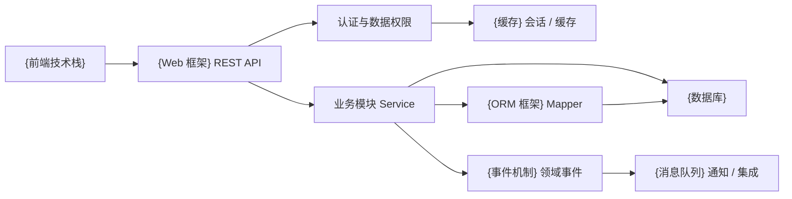
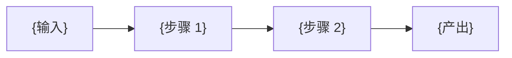
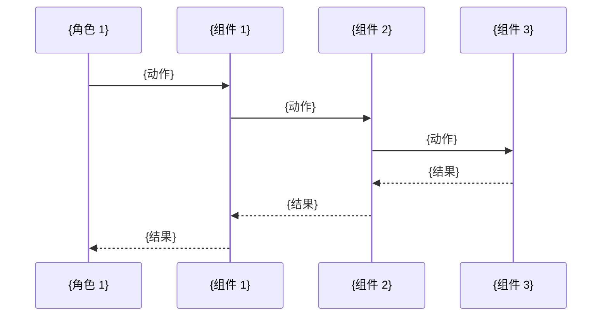

# {项目名}（{项目英文名}）后端总体设计文档

> 本文档以《{项目名}详细产品规格说明书》中的功能章节为主线，采用“一个功能模块 = 一组完整后端设计”的组织方式。每个模块都包含功能边界、权限与状态、数据库设计、模块 API（含入参/出参）、ER 图、关键时序图和测试要点。
>
> 使用说明：所有 `{占位符}` 必须替换为项目实际内容；可选章节（如项目亮点、决策对比）若项目无相关内容可直接删除对应小节。

---

## 1. 总体设计

### 1.1 系统范围与模块状态

| 产品功能 | 后端模块 | 当前状态 |
| --- | --- | --- |
| {功能 A} | `{module_a}` | ✅ 已实现 / ⏳ 待实现 / 🚧 进行中 |
| {功能 B} | `{module_b}` | ⏳ 待实现 |
| ... | ... | ... |

> 状态约定：✅ 已实现 = 已编码并通过测试；⏳ 待实现 = 仅在规格中出现，代码未启动；🚧 进行中 = 已开工但未完成。
> 本设计以 `{代码根目录}/` 和 `{规格目录}/` 主规格为已实现部分的事实来源；未落地的模块标记为“待实现”，后续必须先创建 {变更管理工具} change 再编码。

### 1.2 总体架构



{用 2~4 行说明部署形态：是模块化单体 / 微服务 / Serverless；模块之间如何通信；Controller 是否允许直接访问其他模块的 Mapper 等关键约束。}

### 1.3 技术基线

| 类型 | 选型 |
| --- | --- |
| 运行时 | {语言版本} |
| Web | {框架 + 版本} |
| 安全 | {安全框架 + 会话方案} |
| ORM | {ORM + 版本} |
| 数据库 | {数据库版本}，{测试库} |
| 缓存 | {缓存版本} |
| 消息 | {MQ} |
| 数据库迁移 | {Flyway / Liquibase / 其他} |
| 加密 | {加密方案 + 存储方式} |
| 日志 | {日志框架} |

{如果有更多条目，例如搜索引擎、对象存储、分布式追踪等，继续追加。}

### 1.4 公共契约

所有 API 返回统一结构：

```json
{
  "code": 200,
  "data": {},
  "message": "success"
}
```

分页数据：

```json
{
  "code": 200,
  "data": {
    "total": 100,
    "records": []
  },
  "message": "success"
}
```

统一错误码：`200` 成功、`400` 参数/业务错误、`401` 未认证、`403` 无权限、`404` 不存在、`500` 系统异常。{如果有 HTTP 状态码与业务码不一致的特殊约定，例如兼容前端老逻辑，在此说明。}

### 1.5 {项目亮点 / 特别说明}（可选）

{这一节是项目的“加分项”或“与众不同”的设计。建议用 markdown 表格 + 简短小节呈现对比、决策和工程价值。下面给出一个通用写法作为示例，可整体替换。}

#### 1.5.1 {亮点主题}

| 资产/机制 | 在 {项目目标} 中的职责 |
| --- | --- |
| {规范 A} | {职责 A} |
| {规范 B} | {职责 B} |
| ... | ... |

{2~4 段说明该机制如何运作、解决了什么问题。}

#### 1.5.2 {协同流程或对比}



{解释流程中的角色分工。}

#### 1.5.3 {可追溯的交付链}

```latex
{需求}
  → {规格描述}
  → {技术方案}
  → {实现清单}
  → {代码 / 测试 / 文档 / 迁移}
  → {验证命令}
  → {归档产物}
```

{列出 3~5 条该机制带来的工程价值，例如统一上下文、减少幻觉、过程可审查等。}

---

## 2. {模块 A 名称}模块

> 复制本章作为模板。每个业务模块都按下面的 7 个小节组织；如果某个小节没有内容可以删除对应子节（例如无状态机可删除“状态与规则”）。

### 2.1 功能与权限边界

{用 1~2 段说明本模块对应产品规格哪一章，负责哪些业务能力。}

| 角色 | {资源 1} | {资源 2} | {资源 3} | {资源 4} |
| --- | --- | --- | --- | --- |
| {角色 A} | {权限描述} | ... | ... | ... |
| {角色 B} | ... | ... | ... | ... |
| ... | ... | ... | ... | ... |

{补充说明字段权限、跨模块影响、对外依赖等。}

### 2.2 状态与规则

{列出本模块涉及的所有业务状态、状态机、规则约束。例如：}

#### {状态名}

```latex
{STATE_A} → {STATE_B} → {STATE_C}
                └──────────→ {STATE_D}
```

{用文字补充每种状态之间的触发条件和副作用。}

### 2.3 数据库设计

#### `{表名}` {表中文名}（✅ 当前 / ⏳ 规划）

| 字段 | 类型 | 约束 | 说明 |
| --- | --- | --- | --- |
| `{column}` | {类型} | {PK / FK / UNIQUE / NOT NULL} | {说明} |
| ... | ... | ... | ... |

{继续追加其他字段。}

{如果有多个表，逐一加 `#### 表名` 小节。}

索引：`{索引名}({字段})`、...{列出所有非主键索引。}
联合主键：`({字段1}, {字段2})`{如有}。

### 2.4 模块 API

#### {接口分组，例如“登录与账号安全”}

| 方法 | 路径 | 入参 | 出参 | 说明 |
| --- | --- | --- | --- | --- |
| {GET/POST/...} | `{URL}` | {Body / Query / Path 描述} | {返回类型} | {业务说明} |
| ... | ... | ... | ... | ... |

#### 请求参数定义

公共请求头：除 {无需鉴权的接口列表} 外，受保护接口必须携带 `Authorization: Bearer <token>`；JSON 请求携带 `Content-Type: application/json`。

| 接口 | 参数位置 | 字段 | 类型 | 必填 | 规则 |
| --- | --- | --- | --- | --- | --- |
| `{URL}` | Body / Query / Path | `{field}` | {类型} | {是 / 否} | {校验规则} |
| ... | ... | ... | ... | ... | ... |

#### 请求示例

```json
{示例 JSON}
```

#### 响应参数定义

| 字段 | 类型 | 说明 |
| --- | --- | --- |
| `{field}` | {类型} | {说明} |
| ... | ... | ... |

#### 响应示例

```json
{示例 JSON}
```

### 2.5 ER 图

```mermaid
erDiagram
    {ENTITY_A} ||--o{ {ENTITY_B} : {relationship}
    ...

    {ENTITY_A} {
        {type} {column} PK
        {type} {column} UK
        ...
    }
    ...
```

### 2.6 关键时序图：{场景名称}



{如果模块有多个关键场景，依次加 `### X.Y 关键时序图：场景 N`。}

### 2.7 测试要点

+ {测试点 1}
+ {测试点 2}
+ {边界场景}
+ {权限与脱敏}
+ {并发与性能}
+ ...

---

## 3. {模块 B 名称}模块

{复制第 2 章的小节结构，按业务实际填入。本模板的 7 个固定小节为：功能与权限边界 / 状态与规则 / 数据库设计 / 模块 API / ER 图 / 关键时序图 / 测试要点。}

### 3.1 功能与权限边界
### 3.2 状态与规则
### 3.3 数据库设计
### 3.4 模块 API
### 3.5 ER 图
### 3.6 关键时序图：{场景}
### 3.7 测试要点

---

{继续添加其他业务模块...}

---

## {N+1}. 公共技术、部署与非功能要求

> 本章只描述跨模块共用的工程约束；各模块的具体表、API、入参/出参、ER 图和时序图已经分别放在前面各章中。

### {N+1}.1 工程结构

```latex
{代码根}/src/main/java/{包名}/
├── common/        # {公共能力}
├── config/        # {配置}
├── {module_a}/    # {模块 A}
├── {module_b}/    # {模块 B}
├── ...
└── {module_last}/ # {模块 N}
```

{补充包内分层约定：controller / service / mapper / entity / dto / vo / enums。说明 Entity 是否作为 API 契约、新接口如何引入 Request DTO 与 Response VO。}

### {N+1}.2 事务、事件和消息

+ 单模块写入由 Service 事务包裹。
+ {跨模块事务约束，例如同一事务更新审批实例、任务、历史和下一节点。}
+ 业务模块通过 `{监听注解，例如 @TransactionalEventListener(AFTER_COMMIT)}` 消费 `{事件类}`。
+ {MQ} 用于 {通知 / 催办 / 批量导出 / 长耗时核算} 等非核心同步路径。
+ 消费者使用事件 ID 去重，失败进入重试/死信；通知失败不能回滚核心业务。

### {N+1}.3 数据库迁移顺序

| 版本 | 表/能力 | 状态 |
| --- | --- | --- |
| V1 | {基线迁移} | ✅ |
| V2 | {第二批表} | ✅ |
| ... | ... | ⏳ {change 名称} |

{约定：迁移脚本只追加不修改已执行版本；每个 change 的结构迁移、种子数据和历史数据迁移分开。}

### {N+1}.4 性能和可用性目标

| 指标 | 目标 |
| --- | --- |
| {典型接口响应时间} | {阈值} |
| {批量任务耗时} | {阈值} |
| 并发用户 | {目标值} |
| 会话 | {会话方案} |
| 生产访问 | {HTTPS / 其他} |

{补充实现要求：分页、索引、批量查询、避免 N+1、长任务异步化、缓存失效策略等。性能结论必须通过压测验证。}

### {N+1}.5 安全与运维

+ 配置通过环境变量注入：`{ENV_VAR_PATTERN}`。
+ 禁止提交 `.env`、明文密码、token、加密密钥和敏感数据种子。
+ `{存活检查路径}` 作为存活检查。
+ 日志必须包含模块、请求标识、业务键和异常堆栈，但不得记录 {敏感字段列表}。
+ {数据库备份策略；Flyway 迁移前先备份。}
+ 集群部署时定时任务使用分布式锁或单实例调度。

### {N+1}.6 测试分层

| 层级 | 重点 |
| --- | --- |
| 单元测试 | {状态机、规则计算、审批人解析、脱敏、加密等} |
| Controller 集成测试 | {参数校验、统一响应、401/403、Bearer token} |
| 数据库迁移测试 | {测试库迁移、唯一索引、历史加密迁移} |
| 业务链路测试 | {端到端业务流} |
| 并发测试 | {审批任务、序号生成、打卡、批次创建} |
| 性能测试 | {关键接口与并发指标} |

---

## {N+2}. {变更管理工具，例如 OpenSpec} 实施路线与交付顺序

| 顺序 | Change | 主要后端交付 |
| --- | --- | --- |
| 1 | `{change_id_1}` | {交付内容 1} |
| 2 | `{change_id_2}` | {交付内容 2} |
| ... | ... | ... |

{每个 change 必须包含 {必需文件清单}；实现完成后运行约定的验证命令，例如：}

```bash
{后端验证命令}
{规格校验命令}
```

---

## {N+3}. 结论

{本版后端设计按产品功能拆分为 {模块清单} 等 {N} 个业务模块。每个模块均独立包含数据库设计、具体 API 及其入参/出参、ER 图、关键时序图和测试要点，便于后续按 {变更管理工具} change 逐模块实现、评审和验收。}

---

## 附录 A：模板使用说明

### 占位符速查

| 占位符 | 含义 | 替换示例 |
| --- | --- | --- |
| `{项目名}` | 中文项目名 | 人资管理系统 |
| `{项目英文名}` | 英文缩写 / 全称 | HRMS |
| `{代码根目录}` | 后端代码主目录 | `backend/` |
| `{规格目录}` | 规格或 OpenSpec 目录 | `openspec/specs/` |
| `{变更管理工具}` | OpenSpec / ADR / RFC | OpenSpec |
| `{module_x}` | 后端模块包名 | `auth`、`organization` |
| `{前端技术栈}` | 前端框架与版本 | Umi / React |
| `{Web 框架}` | Spring MVC / Gin / FastAPI 等 | Spring MVC |
| `{数据库}` | MySQL / PostgreSQL | MySQL 8 |
| `{缓存}` | Redis / Memcached | Redis 7 |
| `{消息队列}` | RabbitMQ / Kafka | RabbitMQ 3 |
| `{ORM 框架}` | MyBatis-Plus / GORM / SQLAlchemy | MyBatis-Plus |
| `{事件机制}` | Spring 领域事件 / 自研事件总线 | Spring 领域事件 |
| `{包名}` | Java / Go / Python 包名 | `com.group2.hrms` |

### 通用小节清单

每个业务模块按以下顺序组织；如无内容可整小节删除：

1. **功能与权限边界** — 模块职责 + 角色权限矩阵
2. **状态与规则** — 业务状态机、规则约束
3. **数据库设计** — 每张表一节，标 ✅/⏳ 状态
4. **模块 API** — 接口列表 + 请求/响应参数定义 + 示例
5. **ER 图** — `mermaid erDiagram`
6. **关键时序图** — `mermaid sequenceDiagram`，每场景一节
7. **测试要点** — bullet 列表，覆盖边界、权限、并发

### 可选小节

- 1.5 {项目亮点 / 特别说明}：用于答辩展示、工程价值总结
- 2.2 / X.2 状态与规则：纯查询类模块可删除
- 任意模块中的 “{决策对比}” 子节：解释关键选型理由，例如为何选 Redis Session 而不是 JWT

### 写作风格约定

+ 每个模块独立成节，章节编号随模块递增（2、3、4...），后续公共章节接续编号。
+ 数据库表名、接口路径、字段名统一用代码字体；中文描述用普通文本。
+ mermaid 图保持英文实体名，避免渲染问题。
+ 测试要点用“+”开头的 bullet，强调可执行、可验收。
+ 接口示例 JSON 必须与实际响应结构一致，不要省略公共外壳 `code/data/message`。